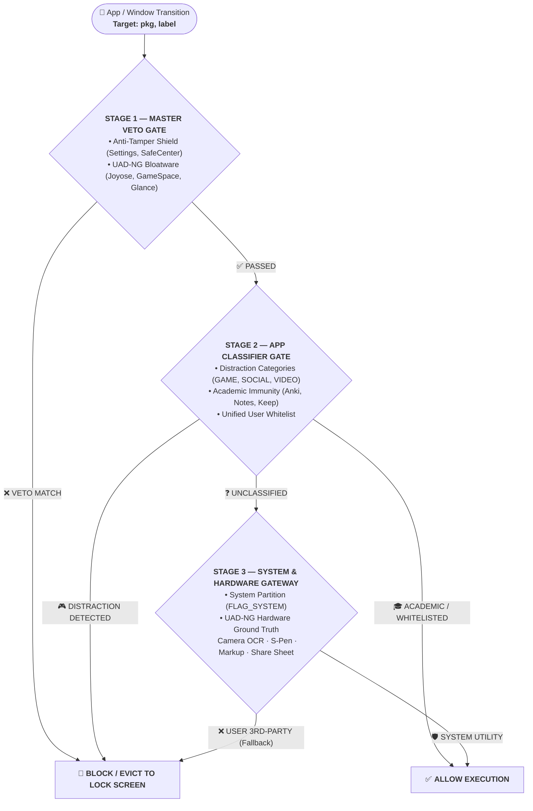

# General Implementation Plan & Architecture Record

This document records all non-Kotlin architectural improvements, core security protocols, recent bug fixes, and feature roadmaps across the QIEZKA platform.

---

## 1. System Protection Architecture: Consolidated 3-Stage Pipeline

### Key Breakthroughs:
1. **AppClassifier BEFORE System Gateway**: Prevents pre-installed OEM YouTube/TikTok from slipping through `FLAG_SYSTEM`.
2. **Complete Retirement of Hardcoded Blacklists**: Removed consumer apps from static blacklist sets. Whitelisting is single-source and unified for developers and forks.
3. **Layer 5 Conservative Fallback**: Guarantees unknown sideloaded APKs (`CATEGORY_UNDEFINED` with `FLAG_SYSTEM == false`) remain blocked.

---

## 2. Recent Implementations & Fixes

### A. Settings UI Runtime Crash Fix (`hasActiveSchedule is not defined`)
- **Issue**: In `src/components/SettingsOverlay.tsx`, API key inputs and warning banners used `disabled={hasActiveSchedule}` and `{hasActiveSchedule && (...)}`, but `hasActiveSchedule` was never declared. Opening Settings triggered an unhandled React runtime error:
  `Uncaught ReferenceError: hasActiveSchedule is not defined`
- **Solution**: Declared `const hasActiveSchedule = isLockedOrConsequence || (settings.schedules || []).some(s => s.isActive);` in `SettingsOverlay.tsx`.
- **Validation**: Rebuilt web assets (`npm run build`), synced to native (`npx cap copy android`), and verified compilation with `./gradlew.bat compileDebugSources` (`BUILD SUCCESSFUL in 43s`).

### B. AOSP Screenshot Markup & Share Sheet Fix
- **Issue**: Clicking "Share" (`com.android.intentresolver`) or "Edit" (`com.google.android.markup`) on screenshots triggered false-positive lockdown evictions because they lacked predefined Play Store categories.
- **Solution**: Created `src/uad_system_allowlist.json` and `SystemUadAllowlist` to provide ground truth protection for 191 essential OEM hardware tools, screenshot markup editors, intent resolvers, and life-safety SOS services across 10 brand/OS categories.
- **Live Device Verification**: Verified via ADB on physical device (`f678bc48`) that `com.android.internal.app.ResolverActivity` (Share Sheet) remains open smoothly without being dismissed.

### C. WebClassifier Subpath Normalization & Auto-Back Remediation
- **Issue**: Subpath URLs like `y8.com/tags/2_player` were bypassing naive domain checks, and aggressive back button spam caused browser UI stuttering.
- **Solution**:
  - Implemented canonical host extraction in `extractHost()` and iterative subdomain stripping in `matchesDomainSet()`.
  - Added a 4-step progressive auto-back state machine with debounce delays to smoothly exit distracting web pages.
  - Implemented instant academic safe-haven immunity for worldwide `.edu`, `.ac.*`, and `.gov` domains.

### D. Unified Allowlist Architecture for Developers & Custom Forks
- **Issue**: Previously, forking QIEZKA required editing hardcoded blacklist constants across multiple TypeScript and Java files.
- **Solution**: Consumer applications are now governed dynamically by categories and the unified AppSettings whitelist. Anyone creating a custom fork (e.g., educational classroom tablet, kiosk) can configure allowed apps in a single place without modifying native source code.

---

## 3. General Platform Roadmap (Non-Kotlin)

| Phase | Milestone | Description |
| :--- | :--- | :--- |
| **Phase 1** | **Rubric Evaluation Enhancements** | Optimize prompt refining and homework evaluation rubrics for Gemini 3.7 Flash and OCR.space integrations. |
| **Phase 2** | **On-Device DNS Sinkhole Tuning** | Fine-tune `LocalDnsVpnService` buffer pools and DoH (DNS-over-HTTPS) canary blocking for low battery consumption. |
| **Phase 3** | **Offline Study Resource Sync** | Enhance offline parsing of `.docx`, `.pdf`, and lecture notes in `HomeworksPage`. |
| **Phase 4** | **UI/UX Refinements** | Polish dark mode aesthetics, timer animations, and multi-window split-screen lockdown views. |
