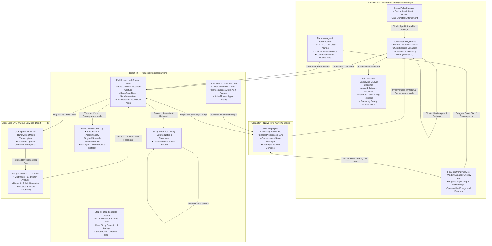
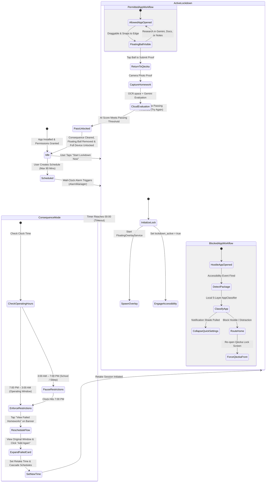

# ⚡ QIEZKA

<div align="center">

```
   ██████╗ ██╗███████╗███████╗██╗  ██╗ █████╗ 
  ██╔═══██╗██║██╔════╝╚══███╔╝██║ ██╔╝██╔══██╗
  ██║   ██║██║█████╗    ███╔╝ █████╔╝ ███████║
  ██║▄▄ ██║██║██╔══╝   ███╔╝  ██╔═██╗ ██╔══██║
  ╚██████╔╝██║███████╗███████╗██║  ██╗██║  ██║
   ╚══▀▀═╝ ╚═╝╚══════╝╚══════╝╚═╝  ╚═╝╚═╝  ╚═╝
```

### *This app is specifically made for me, do not blame me for bricked phones*

[-3DDC84?style=for-the-badge&logo=android&logoColor=white)](https://developer.android.com/)
[](https://react.dev/)
[](https://capacitorjs.com/)
[](https://vitejs.dev/)
[](https://tailwindcss.com/)
[](https://aistudio.google.com/)
[](https://developer.android.com/guide/topics/admin/device-admin)
[](https://developer.android.com/reference/android/view/WindowManager.LayoutParams#TYPE_APPLICATION_OVERLAY)
[](#-online-architecture--offline-resources-byok)
[](LICENSE)

<br/>

**[⚡ Philosophy](#-philosophy-procrastination-prevention)** • 
**[⚖️ Comparison Matrix](#%EF%B8%8F-qiezka-vs-traditional-app-blockers)** • 
**[🏗️ Architecture](#%EF%B8%8F-system-architecture)** • 
**[🧠 Local App Classifier](#-local-app-classifier-engine-on-device-5-layer-heuristics)** • 
**[🚨 Consequence Lockdown](#-consequence-lockdown--operating-hours-700-pm--300-am)** • 
**[⚡ Operating Modes: Safemode vs Hardcore](#-operating-modes-safemode-vs-hardcore-247)** • 
**[🌐 Web & Browser Protection](#-web--browser-protection-accessibility-guard--local-dns-sinkhole)** • 
**[📰 Case Studies](#-case-studies--article-declutter-system)** • 
**[🔮 Floating Ball Overlay](#-floating-assistive-timer-ball)** • 
**[📋 App Directory](#-complete-application-reference-blocked--allowed)** • 
**[🛡️ Anti-Cheat & Security](#%EF%B8%8F-security--anti-cheat-architecture)** • 
**[🚀 Setup & ADB](#-setup-guide)** • 
**[📱 OEM Guides](#-oem-rom-optimization-guide)** • 
**[📂 Codebase Tour](#-codebase-architecture--tour)** • 
**[❓ FAQ](#-frequently-asked-questions-faq)**

</div>

Most productivity apps fail because they operate at one of two counterproductive extremes:

1. **The "Honor System" (Too Soft)**: Apps like *Forest*, *StayFree*, or standard Pomodoro timers show polite reminder dialogs, draw virtual trees, or set soft timers. When a student feels cognitive friction or boredom, they dismiss the dialog with a single swipe, disable the timer, and plunge right back into endless scrolling.
2. **The "Dumb Phone" Brick (Blindly Restrictive)**: Traditional kiosk and extreme lockdown tools disable the entire phone or block every app except phone calls. This completely ruins modern academic workflows: students can't access lecture slides in Google Drive, consult PDF textbooks in Adobe Acrobat, write down thoughts in Obsidian or Samsung Notes, translate Latin or German homework in DeepL, or ask Google Gemini to explain a complex physics derivation.

**QIEZKA rejects both extremes.**

Our design directive is uncompromising: **Obliterate the algorithmic dopamine pits of wasted time, while keeping the full homework, research, and AI accessible.**

---

## 🏗️ System Architecture

### 1. Multi-Layer Component Flow



---

### 2. Lockdown Lifecycle State Machine



---

## 🧠 Local App Classifier Engine (On-Device 5-Layer Heuristics)

To solve the limitations of static lists without requiring central servers or consuming personal API keys on every app launch, QIEZKA includes an **On-Device Local App Classifier (`AppClassifier.java`)**.

### The 3-Tier Classification Model

```
APP LAUNCH
    │
    ▼
Is package hardcoded?
   / \
 YES  NO
  │    │
  ▼    ▼
Known ALLOWED       UNKNOWN APP
  │                     │
  ▼                     ▼
ALLOW             LOCAL 5-LAYER CLASSIFIER
                        │
          ┌─────────────┼─────────────┐
          ▼             ▼             ▼
        SAFE         UNKNOWN       HOSTILE
          │             │             │
          ▼             ▼             ▼
        ALLOW         BLOCK         BLOCK
```

1. **Known Allowed Apps**: Chrome, Google Docs, ChatGPT, Claude, Keep, OpenCamera, Gboard, etc. $\to$ **ALLOW** immediately.
2. **Known Hostile Apps**: TikTok, YouTube, Roblox, Netflix, Instagram, GameGuardian, ReVanced, VMOS $\to$ **BLOCK** immediately.
3. **Unknown Apps**: Analyzed locally in $<5\text{ms}$ using Android's native `PackageManager` and `ApplicationInfo`. Zero network requests, preserving BYOK.

### 5-Layer Local Decision Hierarchy

| Layer | Component Evaluated | Decision / Criteria |
|---|---|---|
| **Layer 1: Permanent Exemptions** | Core Framework & Telephony | Always allows OS (`android`, `com.android.systemui`), dialers (`com.android.phone`, `com.google.android.dialer`, `com.android.incallui`), keyboards/IMEs, launchers, and user-configured whitelist. |
| **Layer 2: Tampering & Blacklist** | Settings & Hostile Signatures | Blocks `com.android.settings` (prevents disabling Accessibility) and all `BlacklistConstants` signatures. |
| **Layer 3: Declared Android OS Category** | `ApplicationInfo.category` | • `CATEGORY_GAME` (0) $\to$ **BLOCK**<br/>• `CATEGORY_SOCIAL` (4) $\to$ **BLOCK**<br/>• `CATEGORY_VIDEO` (2) $\to$ **BLOCK**<br/>• `CATEGORY_NEWS` (5) $\to$ **BLOCK**<br/>• `CATEGORY_ACCESSIBILITY` (8) $\to$ **ALLOW**<br/>• `CATEGORY_MAPS` (6) $\to$ **ALLOW**<br/>• `CATEGORY_AUDIO` (1) & `IMAGE` (3) $\to$ **ALLOW** (if clean of distraction signals)<br/>• `CATEGORY_PRODUCTIVITY` (7) $\to$ Verified against negative signals |
| **Layer 4a: Negative Distraction Filter** | App Label & Package Substrings | Overrides declared categories. If the title contains gaming, gambling, dating, modding, or comics (`game`, `casino`, `poker`, `betting`, `dating`, `cloner`, `parallel`, `manga`, `webtoon`), it is strictly **BLOCKED**. |
| **Layer 4b: Positive Academic Promotion** | Educational Keywords | Promotes unlisted `CATEGORY_UNDEFINED` apps to **ALLOW** if the title/package contains educational terms (`study`, `school`, `university`, `college`, `campus`, `academy`, `reader`, `pdf`, `dictionary`, `formula`, `calculator`, `desmos`, `geometry`, `science`, `flashcard`, `homework`, `portal`). |
| **Layer 5: Conservative Fallback** | Unclassified / Ambiguous Apps | Defaults to **BLOCK**. Unknown apps without positive academic signals are never granted a free pass. |

### UI Recognition: "Auto" Allowed Badge
Unlisted apps recognized by the local classifier (e.g. regional school portals like *"CEU Study Hub"*, campus portals, or unlisted scientific calculators) appear in the **Allowed Applications** section on both the **Dashboard** and the **LockScreen** with a dedicated green **`Auto`** badge, confirming to the student that the app is permitted.

---

## 🚨 Consequence Lockdown & Operating Hours (7:00 PM – 3:00 AM)

### Eliminating the "Wait-It-Out" Loophole
Previous app blockers have an obvious vulnerability: a student can simply wait out the countdown timer (25–40 minutes) without doing any homework, knowing the device will unlock when the clock reaches 0:00.

**In QIEZKA, waiting out the clock has severe consequences:**
- When the timer expires without submitting passing homework proof, **the device does not auto-unlock**.
- **Consequence Mode (`consequenceActive`)** activates natively in `SharedPreferences` and in React state.
- Distracting apps remain restricted, while essential study tools (notes, research, camera, messaging, QIEZKA) stay accessible.
- The restriction persists continuously until the student reschedules the failed homework and **passes AI evaluation**.

### Operating Hours Window (7:00 PM – 3:00 AM)
QIEZKA strictly respects human circadian needs and daytime academic schedules:
- **7:00 PM to 3:00 AM**: Primary homework and study hours. Consequence failure restrictions are actively enforced.
- **3:00 AM to 7:00 PM**: QIEZKA pauses restrictions so the student can sleep and use their phone normally for daytime school and commuting.
- **At 7:00 PM sharp**: Consequence failure restrictions **automatically resume** if the failed homework has not yet been rescheduled and passed.

### Strict Retake Flow
1. **Dashboard Banner**: When consequence mode is active, a persistent red alert banner appears with a single action: **"View Failed Homeworks"** (no bypass shortcuts).
2. **Failed Homeworks Hub**: Expanding the failed session displays the original scheduled window, allotted duration, and an alert card.
3. **Reschedule & Retake**: User clicks **"Add Again (Reschedule)"** $\to$ sets a new start time with automatic cascading $\to$ completes the session $\to$ submits answers $\to$ **passing AI evaluation completely clears Consequence Mode and restores full phone access**.

---

## ⚡ Operating Modes: Safemode vs. Hardcore (24/7)

QIEZKA provides two distinct operating modes configured in **Settings > General > Operating Mode**:

```
┌─────────────────────────────────────────────────────────────┐
│                       OPERATING MODES                       │
├──────────────────────────────┬──────────────────────────────┤
│ 🛡️ SAFEMODE (Default)        │ ⚡ HARDCORE (24/7)           │
├──────────────────────────────┼──────────────────────────────┤
│ • 7:00 PM – 3:00 AM window   │ • 24/7 round-the-clock       │
│ • Daytime pause (3 AM - 7 PM)│ • Lockdown anytime (24h)     │
│ • Strict 3:00 AM curfew cap  │ • No 3:00 AM curfew cap      │
│ • School & sleep protection  │ • Consequence persists 24/7  │
└──────────────────────────────┴──────────────────────────────┘
```

### 1. Safemode (7:00 PM – 3:00 AM) — *Default*
- **Circadian & Academic Balance**: Focus sessions and consequence restrictions operate strictly during evening and night study hours (7:00 PM – 3:00 AM).
- **Daytime Truce (3:00 AM – 7:00 PM)**: Consequence app blocking pauses automatically during daytime hours so students can attend classes, commute, access banking/work portals, and rest without obstruction.
- **Automated 3:00 AM Curfew**: Cascaded schedule calculations enforce a 3:00 AM curfew cap. Any schedule series or break intervals that would spill past 3:00 AM are flagged as invalid, preventing unhealthy late-night study cycles.
- **Smart Rescheduling**: When retaking a failed assignment during daytime, the scheduler defaults to a 7:00 PM start time.

### 2. Hardcore Mode (24/7 Round-the-Clock)
- **Uncompromising Discipline**: Designed for intense study marathons, weekends, bar review, or users needing strict accountability all day long.
- **Anytime Scheduling**: Sessions can be scheduled and locked down at **any hour of the day or night (00:00 – 23:59)**.
- **No Curfew Cap**: Cascade schedules have no 3:00 AM cutoff; sessions can ripple across the morning and afternoon.
- **24/7 Consequence Enforcement**: If a session expires without passing submission, distracting apps remain blocked **continuously 24/7** without any daytime truce at 3:00 AM.
- **Native OS Persistence**: Capacitor bridge passes `operating_mode: "hardcore"` directly into Android `SharedPreferences`. `LockAccessibilityService` and `FloatingOverlayService` continuously intercept and block hostile packages 24 hours a day, 7 days a week.

### 🛡️ Safety Modal & Daytime Schedule Anti-Cheat Guard

To eliminate cheat vectors and prevent impulsive lockouts:

1. **High-Contrast Warning Modal**: Switching from Safemode to Hardcore triggers an explicit confirmation dialog warning that consequence restrictions will persist round-the-clock without daytime relief.
2. **Active Lockdown Guard**: Operating mode **cannot be changed** while a lockdown session is active or while Consequence Mode is active (`isLockedOrConsequence`).
3. **Daytime Schedule Downgrade Guard**: A user **cannot switch from Hardcore back to Safemode if an active schedule exists during daytime hours (03:01 AM – 06:59 PM)**. 
   - *Anti-Cheat Rationale*: Prevents a user from scheduling a daytime lock session in Hardcore mode, realizing they want to play games during the day, and downgrading to Safemode to escape the restriction.
   - *Requirement*: The user must complete or delete all daytime schedules first before Safemode can be restored.

---

## 🌐 Web & Browser Protection (Accessibility Guard & Local DNS Sinkhole)

While QIEZKA strictly blocks distracting apps (TikTok, Instagram, Reddit, Twitter, Netflix, etc.), students facing high academic friction often attempt to bypass restrictions using **mobile Chrome or alternative web browsers**. 

To close this backdoor without breaking legitimate web research (e.g. Wikipedia, Google Docs, AI assistants, or university portals), QIEZKA provides a multi-layer web defense system configured in **Settings > General > Web & Browser Protection**:

```
┌─────────────────────────────────────────────────────────────────────────┐
│                      WEB PROTECTION ARCHITECTURE                        │
├────────────────────────────────────┬────────────────────────────────────┤
│ 🛡️ ACCESSIBILITY URL GUARD         │ ⚡ LOCAL DNS SINKHOLE (VPN)        │
├────────────────────────────────────┼────────────────────────────────────┤
│ • Real-time Omnibox inspection     │ • On-device UDP port 53 loopback   │
│ • Immediate visual eviction (Back) │ • Sinkholes domains to 0.0.0.0     │
│ • Leaves VPN slot FREE             │ • Blocks all browsers & WebViews   │
│ • Zero battery / latency overhead  │ • Zero proxy delay for HTTPS       │
└────────────────────────────────────┴────────────────────────────────────┘
```

### 1. Protection Modes

| Mode | Technology | Best For | VPN Slot Used? |
|---|---|---|:---:|
| **🛡️ Accessibility URL Guard** *(Default)* | Inspects the address bar in Chrome, Samsung Internet, Firefox, Edge, and Brave using `LockAccessibilityService`. If a blacklisted domain is navigated to, QIEZKA triggers `GLOBAL_ACTION_BACK` and flashes an informative block toast. | Students who need external VPNs (university campus VPN, WireGuard, Tailscale, Cloudflare WARP) for research. | **No** (Slot free) |
| **⚡ DNS Sinkhole (Local VPN)** | Runs an on-device `LocalDnsVpnService` that routes virtual DNS queries (`10.111.222.1/32`). Blacklisted domains resolve to `0.0.0.0`, while legitimate research queries are relayed to upstream DNS (`1.1.1.1` / `8.8.8.8`) via protected sockets. | Maximum packet-level blocking across all obscure browsers, private tabs, and in-app WebViews. | **Yes** (1 VPN slot) |
| **🔒 Dual-Layer Hybrid** | Runs both Accessibility URL Guard and DNS Sinkhole concurrently for zero-tolerance discipline. | High-stakes exam periods, bar exams, and extreme focus sprints. | **Yes** (1 VPN slot) |
| **⚪ Off (Unrestricted)** | Web filtering is disabled; allowed browsers can navigate to any URL. | Users with high self-discipline who only want app blocking. | **No** |

### 2. YouTube Policy (Default Blocked & Academic Web Only)

To prevent procrastination loops while allowing legitimate lecture research:

1. **Native YouTube App Permanently Blocked**: 
   - The native YouTube application (`com.google.android.youtube`, YouTube Kids, YouTube Studio, ReVanced, NewPipe, etc.) is **strictly hardcoded in the distraction blacklist and can NEVER be launched or whitelisted**.
   - The only supported route to YouTube is through an allowed web browser.

2. **Blocked by Default**:
   - By default, YouTube web domains (`youtube.com`, `youtu.be`, `googlevideo.com`) are **completely blocked** both in the Accessibility URL Guard and the Local DNS Sinkhole.

3. **"Allow YouTube (Academic Only)" Option**:
   - In **Settings > General > Web & Browser Protection**, users can toggle **"Allow YouTube (Academic Only)"** (disabled by default).
   - **When Enabled**:
     - Long-form educational videos, documentaries, and academic searches on `youtube.com` are permitted in allowed browsers.
     - **YouTube Shorts (`youtube.com/shorts/*` or `#shorts`) are strictly blocked** in real-time, instantly issuing a `GLOBAL_ACTION_BACK` and displaying an alert toast.
     - The native YouTube app remains 100% blocked.

### 3. Anti-Cheat Lockout Guard
Just like Operating Mode settings, **Web & Browser Protection and YouTube settings cannot be changed or disabled during an active lockdown session or during Consequence Mode**. The student must complete and pass their homework submission first.

---

## 📰 Case Studies & Article Declutter System

Assignments requiring students to evaluate real-world issues (news clips, documentary transcripts, journal articles, or court cases) using foundational course concepts are supported through a specialized architecture:

### 1. Dedicated `articleDeclutter` Parser
Standard study decluttering compresses text into flashcard pairs (`[Trigger] | [Variable]`). Feeding news articles or legal briefs into a flashcard prompt destroys narrative continuity.
- **`articleDeclutter`** acts as a diagnostic research analyst, extracting:
  1. *Artifact & Source* (Title, author, publication, date).
  2. *Core Issue & Background* (Central operational failure or controversy).
  3. *Key Parties & Actors* (Entities, systems, individuals involved).
  4. *Timeline & Chronology* (Factual sequence of events).
  5. *Technical & Ethical Dilemmas* (Specific engineering or procedural dilemmas).
  6. *Outcomes & Impact* (Consequences, regulatory penalties, societal fallout).
  7. *Empirical Data & Quotes* (Exact measurements and key citations).

### 2. Step 2 Case Study Gating
When creating a schedule, if the AI detects the prompt is an external case study:
- Displays a dedicated **Case Study / Article Selection** section.
- Lets the user pick from their saved Case Studies library or click **"+ Add Case Study / Article"** to paste and clean up a document on the spot.
- **Gated Progression**: The "Next" button is disabled until an article is selected or General AI Knowledge is authorized.

---

## 🔮 Floating Assistive Timer Ball

When a lockdown session is initiated, QIEZKA summons a **Floating Assistive Ball Timer** that stays with you across all permitted apps:

```
          ┌────────────────────────────────────────────────────────┐
          │  Allowed Application (Google Docs / Keep / Gemini)     │
          │                                                        │
          │                                                        │
          │                   ┌──────────────┐                     │
          │                   │  ⏱️ 24:18    │ ◀─── Assistive Ball │
          │                   └──────────────┘                     │
          │                                                        │
          │  • Floats above all permitted applications             │
          │  • Drag anywhere & smoothly snaps to nearest edge      │
          │  • Real-time countdown synced with native bridge       │
          │  • Single tap instantly returns to QIEZKA submission   │
          └────────────────────────────────────────────────────────┘
```

### Engineering Specifications of the Floating Ball
* **System-Wide Overlay**: Rendered via native Android `WindowManager.LayoutParams.TYPE_APPLICATION_OVERLAY` with `FLAG_NOT_FOCUSABLE`. It never steals keyboard focus when you are typing essays in Google Docs or prompts in Gemini.
* **Physics-Based Edge Snapping**: You can drag the ball anywhere across the screen. On touch release (`ACTION_UP`), the service calculates the screen width and uses a smooth `ValueAnimator` with cubic deceleration to glide and snap the ball against the nearest left or right border.
* **Flicker-Free Debounce**: Digits are updated using a dedicated equality check (`if (!newText.equals(tvTimer.getText().toString()))`) before calling `setText()`. Rapid window switches or app taps never cause digit flashing or erratic frame stutter.
* **Foreground Service Persistence**: Supported by Android's `FOREGROUND_SERVICE_TYPE_SPECIAL_USE` daemon. Even under aggressive OEM memory pressure on Android 14, 15, and 16, the system will not kill the overlay timer.
* **One-Tap Quick Return**: Tapping the floating ball automatically fires a high-priority `Intent` with `FLAG_ACTIVITY_NEW_TASK | FLAG_ACTIVITY_REORDER_TO_FRONT` to summon QIEZKA's homework submission screen in milliseconds.

---

## 📋 Complete Application Reference (Blocked & Allowed)

QIEZKA utilizes dual-layer enforcement: **Exact Package ID Matching** and **Dynamic Substring / Signature Heuristics**. Below is the complete catalog of all hardcoded applications recognized by the frontend UI and the native Android Accessibility engine ([`blacklistedApps.ts`](file:///c:/Users/CxAdmin/Desktop/qiezka/uncode/src/constants/blacklistedApps.ts), [`BlacklistConstants.java`](file:///c:/Users/CxAdmin/Desktop/qiezka/uncode/android/app/src/main/java/com/uncode/app/BlacklistConstants.java), and [`LockPlugin.java`](file:///c:/Users/CxAdmin/Desktop/qiezka/uncode/android/app/src/main/java/com/uncode/app/LockPlugin.java)).

---

### 🟢 Hardcoded Allowed Applications ("ALWAYS" Accessible)

These applications are permanently whitelisted during lockdown. They appear in the app drawer and are never routed Home or blocked.

<details open>
<summary><b>🤖 1. AI Study Assistants (11 Packages)</b></summary>

| Application | Android Package ID | Academic Role |
|---|---|---|
| **Google Gemini** | `com.google.android.apps.bard` | Native Google multimodal AI assistant |
| **Google Gemini (Direct)** | `com.google.android.apps.gemini` | Standalone Google Gemini package |
| **Google Assistant / Gemini** | `com.google.android.apps.googleassistant` | Android voice & assistant trigger |
| **ChatGPT** | `com.openai.chatgpt` | OpenAI homework & concept tutor |
| **Claude** | `com.anthropic.claude` | Anthropic reasoning & writing tutor |
| **Microsoft Copilot** | `com.microsoft.copilot` | Microsoft GPT-4 & Bing search assistant |
| **Perplexity AI** | `ai.perplexity.app.android` | Citation-backed research engine |
| **DeepSeek** | `com.deepseek.chat` | DeepSeek AI assistant & math reasoning |
| **Poe by Quora** | `com.poe.android`, `com.quora.poe.android` | Multi-bot AI ecosystem by Quora |
| **Pi AI** | `ai.inflection.pi` | Conversational study coach |

</details>

<details open>
<summary><b>📂 2. System Document Pickers & Media Providers (Hidden Exemptions - 13 Packages)</b></summary>

*These packages are internal OS file providers. They are hardcoded as completely exempt so homework photo uploads and document attachments never get blocked, but are hidden from the user-facing Allowed Apps UI:*

| Component / Provider | Package ID | Role |
|---|---|---|
| **Google DocumentsUI** | `com.google.android.documentsui` | Stock Android file and storage picker |
| **AOSP DocumentsUI** | `com.android.documentsui` | Core Android system document provider |
| **Google Media Provider** | `com.google.android.providers.media.module` | Internal Android photo picker provider |
| **AOSP Media Provider** | `com.android.providers.media` | System media indexing & SAF provider |
| **Samsung My Files** | `com.sec.android.app.myfiles` | Samsung OneUI file manager |
| **Files by Google** | `com.google.android.apps.nbu.files` | Google official file explorer |
| **Xiaomi File Explorer** | `com.mi.android.globalFileexplorer` | MIUI / HyperOS file selector |
| **Oppo File Manager** | `com.coloros.filemanager` | ColorOS file manager |
| **OnePlus File Manager** | `com.oneplus.filemanager` | OxygenOS file selector |
| **Huawei Files** | `com.huawei.filemanager` | EMUI / HarmonyOS file browser |
| **Vivo File Manager** | `com.vivo.FileManager` | FuntouchOS file selector |
| **Motorola Files** | `com.motorola.filemanager` | Moto file manager |
| **Asus File Manager** | `com.asus.filemanager` | ZenUI storage browser |

</details>

<details open>
<summary><b>📄 3. Document Scanners & PDF Worksheets (8 Packages)</b></summary>

| Application | Android Package ID | Academic Role |
|---|---|---|
| **Adobe Acrobat Reader** | `com.adobe.reader` | PDF viewing, annotations, and worksheets |
| **Adobe Scan** | `com.adobe.scan.android` | Camera document scanning with OCR |
| **CamScanner** | `com.intsig.camscanner` | Document capture & homework PDF export |
| **WPS Office** | `cn.wps.moffice_eng` | Complete office suite (Word, Excel, PPT, PDF) |
| **Microsoft Lens** | `com.microsoft.office.officelens` | Whiteboard & document photo scanning |
| **ReadEra** | `org.readera` | Offline PDF, EPUB, and textbook reader |
| **Xodo PDF Reader** | `com.xodo.pdf.reader` | PDF worksheet form-filling & drawing |
| **Foxit PDF Reader** | `com.foxit.mobile.pdf.lite` | Lightweight PDF reading and annotating |

</details>

<details open>
<summary><b>🌐 4. Translation & Language Dictionaries (6 Packages)</b></summary>

| Application | Android Package ID | Academic Role |
|---|---|---|
| **Google Translate** | `com.google.android.apps.translate` | Multilingual text, speech, and camera translation |
| **DeepL Translate** | `com.deepl.mobiletranslator` | High-accuracy neural translation |
| **Duolingo** | `com.duolingo` | Foreign language vocabulary & grammar practice |
| **Merriam-Webster Dictionary** | `com.merriamwebster` | English vocabulary, definitions, and thesaurus |
| **Oxford Dictionary of English** | `com.mobisystems.msdict.embedded.wireless.oxford.dictionaryofenglish` | Academic English reference |
| **Cambridge Dictionary** | `org.cambridge.cclae` | Learner vocabulary and collocations |

</details>

<details open>
<summary><b>📝 5. Note-Taking & Brainstorming (15 Packages)</b></summary>

| Application | Android Package ID | Academic Role |
|---|---|---|
| **Google Keep** | `com.google.android.keep` | Quick notes, lists, and audio memos |
| **Samsung Notes** | `com.samsung.android.app.notes` | Handwritten stylus notes and lecture scribbles |
| **Microsoft OneNote** | `com.microsoft.office.onenote` | Multi-subject binder & notebook organizer |
| **Notion** | `notion.id` | Project planning, lecture databases, and wikis |
| **Obsidian** | `md.obsidian` | Markdown knowledge base & networked thought |
| **Evernote** | `com.evernote` | Cross-platform note archive |
| **Simplenote** | `com.automattic.simplenote` | Clean, distraction-free markdown notes |
| **ColorNote** | `com.socialnmobile.dictapps.notepad.color.note` | Simple sticky notes and checklists |
| **Zoho Notebook** | `com.zoho.notebook` | Visual card-based notebook system |
| **Squid** | `com.steadfastinnovation.android.pencilbook` | Handwritten PDF markup & vector paper |
| **Goodnotes** | `com.goodnotes.goodnotes` | Digital notebook and handwriting suite |
| **Nebo** | `com.myscript.nebo` | Handwriting-to-digital-text conversion |
| **UpNote** | `com.upnote.app` | Elegant rich-text note editor |
| **Standard Notes** | `com.standardnotes` | Encrypted, future-proof notes |
| **Noteshelf** | `com.fluidtouch.noteshelf3` | Digital planner & handwriting |

</details>

<details open>
<summary><b>🎓 6. Student Platforms, LMS & Office Suites (21 Packages)</b></summary>

| Application | Android Package ID | Academic Role |
|---|---|---|
| **Google Classroom** | `com.google.android.apps.classroom` | School assignments, announcements, and submissions |
| **Google Drive** | `com.google.android.apps.docs` | Cloud file management and lecture slides |
| **Google Docs** | `com.google.android.apps.docs.editors.docs` | Word processing and essay drafting |
| **Google Sheets** | `com.google.android.apps.docs.editors.sheets` | Spreadsheets, data analysis, and graphing |
| **Google Slides** | `com.google.android.apps.docs.editors.slides` | Presentation creation and lecture decks |
| **Google PDF Viewer** | `com.google.android.apps.pdfviewer` | Direct PDF viewing utility |
| **Canvas Student** | `com.instructure.cstudent` | University/school LMS portal and quiz hub |
| **Canvas Teacher** | `com.instructure.cancan` | Instructor grading and module inspection |
| **Blackboard Learn** | `com.blackboard.android.bbstudent` | University LMS portal & course syllabus |
| **Schoology** | `com.schoology.app` | K-12 and collegiate learning management |
| **Quizlet** | `com.quizlet.quizletandroid` | Flashcards, study sets, and memorization |
| **AnkiDroid** | `com.ichi2.anki` | Spaced repetition flashcard engine |
| **Brainly** | `co.brainly` | Peer-to-peer homework question & answer |
| **Photomath** | `com.photomath.android` | Step-by-step math solver with camera scanning |
| **Desmos Graphing Calculator** | `com.desmos.calculator` | Interactive graphing and Cartesian curves |
| **GeoGebra** | `org.geogebra.android` | Geometry, 3D graphing, and calculus models |
| **WolframAlpha** | `com.wolfram.android.alpha` | Computational knowledge & symbolic math engine |
| **Microsoft 365 (Office)** | `com.microsoft.office.officehubrow` | Integrated Word, Excel, and PowerPoint suite |
| **Microsoft Word** | `com.microsoft.office.word` | Academic essay and report editing |
| **Microsoft Excel** | `com.microsoft.office.excel` | Advanced formulas, tables, and statistics |
| **Microsoft PowerPoint** | `com.microsoft.office.powerpoint` | Slide deck review and presentation prep |

</details>

<details open>
<summary><b>🧮 7. STEM Solvers & Learning Hubs (7 Packages)</b></summary>

| Application | Android Package ID | Academic Role |
|---|---|---|
| **Khan Academy** | `org.khanacademy.android` | Free comprehensive courses in math, science, history |
| **Symbolab** | `com.devsense.symbolab` | Step-by-step calculus, algebra, and matrix solver |
| **Mathway** | `com.bagatrix.mathway.android` | Instant math problem step-by-step solver |
| **Chegg Study** | `com.chegg` | Textbook solutions and expert Q&A |
| **Brilliant** | `org.brilliant.android` | Interactive STEM, logic, and CS problem solving |
| **Periodic Table 2024** | `mendeleev.redlime` | Chemistry element data, isotopes, and properties |
| **Cymath** | `com.cymath.cymath` | Math problem solver with step derivations |

</details>

<details open>
<summary><b>☁️ 8. Cloud Storage & Sync (3 Packages)</b></summary>

| Application | Android Package ID | Academic Role |
|---|---|---|
| **Microsoft OneDrive** | `com.microsoft.skydrive` | University 365 cloud file storage |
| **Dropbox** | `com.dropbox.android` | Cloud file sharing and document archive |
| **Box** | `net.box.android` | Enterprise and collegiate cloud storage |

</details>

<details open>
<summary><b>💻 9. CS & Coding Environments (4 Packages)</b></summary>

| Application | Android Package ID | Academic Role |
|---|---|---|
| **Termux** | `com.termux` | Full-fledged Linux terminal emulator and package manager |
| **Acode** | `com.foxdebug.acode` | Powerful mobile code editor for web, JS, and Python |
| **Pydroid 3** | `ru.iiec.pydroid3` | Offline educational Python 3 IDE with pip |
| **GitHub** | `com.github.android` | Code repository review, issues, and pull requests |

</details>

<details open>
<summary><b>🛡️ 10. 2FA Authenticators (10 Packages)</b></summary>

| Application | Android Package ID | Security Role |
|---|---|---|
| **Google Authenticator** | `com.google.android.apps.authenticator2` | 2FA OTP codes for Google and academic portals |
| **Microsoft Authenticator** | `com.azure.authenticator` | University Single Sign-On (SSO) and 2FA |
| **Duo Mobile** | `com.duosecurity.duomobile` | Campus two-factor authentication push prompts |
| **Twilio Authy** | `com.authy.authy` | Multi-device cloud 2FA tokens |
| **2FAS Authenticator** | `com.twofasapp` | Open-source privacy-focused 2FA |
| **Aegis Authenticator** | `com.beemdevelopment.aegis` | Secure, open-source Android 2FA client |
| **Bitwarden Authenticator** | `com.bitwarden.authenticator` | Integrated password & TOTP generator |
| **LastPass Authenticator** | `com.lastpass.authenticator` | Two-factor verification tool |
| **FreeOTP** | `org.fedorahosted.freeotp` | Red Hat open-source 2FA |
| **Yubico Authenticator** | `com.yubico.yubioath` | Hardware security key companion |

</details>

<details open>
<summary><b>🌐 11. Web Browsers (8 Packages)</b></summary>

| Application | Android Package ID | Function |
|---|---|---|
| **Google Chrome** | `com.android.chrome`, `com.google.chrome` | General web research & portal access |
| **Mozilla Firefox** | `org.mozilla.firefox` | Independent web browser |
| **Samsung Internet** | `com.sec.android.app.sbrowser` | Optimized Samsung browser |
| **Microsoft Edge** | `com.microsoft.emmx` | Web research & Copilot sync |
| **Opera Browser** | `com.opera.browser` | Web browser |
| **Opera Mini** | `com.opera.mini.native` | Data-saving web browser |
| **Brave Browser** | `com.brave.browser` | Privacy-centric web browser |
| **DuckDuckGo** | `com.duckduckgo.mobile.android` | Tracker-free search browser |

</details>

<details open>
<summary><b>🎵 12. Deep Focus Music & Audio (9 Packages)</b></summary>

| Application | Android Package ID | Function |
|---|---|---|
| **Spotify** | `com.spotify.music` | Lo-Fi study beats, white noise, and focus playlists |
| **YouTube Music** | `com.google.android.apps.youtube.music` | Background study music streaming |
| **Apple Music** | `com.apple.android.music` | High-fidelity focus audio streaming |
| **Amazon Music** | `com.amazon.mp3` | Audio streaming |
| **Tidal** | `com.aspiro.tidal` | Lossless focus audio |
| **Deezer** | `deezer.android.app` | Music & podcast streaming |
| **SoundCloud** | `com.soundcloud.android` | Independent artist tracks and study mixes |
| **Samsung Music** | `com.sec.android.app.music` | Offline local audio player |
| **MIUI Music Player** | `com.miui.player` | Offline Xiaomi audio player |

</details>

<details open>
<summary><b>📸 13. System Camera Applications (12 Packages)</b></summary>

| Vendor / ROM | Android Package ID |
|---|---|
| **AOSP / Generic Camera** | `com.android.camera`, `com.android.camera2` |
| **Google Pixel Camera** | `com.google.android.GoogleCamera` |
| **Samsung Camera** | `com.sec.android.app.camera`, `com.samsung.android.camera` |
| **Huawei Camera** | `com.huawei.camera` |
| **Oppo / Realme Camera** | `com.oppo.camera` |
| **OnePlus Camera** | `com.oneplus.camera` |
| **Xiaomi / Redmi / POCO Camera** | `com.xiaomi.camera` |
| **Motorola Camera** | `com.motorola.camera`, `com.motorola.camera2` |
| **Sony Xperia Camera** | `com.sonyericsson.android.camera` |
| **LineageOS Snap** | `org.lineageos.snap` |

</details>

<details>
<summary><b>⚙️ 14. System Keyboards & IMEs (Under-the-Hood Exemptions - 18 Packages)</b></summary>

*These packages are native input-method infrastructure. They are automatically permitted so students can type in search boxes and notes, but are hidden from the UI app drawer:*

`com.google.android.inputmethod.latin` (Gboard), `com.samsung.android.honeyboard` (Samsung Keyboard), `com.touchtype.swiftkey` & `com.touchtype.swiftkey.beta` (SwiftKey), `com.android.inputmethod.latin` (AOSP), `com.syntellia.fleksy.keyboard` (Fleksy), `org.dslul.openboard.inputmethod.latin` (OpenBoard), `com.menny.android.anysoftkeyboard` (AnySoftKeyboard), `com.grammarly.android.keyboard` (Grammarly), `com.oppo.keyboard`, `com.coloros.keyboard`, `com.vivo.keyboard`, `com.huawei.ohos.inputmethod`, `com.sohu.inputmethod.sogou`, `com.baidu.input`, `com.google.android.tts`.

</details>

---

### 🔴 Hardcoded Blacklisted Applications (Strictly Blocked)

These applications represent high-dopamine distractions, bypass vectors, or cracking utilities. Any attempt to open them immediately triggers the native accessibility service to route the user Home in milliseconds.

<details open>
<summary><b>🍿 1. Asian Dramas, Anime & Streaming (26 Packages)</b></summary>

| Application | Android Package ID | Category |
|---|---|---|
| **KissKH TWA** | `id.kisskh.twa` | Pirated drama streaming PWA/TWA wrapper |
| **KissKH App** | `com.kisskh.app` | Asian drama streaming client |
| **KissAsian** | `com.kissasian.app` | Asian drama streaming portal |
| **Bilibili (Mainland China)** | `tv.danmaku.bili` | Video streaming & Danmaku community |
| **Bilibili Global / SEA** | `com.bstar.intl` | International Bilibili anime platform |
| **Bilibili India** | `com.bilibili.app.in` | Bilibili regional client |
| **Bilibili HD** | `tv.danmaku.bilibilihd` | Bilibili tablet edition |
| **Bilibili Comics** | `com.bilibili.comic`, `com.bilibili.comic.intl` | Manga & comic reader |
| **Bilibili Studio** | `com.bilibili.studio` | Content creator studio |
| **iQIYI / iQIYI International** | `com.iqiyi`, `com.iqiyi.i18n`, `com.qiyi.video` | Chinese drama & variety shows |
| **WeTV / Tencent Video** | `com.tencent.qqlivei18n`, `com.tencent.qqlive` | Asian drama streaming |
| **Viu** | `com.vuclip.viu` | Korean & Asian drama streaming |
| **Viki (Rakuten)** | `com.viki.android` | Asian drama streaming & community subs |
| **Youku / Youku International** | `com.youku.phone`, `com.youku.international` | Chinese video streaming |
| **Mango TV / MGTV** | `com.hunantv.imgo.activity`, `com.mgtv.tv` | Variety & entertainment streaming |
| **Crunchyroll** | `com.crunchyroll.crunchyroid` | Anime streaming service |
| **Funimation** | `com.funimation.funimationnow` | Anime streaming platform |
| **HIDIVE** | `com.hidive.android` | Anime streaming service |
| **RetroCrush** | `tv.cinedigm.retrocrush` | Classic retro anime streaming |

</details>

<details open>
<summary><b>🏴‍☠️ 2. Unofficial / Piracy / Third-Party Streaming (10 Packages)</b></summary>

| Application | Android Package ID | Threat Type |
|---|---|---|
| **Loklok** | `com.artem.scotepio`, `com.darmiu.folasia`, `com.tarparos.phigaea` | Pirated movie & drama aggregator |
| **CloudStream 3** | `com.lagradost.cloudstream3` | Open-source modular piracy streaming client |
| **MovieBoxPro** | `com.movieboxpro.android` | Third-party movie & series streaming |
| **Anilab** | `com.anilab.android`, `com.anilab.animtvappr` | Unofficial anime streaming app |
| **Stremio** | `com.stremio.one` | Torrent-based media streaming aggregator |
| **OnStream** | `com.onstream.app` | Third-party film & TV streaming client |
| **Popcorn Time** | `com.popcorntime` | Peer-to-peer torrent video player |

</details>

<details open>
<summary><b>📖 3. Webtoons, Manga & Light Novels (10 Packages)</b></summary>

| Application | Android Package ID | Description |
|---|---|---|
| **Line Webtoon** | `com.naver.linewebtoon` | Infinite-scroll Korean comic reader |
| **Tapas** | `com.tapastic` | Web comics and novel app |
| **KakaoPage / Kakao Webtoon** | `com.kakao.page`, `com.kakaowebtoon.app` | Webtoon reading portal |
| **Manga Plus by Shueisha** | `jp.co.shueisha.mangaplus` | Official Shonen Jump manga reader |
| **Tappytoon** | `com.contentsfirst.tappytoon` | Comics and light novel reader |
| **Tachiyomi** | `eu.kanade.tachiyomi` | Modular open-source manga reader |
| **Mihon** | `app.mihon` | Modern successor to Tachiyomi |
| **Aniyomi** | `eu.kanade.tachiyomi.anime`, `app.aniyomi` | Manga & anime fork of Tachiyomi |

</details>

<details open>
<summary><b>🎬 4. Micro-Drama & Vertical Short Series (6 Packages)</b></summary>

| Application | Android Package ID | Description |
|---|---|---|
| **ReelShort** | `com.newleaf.app.android.victor` | 1-minute episodic addictive drama reels |
| **DramaBox** | `com.storymatrix.drama` | Micro-drama vertical streaming |
| **ShortMax** | `live.shorttv.apps` | Short TV series and dramatic reels |
| **GoodShort** | `com.goodreels.app` | Micro-episodes & romance video drama |
| **MoboReels** | `com.chao.novel.moboreels` | Vertical mini-drama player |
| **TopShort** | `com.topshort.video` | Short drama entertainment |

</details>

<details open>
<summary><b>📺 5. Global Video Streaming & OTT (20 Packages)</b></summary>

| Application | Android Package ID |
|---|---|
| **Netflix** | `com.netflix.mediaclient`, `com.netflix.ninja` |
| **Disney+ / Hotstar** | `com.disney.disneyplus`, `in.startv.hotstar` |
| **Twitch** | `tv.twitch.android.app` |
| **Kick Streaming** | `com.kick.app` |
| **Amazon Prime Video** | `com.amazon.avod.thirdpartyclient`, `com.amazon.amazonvideo.livingroom` |
| **Hulu** | `com.hulu.plus` |
| **Max / HBO** | `com.wbd.stream`, `com.hbo.hbonow`, `com.hbo.gobro` |
| **Peacock TV** | `com.peacocktv.peacockandroid` |
| **Paramount+** | `com.cbs.app`, `com.cbs.ott` |
| **Apple TV** | `com.apple.atve.androidtv.appletv` |
| **Tubi TV** | `com.tubitv` |
| **Pluto TV** | `tv.pluto.android` |
| **Dailymotion** | `com.dailymotion.videoplayer` |
| **Vimeo** | `com.vimeo.android.videoapp` |
| **Plex** | `com.plexapp.android` |
| **JioCinema** | `com.jio.media.ondemand` |
| **Zee5** | `com.graymatrix.did` |
| **SonyLIV** | `com.sonyliv` |
| **MX Player** | `com.mxtech.videoplayer.ad` |

</details>

<details open>
<summary><b>💉 6. Game Modding, Memory Editors & Cracking (10 Packages)</b></summary>

| Application | Android Package ID | Bypass / Threat Vector |
|---|---|---|
| **Lucky Patcher** | `com.chelpus.luckypatcher`, `ru.chelpus.patcher`, `com.forpda.lp`, `com.dimonvideo.luckypatcher` | APK patching, in-app billing spoofing, signature removal |
| **GameGuardian** | `catch_.me_.if_.you_.can_`, `com.gameguardian` | Live process memory modification & speedhack |
| **SB Game Hacker** | `org.sbtools.gamehack` | Memory value scanner & trainer |
| **Creehack** | `org.cree.creehack` | Offline in-app purchase emulation |
| **Freedom APK** | `madkite.freedom`, `cc.madkite.freedom` | Google Play billing bypass daemon |

</details>

<details open>
<summary><b>📦 7. Virtual OS, Containers & Sandbox Bypass Tools (13 Packages)</b></summary>

| Application | Android Package ID | Bypass Mechanism |
|---|---|---|
| **VMOS / VMOS Pro** | `com.vmos.app`, `com.vmos.pro`, `com.vmos.vmospro` | Complete guest Android OS with independent root & zygote |
| **F1 VM** | `com.f1player.f1vm`, `com.f1vm.android` | Virtual machine sandbox bypassing system services |
| **VPhoneGaGa** | `com.vphonegaga.titan` | Parallel virtual Android runtime container |
| **X8 Sandbox** | `com.x8zs.sandbox` | Sandboxed Android environment with speed hacks |
| **Island** | `com.oasisfeng.island` | Managed work profile container |
| **Shelter** | `net.typeblog.shelter` | Work profile sandbox isolator |
| **MT Manager** | `bin.mt.plus` | Advanced APK editor, dex decompiler, signature cloner |
| **NP Manager** | `com.mcal.np` | Dex string decryptor, APK modding tool |
| **Apktool M** | `ru.maximoff.apktool` | Mobile decompilation & resource re-packager |
| **APK Editor** | `com.google.android.apps.apkeditor` | On-device manifest and byte modification |

</details>

<details open>
<summary><b>🛒 8. Modded App Stores & Cloners (11 Packages)</b></summary>

| Application | Android Package ID |
|---|---|
| **HappyMod** | `com.happymod.apk` |
| **Aptoide** | `cm.aptoide.pt` |
| **ACMarket** | `net.appx.acmarket` |
| **Mobilism** | `org.mobilism.android` |
| **Androeed** | `com.androeed` |
| **TutuApp** | `com.tutuapp.android` |
| **Parallel Space** | `com.lbe.parallel.intl` |
| **Dual Space** | `com.excelliance.dualaid`, `clone.app.dualspace` |
| **Super Clone** | `com.polestar.super.clone` |
| **App Cloner** | `com.applisto.appcloner` |

</details>

<details open>
<summary><b>✨ 9. Modded Social Media & Third-Party Clients (14 Packages)</b></summary>

| Application | Android Package ID | Base App / Target |
|---|---|---|
| **InstaPrime** | `com.instaprime.android` | Modded Instagram with media downloaders |
| **Instander** | `com.instander.android` | Modded Instagram client |
| **AeroInsta** | `com.aeroinsta.android` | Modded Instagram suite |
| **Honista** | `com.honista.app` | Modded Instagram client |
| **YouTube ReVanced** | `app.revanced.android.youtube` | Modded YouTube client |
| **ReVanced Extended** | `app.rvx.android.youtube` | Extended YouTube ReVanced fork |
| **NewPipe** | `org.schabi.newpipe` | Lightweight third-party YouTube player |
| **SmartTube** | `com.teamsmart.videomanager.tv` | Unofficial YouTube TV client |
| **YouTube Vanced (Legacy)** | `com.vanced.android.youtube` | Discontinued modded YouTube client |
| **GBWhatsApp** | `com.gbwhatsapp` | Modded WhatsApp client |
| **FMWhatsApp** | `com.fmwhatsapp` | Modded WhatsApp client |
| **YoWhatsApp** | `com.yowhatsapp` | Modded WhatsApp client |
| **Aero WhatsApp** | `com.aerowhatsapp` | Modded WhatsApp client |
| **Plus Messenger** | `org.telegram.plus` | Modded Telegram client |

</details>

<details open>
<summary><b>📱 10. Social Media & Short-Form Video (35 Packages)</b></summary>

| Application | Android Package ID |
|---|---|
| **TikTok** | `com.zhiliaoapp.musically`, `com.ss.android.ugc.trill` |
| **Douyin / Douyin Lite** | `com.ss.android.ugc.aweme`, `com.ss.android.ugc.aweme.lite` |
| **Kwai / Kuaishou** | `com.kwai.video`, `com.smile.gifmaker`, `com.kuaishou.nebula` |
| **Likee** | `video.like` |
| **CapCut (Video Editor)** | `com.lemon.lvoverseas`, `com.lemon.lv` |
| **Instagram / Instagram Lite** | `com.instagram.android`, `com.instagram.lite` |
| **Threads** | `com.instagram.barcelona` |
| **YouTube** | `com.google.android.youtube`, `com.google.android.apps.youtube.kids`, `com.google.android.apps.youtube.creator` |
| **Snapchat** | `com.snapchat.android` |
| **Facebook / Facebook Lite** | `com.facebook.katana`, `com.facebook.lite` |
| **X / Twitter / Twitter Lite** | `com.twitter.android`, `com.twitter.android.lite` |
| **Reddit** | `com.reddit.frontpage`, `com.rubenmayayo.reddit` (Infinity), `me.ccrama.redditslide` (Slide) |
| **Pinterest** | `com.pinterest` |
| **Tumblr** | `com.tumblr` |
| **BeReal** | `com.bereal.ft` |
| **Bluesky** | `xyz.blueskyweb.app` |
| **Mastodon** | `org.joinmastodon.android` |
| **Sina Weibo** | `com.sina.weibo` |
| **Xiaohongshu (RED)** | `com.xingin.xhs` |
| **Lemon8** | `com.bd.nproject` |
| **Amino** | `com.narvii.amino.master` |
| **9GAG** | `com.ninegag.android.app` |
| **Imgur** | `com.imgur.mobile` |
| **iFunny** | `mobi.ifunny` |

</details>

<details open>
<summary><b>🎮 11. Games, Gachas & Platforms (48 Packages)</b></summary>

| Application / Studio | Android Package ID |
|---|---|
| **Roblox** | `com.roblox.client` |
| **Discord** | `com.discord` |
| **Steam** | `com.valvesoftware.android.steam.community` |
| **HoYoverse Titles** | `com.mihoyo.genshinimpact`, `com.cognosphere.genshinimpact.oversea` (Genshin), `com.hoyoverse.hkrpgoversea`, `com.mihoyo.hkrpg` (Star Rail), `com.hoyoverse.nap`, `com.cognosphere.nap.oversea` (Zenless Zone Zero) |
| **Shooters & Battle Royales** | `com.tencent.ig`, `com.pubg.krmobile`, `com.pubg.imobile`, `com.vng.pubgmobile` (PUBG), `com.dts.freefireth`, `com.dts.freefiremax` (Free Fire), `com.activision.callofduty.shooter`, `com.activision.callofduty.warzone` (Call of Duty) |
| **MOBAs** | `com.mobile.legends` (Mobile Legends: Bang Bang), `com.riotgames.league.wildrift` (Wild Rift), `com.riotgames.league.teamfighttactics` (TFT), `com.garena.game.kgid` (Arena of Valor) |
| **Supercell Titles** | `com.supercell.brawlstars`, `com.supercell.clashofclans`, `com.supercell.clashroyale`, `com.supercell.squad`, `com.supercell.hayday`, `com.supercell.boombeach` |
| **Casual & Runners** | `com.king.candycrushsaga`, `com.king.candycrushsodasaga`, `com.king.farmheroessaga`, `com.kiloo.subwaysurf`, `com.imangi.templerun`, `com.imangi.templerun2`, `com.innersloth.spacemafia` (Among Us), `com.mojang.minecraftpe` (Minecraft) |
| **Sports & AR** | `com.ea.gp.fifamobile` (FC Mobile), `jp.konami.pesam` (eFootball), `com.nianticlabs.pokemongo`, `jp.pokemon.pokemonunite` |
| **Stores & Emulators** | `com.taptap`, `com.taptap.global`, `com.epicgames.portal`, `org.ppsspp.ppsspp`, `org.ppsspp.ppssppgold`, `com.retroarch`, `org.dolphinemu.dolphinemu`, `xyz.aethersx2.android` |

</details>

<details open>
<summary><b>🛍️ 12. Shopping & E-Commerce (19 Packages)</b></summary>

| Store | Android Package ID |
|---|---|
| **Shopee** | `com.shopee.ph`, `com.shopee.id`, `com.shopee.my`, `com.shopee.sg`, `com.shopee.th`, `com.shopee.vn`, `com.shopee.tw`, `com.shopee.br` |
| **Lazada** | `com.lazada.android` |
| **Amazon Shopping** | `com.amazon.mshop.android.shopping` |
| **Shein** | `com.zzkko` |
| **Temu** | `com.einnovation.temu` |
| **AliExpress / Taobao** | `com.alibaba.aliexpresshd`, `com.taobao.taobao` |
| **eBay** | `com.ebay.mobile` |
| **Tokopedia / Bukalapak** | `com.tokopedia.tkpd`, `com.bukalapak.android` |
| **Mercado Libre** | `com.mercadolibre` |

</details>

<details open>
<summary><b>📚 13. Fanfic, Web Novels & Light Novels (6 Packages)</b></summary>

| Application | Android Package ID | Description |
|---|---|---|
| **Wattpad** | `wp.wattpad` | Social storytelling and fanfiction platform |
| **Webnovel** | `com.qidian.Int.reader` | Serialized web novels and light novels |
| **MangaToon / NovelToon** | `mobi.mangatoon.novel`, `mobi.mangatoon.noveltoon` | Comics and light fiction reading |
| **Wuxiaworld** | `com.wuxiaworld.mobile` | Chinese/Korean martial arts & cultivation web novels |
| **Shosetsu** | `com.shosetsu.android` | Open-source novel aggregator |

</details>

<details open>
<summary><b>📹 14. Live Video Feeds & Stranger Chats (6 Packages)</b></summary>

| Application | Android Package ID | Description |
|---|---|---|
| **OmeTV** | `video.chat.ometv`, `com.duoduo.ometv` | Live video roulette with random strangers |
| **Bigo Live** | `sg.bigo.live` | Live streaming and virtual gifting broadcasts |
| **Tango** | `com.sgiggle.production` | Interactive live streaming and stranger chat |
| **17LIVE** | `com.machipopo.media17` | Live video social platform |
| **Yubo** | `co.yubo.mobile` | Social live streaming and friend discovery |

</details>

<details open>
<summary><b>💬 15. Dating & Swiping Apps (6 Packages)</b></summary>

| Application | Android Package ID | Description |
|---|---|---|
| **Tinder** | `com.tinder` | Swiping & dating app |
| **Bumble** | `com.bumble.app` | Dating, friends, and networking |
| **Hinge** | `co.hinge.app` | Relationship-oriented dating app |
| **Badoo** | `com.badoo.mobile` | Global dating community |
| **Omi** | `com.zenmen.omi` | Asian social dating app |
| **Grindr** | `com.grindrapp.android` | Location-based dating and chat |

</details>

<details open>
<summary><b>🎲 16. Gambling & Sports Betting (6 Packages)</b></summary>

| Application | Android Package ID | Description |
|---|---|---|
| **DraftKings** | `com.draftkings.dknative` | Sportsbook, casino, and daily fantasy |
| **FanDuel** | `com.fanduel.sportsbook` | Sportsbook & racing app |
| **PokerStars** | `com.pokerstars.android` | Real money poker and card tournaments |
| **Bet365** | `com.bet365Wrapper.Bet365` | Sports betting and live match odds |
| **1xBet** | `com.xbet.android` | Online sports betting client |
| **Stake** | `com.stake.mobile` | Crypto casino and sports betting |

</details>

<details open>
<summary><b>🏷️ 17. Resale & Second-Hand Bidding (4 Packages)</b></summary>

| Application | Android Package ID | Description |
|---|---|---|
| **Carousell** | `com.thecarousell.Carousell` | Classifieds marketplace for preloved goods |
| **Vinted** | `fr.vinted` | Second-hand clothes shopping & resale |
| **Depop** | `io.depop` | Vintage fashion marketplace |
| **Pinduoduo** | `com.xunmeng.pinduoduo` | Group-buying social shopping app |

</details>

<details open>
<summary><b>🌀 18. Hyper-Casual, .IO & Satisfying Time-Wasters (46 Packages)</b></summary>

| Application | Android Package ID | Publisher / Type |
|---|---|---|
| **Hole.io** | `io.voodoo.holeio` | VOODOO physics black-hole devourer |
| **Woodturning 3D** | `com.furunwang.woodturning`, `com.voodoo.woodturning` | VOODOO ASMR lathe carving simulator |
| **Paper.io & Paper.io 2** | `io.voodoo.paperio`, `io.voodoo.paper2` | VOODOO territory claiming .io game |
| **Helix Jump** | `com.h8games.helixjump` | VOODOO endless bouncy ball drop |
| **Crowd City** | `io.voodoo.crowdcity` | VOODOO crowd gathering .io battle |
| **Aquapark.io** | `com.cassette.aquapark` | VOODOO water slide racing .io |
| **Flappy Dunk** | `io.voodoo.flappydunk` | VOODOO winged basketball tapper |
| **Slither.io** | `air.com.hypah.io.slither` | Original snake multiplayer .io |
| **Agar.io / Diep.io** | `com.miniclip.agar.io`, `com.miniclip.diep.io` | Miniclip classic cellular & tank .io |
| **Snake.io** | `com.amelosinteractive.snake` | Modern arcade worm battle .io |
| **Survivor!.io** | `com.gorilla.boltrend.survivorio`, `com.habby.survivorio` | Habby roguelite zombie wave horde |
| **Archero** | `com.habby.archero` | Habby dungeon crawler shooter |
| **Join Clash 3D** | `com.freeplay.clash3d`, `com.superpow.snake` | Supersonic crowd runner battle |
| **Bridge Race** | `com.garawell.bridgerace` | Garawell brick collecting runner |
| **Going Balls** | `com.pronetis.ironball` | Supersonic rolling ball obstacle platformer |
| **Tall Man Run** | `com.supersonic.tallmanrun` | Supersonic scaling runner game |
| **Stumble Guys** | `com.kitkagames.fallbuddies` | Knockout multiplayer party royale |
| **Tiles Hop: EDM Rush!** | `com.amanotes.pamadiscodancing` | Amanotes rhythm ball hopper |
| **Magic Tiles 3** | `com.youmusic.magictiles` | Amanotes piano tile rhythm tapper |
| **Color Switch** | `com.fortafygames.colorswitch` | Color matching geometry reflex tapper |
| **Crossy Road** | `com.yodo1.crossyroad` | Endless road crossing arcade |
| **Fruit Ninja** | `com.halfbrick.fruitninjafree` | Halfbrick blade slashing reflex arcade |
| **Cut the Rope** | `com.zeptolab.ctr.ads` | ZeptoLab physics puzzle |
| **Blockudoku** | `com.easybrain.block.puzzle.game` | Easybrain spatial grid time sink |
| **2048** | `com.androbaby.game2048` | Sliding tile math puzzle |
| **Stack / Knife Hit / Rider** | `com.ketchapp.stack`, `com.ketchapp.knifehit`, `com.ketchapp.rider` | Ketchapp minimalist reflex games |
| **Sand Balls** | `com.mhappsgaming.sandballs` | SayGames sand digging physics puzzle |
| **Johnny Trigger** | `com.saygames.johnnytrigger` | SayGames slow-motion platform shooter |
| **My Perfect Hotel** | `com.redfox.myhotel` | SayGames idle hotel tycoon runner |
| **Race Master 3D** | `com.saygames.racemaster` | SayGames high-octane mini racer |
| **Hair Challenge / High Heels!** | `com.rolllic.hairchallenge`, `com.zynga.highheels` | Rollic / Zynga endless fashion runners |
| **Tie Dye / ASMR Slicing / Soap Cutting** | `com.crazylabs.tiedye`, `com.crazylabs.asmr.slicing`, `com.crazylabs.soapcutting` | CrazyLabs satisfying ASMR simulations |
| **Happy Glass / Save The Girl / Mr Bullet** | `com.lionstudios.happyglass`, `com.lionstudios.savethegirl`, `com.lionstudios.mrbullet`, `com.lionstudios.pullhimout` | Lion Studios puzzle & pin-pulling teasers |

</details>

---

### 🛡️ Dynamic Substring & Heuristic Defense

In addition to exact package ID matching, QIEZKA runs real-time **substring signature evaluation** on every foreground window change event in [`blacklistedApps.ts`](file:///c:/Users/CxAdmin/Desktop/qiezka/uncode/src/constants/blacklistedApps.ts) and [`BlacklistConstants.java`](file:///c:/Users/CxAdmin/Desktop/qiezka/uncode/android/app/src/main/java/com/uncode/app/BlacklistConstants.java).

Any application whose package identifier contains any of the following substrings is **automatically recognized as hostile and blocked**, instantly neutralizing rebranded clones, third-party APK forks, and modded sideloads:

```
kisskh • bilibili • danmaku.bili • chelpus • luckypatcher • instaprime • instander • aeroinsta • honista • gameguardian • happymod • acmarket • dramabox • reelshort • shortmax • goodshort • moboreels • loklok • cloudstream • movieboxpro • anilab • stremio • onstream • revanced • gbwhatsapp • fmwhatsapp • yowhatsapp • vmos • f1vm • vphonegaga • x8zs • wattpad • webnovel • wuxiaworld • ometv • bigo • tinder • bumble • pokerstars • bet365 • draftkings • fanduel • carousell • vinted • depop • holeio • woodturning • paperio • helixjump • crowdcity • aquapark • slither • agar.io • snake.io • survivorio • bridgerace • stumbleguys • voodoo • saygames • lionstudios • crazylabs • ketchapp
```

---

## 📖 Feature Deep Dive

### 1. Step-by-Step Schedule Creator with Editable OCR (Step 2)
Creating a schedule is intuitive and friction-free:
1. **Step 1: Select Attached Resources**: Choose from your local library or toggle 🌐 **General AI Knowledge**.
2. **Step 2: Homework Content & Requirements**: Upload an image, `.docx`, or text file to extract instructions via OCR. **The text is fully interactive and editable in a dedicated editor**, allowing students to fix typos, add notes, or write custom problem sets from scratch.
3. **Step 3: Define Grading Rubric**: Generate a criteria rubric using Google Gemini AI or write custom instructions.
4. **Step 4: Timing & Duration (Max 90 Minutes)**: Set activation time (between 7:00 PM and 3:00 AM) and duration. **Duration is strictly capped at 90 minutes** to enforce scientifically optimal deep work cycles (ultradian rhythms) and prevent burnout.

---

### 2. Active Schedules: Clickable Read-Only Homework Viewer
On the main Dashboard, active schedule cards feature a clickable **Homework Content** section:
- Provides a neat 3-line preview with an interactive **"View Full"** action.
- Tapping it summons an instant, distraction-free modal viewer displaying the complete homework prompt in full-fidelity read-only text.

---

### 3. Homeworks Log & Timeout Failure Tracking
All study activity is permanently tracked under the **Homeworks Log** (accessible via the file icon in the dashboard header):
- **Passed Sessions**: Displays green verification badges, OCR transcriptions, and AI feedback.
- **Failed / Expired Sessions**: If a timer expires before homework is submitted and passed, QIEZKA logs the attempt with a red `Failed / Expired` badge and timestamp to keep students accountable.
- Includes a 1-click **Clear All** action when desired.

---

### 4. AI General Knowledge Auto-Harvesting with `declutterResource`
When a student completes a homework session where 🌐 **General AI Knowledge** was enabled alongside a notebook resource:
- The AI answer and research are merged with the existing resource.
- The combined text is automatically processed by `declutterResource` using Google Gemini in the background.
- Redundant greetings, conversational filler, and markdown fluff are stripped away, leaving a clean, highly structured reference document in your offline resource library.

---

## 🌐 Online Architecture & Offline Resources (BYOK)

QIEZKA is designed as a **hybrid online/offline system** with a strict **Bring Your Own Key (BYOK)** privacy model:

```
                                  QIEZKA SYSTEM
                                        │
        ┌───────────────────────────────┴───────────────────────────────┐
        ▼                                                               ▼
[ ONLINE FEATURES ]                                             [ OFFLINE FEATURES ]
Requires Internet + Personal API Key                            Works 100% Without Internet
 • Handwritten Homework AI Evaluation (Gemini)                   • Study Resource Library & Notes Editor
 • Real-time Photo OCR Transcription (OCR.space)                 • Local Document Parsing (.docx, .txt, .md)
 • AI Prompt Refinement & Dynamic Rubrics                        • Focus Session Timers & Floating Ball
 • Cloud Model Selection (Gemini 2.5/2.0/Flash/Pro)              • Selective App Blocking (Accessibility)
 • Automatic Knowledge Harvesting & Decluttering                 • Quick Settings Shield & Recents Guard
                                                                 • Device Admin Anti-Uninstall Protection
                                                                 • Full JSON Data Backup & Restore
```

### 1. What Works Offline (Resources & Lockdown Only)
- **Local Study Resources**: Create, edit, search, organize, and review all notes, syllabi, and study materials with zero internet connection.
- **Client-Side Document Parsing**: Ingestion of `.txt`, `.md`, and Microsoft Word `.docx` documents is processed directly inside your browser/WebView using local in-memory engines ([Mammoth](https://github.com/mwilliamson/mammoth.js)).
- **Focus Enforcement & Lockdown Engine**: Android Accessibility service app-blocking, Quick Settings tile collapse, Device Administrator uninstall prevention, and boot recovery operate strictly on-device via native Android OS APIs.
- **Data Backups**: Export and import complete JSON backups of your settings, resources, and schedules offline.

### 2. What Requires an Online Connection & Your Own API Key (BYOK)
- **AI Homework Evaluation**: Grading your handwritten homework photo against your study rubric requires connecting to the Google Gemini API.
- **Photo OCR Transcription**: Extracting text from photographed papers requires connecting to the OCR.space API.
- **Users Must Provide Their Own API Key (BYOK)**:
  - **Zero Central Servers**: QIEZKA has no middleman servers, no proxy backends, and no proprietary accounts.
  - **100% Private**: Your API keys and homework photos travel directly from your phone to Google / OCR.space over encrypted HTTPS.
  - **Always Free**: Both Google Gemini and OCR.space provide generous **free tiers** that require no payment.

---

## 🔑 How to Get Your Free API Keys

QIEZKA takes 1 minute to configure with free keys:

### 1. Google Gemini API Key (Required for AI Evaluation)
1. Visit [Google AI Studio](https://aistudio.google.com/app/apikey).
2. Sign in with any Google account.
3. Click **"Create API Key"** and copy the generated key (starts with `AIzaSy...`).
4. In QIEZKA, tap the **Settings (gear icon)** at the top right, paste it into **Gemini API Key**, and tap **Save**.

### 2. OCR.space API Key (Required for Image Transcription)
1. Visit [OCR.space Free API Registration](https://ocr.space/ocrapi/freekey).
2. Enter your email and name; your free API key will be delivered instantly.
3. In QIEZKA, paste it into **Simple OCR API Key** or **Formatted OCR API Key** under Settings and tap **Save**.

---

## 🚀 Setup Guide

QIEZKA offers two distinct setup paths. Both yield the exact same security and app-blocking capabilities:

```
                            Choose Your Setup Path
                                      │
              ┌───────────────────────┴───────────────────────┐
              ▼                                               ▼
      [ Method A: On-Device ]                     [ Method B: PC ADB Script ]
       • 100% on your phone                        • Automated via qiezka.bat
       • No PC or USB cable needed                 • Takes 5 seconds
       • Step-by-step guided UI                    • Pre-grants all permissions
```

---

### Method A: On-Device Setup (No PC Required)

Ideal for everyday use. Complete all 4 steps inside the in-app **Permission Walkthrough** screen:

1. **Step 1: Enable Accessibility Service (Required)**
   - Tap **Open Accessibility Settings**.
   - Navigate to *Installed Apps* / *Downloaded Services*.
   - Tap **QIEZKA** and toggle it **ON**.
2. **Step 2: Activate Device Administrator (Recommended)**
   - Tap **Activate Device Admin**.
   - Confirm the system prompt to prevent uninstallation during a lockdown session.
   - *(If the direct prompt does not open on your OEM ROM, tap "Open Device Admin Apps list" and toggle QIEZKA on manually).*
3. **Step 3: Unrestricted Battery / Background (Recommended)**
   - Tap **Allow Unrestricted Background Usage**.
   - Tap **Allow** on Android's native battery optimization exemption prompt (`ACTION_REQUEST_IGNORE_BATTERY_OPTIMIZATIONS`) to stop OEM task killers from freezing timers.
4. **Step 4: Allow Notifications (Recommended)**
   - Tap **Allow Notifications** to enable persistent timer alerts and lock completion alerts.
5. **Tap "Proceed to Dashboard"** to finish setup!

> [!TIP]
> #### Android 13/14/15/16 "Restricted setting" Bypass Guide
> Modern Android automatically marks sideloaded apps with a *"Restricted setting"* warning for Accessibility and Device Admin. You can unlock it in 10 seconds:
> 1. In the QIEZKA walkthrough, tap **Step 1** or **Step 2** once (this triggers Android to register the restriction attempt).
> 2. Tap the **Open App Info** button inside the walkthrough banner.
> 3. In the top-right corner of QIEZKA's App Info page, tap the **3 dots (⋮)** menu.
> 4. Tap **Allow restricted settings** and confirm with your device PIN or fingerprint.
> 5. Return to QIEZKA and complete the steps normally!

---

### Method B: PC Automated Setup (`qiezka.bat`)

Ideal for power users, developers, or anyone with a PC who wants an instant, 1-click setup:

1. Enable **Developer Options** on your Android phone (Go to *Settings > About Phone* and tap *Build Number* 7 times).
2. Go to *Settings > Developer Options* and turn on **USB Debugging**.
3. Connect your phone to your PC via USB cable and allow the USB Debugging authorization prompt on your phone screen.
4. Double-click **`qiezka.bat`** (or execute it in Command Prompt / PowerShell).
5. The script automatically verifies your device, checks if QIEZKA is installed (or installs a local APK), unlocks restricted settings, whitelists battery, enables accessibility, activates device admin, and launches QIEZKA!

---

## ⚙️ Customizing `qiezka.bat`

[`qiezka.bat`](file:///c:/Users/CxAdmin/Desktop/qiezka/uncode/qiezka.bat) includes a **User Configuration Section** at the very top. You can open `qiezka.bat` in any text editor to customize every function using simple `true` or `false` flags:

```bat
:: ============================================================================
::                     USER CONFIGURATION / PREFERENCES
::  Edit the values below (true or false) to tailor the setup to your needs.
:: ============================================================================

:: 1. Force re-install local APK even if already installed on device (default: false)
set "FORCE_REINSTALL_APK=false"

:: 2. Unlock Android 13/14+ Restricted Settings automatically via ADB
set "BYPASS_RESTRICTED_SETTINGS=true"

:: 3. Grant elevated system permissions (WRITE_SECURE_SETTINGS, DUMP, POST_NOTIFICATIONS)
set "GRANT_SECURE_PERMISSIONS=true"

:: 4. Whitelist QIEZKA from aggressive OS battery savers (Samsung, Xiaomi, etc.)
set "WHITELIST_BATTERY=true"

:: 5. Automatically enable QIEZKA's Accessibility Service via ADB
set "ENABLE_ACCESSIBILITY=true"

:: 6. Activate Device Administrator to prevent uninstallation during lockdown
set "ACTIVATE_DEVICE_ADMIN=true"

:: 7. Attempt Enterprise Device Owner mode (DEFAULT: false)
set "TRY_DEVICE_OWNER=false"

:: 8. Automatically launch QIEZKA on your phone after setup completes
set "LAUNCH_APP_ON_FINISH=true"
```

---

## 🛡️ Security & Anti-Cheat Architecture

```
                            ┌────────────────────────┐
                            │   Active Lock Session  │
                            └───────────┬────────────┘
                                        │
          ┌─────────────────────────────┼─────────────────────────────┐
          ▼                             ▼                             ▼
  [ App Interception ]          [ SystemUI Defense ]          [ Anti-Bypass Guard ]
   • Window events monitored     • Quick Settings collapsed    • Device Admin prevents
   • Whitelisted: Allowed          in real time                  uninstallation
   • Blacklisted: Routed Home    • Notification shade stays    • Settings app: Blocked
   • Camera & File Pickers:        accessible for alerts       • BootReceiver: Resumes
     Exempt for homework         • Recents overview: Auto        lock after reboot
     submission without kick       re-launches if swiped
```
---

## 📱 OEM ROM Optimization Guide

Aggressive OEM background managers can prematurely terminate background accessibility monitors. Follow your manufacturer's checklist below:

<details>
<summary><b>🔵 Samsung (One UI)</b></summary>

1. **Battery Exemption**: Go to *Settings > Apps > QIEZKA > Battery* and choose **Unrestricted**.
2. **Never Sleeping Apps**: Go to *Settings > Battery > Background usage limits > Never auto-sleeping apps* and tap **+** to add QIEZKA.
3. **Lock in Recents**: Open the App Switcher (Recents), tap the QIEZKA app icon, and tap **Lock this app**.

</details>

<details>
<summary><b>🟠 Xiaomi / Redmi / POCO (MIUI / HyperOS)</b></summary>

1. **Autostart**: Go to *Settings > Apps > Manage Apps > QIEZKA* and toggle **Autostart** to **ON**.
2. **Battery Saver**: In the same menu, tap **Battery Saver** and select **No restrictions**.
3. **Lock in Task Switcher**: Open Recents, long-press the QIEZKA card, and tap the **Padlock icon**.
4. **Display Pop-up Windows**: Enable *Display pop-up windows while running in the background*.

</details>

<details>
<summary><b>🟢 Oppo / Realme / OnePlus (ColorOS / OxygenOS)</b></summary>

1. **Allow Background Activity**: Go to *Settings > Apps > App Management > QIEZKA > Battery Usage* and enable **Allow background activity** and **Allow auto-launch**.
2. **App Lock**: In Recents, tap the **3 dots** next to QIEZKA and select **Lock**.

</details>

<details>
<summary><b>🔴 Vivo / iQOO (Funtouch OS / OriginOS)</b></summary>

1. **High Background Power Consumption**: Go to *Settings > Battery > Background power consumption management* and set QIEZKA to **Don't restrict background power use**.
2. **Autostart**: Go to *Settings > Applications and Permissions > Autostart* and turn QIEZKA **ON**.

</details>

<details>
<summary><b>⚪ Google Pixel & Stock Android</b></summary>

1. Go to *Settings > Apps > See all apps > QIEZKA > App battery usage*.
2. Select **Unrestricted**.

</details>

---

## 📂 Codebase Architecture & Tour

```
qiezka/
├── android/app/src/main/java/com/uncode/app/
│   ├── AdminReceiver.java            # DeviceAdminReceiver: intercepts & prevents uninstall attempts
│   ├── AlarmReceiver.java            # BroadcastReceiver: triggers exact wall-clock schedule alarms
│   ├── BlacklistConstants.java       # Native blacklist database: package IDs & heuristic regexes
│   ├── BootReceiver.java             # Auto-resumes active lockdown sessions after device reboot
│   ├── FloatingOverlayService.java   # Draggable WindowManager floating ball timer with edge-snapping
│   ├── LockAccessibilityService.java # Core Accessibility engine: window monitoring & app interception
│   ├── LockPlugin.java               # Capacitor two-way IPC bridge between React and native services
│   ├── MainActivity.java             # Android activity entry point & Capacitor bridge initializer
│   └── ScheduleManager.java          # Native schedule persistence & AlarmManager coordinator
├── src/
│   ├── api/
│   │   ├── buildRubric.ts            # AI rubric generation from homework prompts
│   │   ├── declutterResource.ts      # Gemini pipeline to strip chat fluff & clean study notes
│   │   ├── evaluate.ts               # Gemini multimodal handwritten homework grading
│   │   ├── generateAnswer.ts         # Generates reference answers & scoring rubrics
│   │   ├── parseResource.ts          # Client-side .docx (Mammoth), .txt, and .md document parsing
│   │   └── validateHomework.ts       # Validates photographed homework against rubric criteria
│   ├── components/
│   │   ├── CreateSchedule.tsx        # 4-step schedule creator with editable OCR text & 90-min cap
│   │   ├── Dashboard.tsx             # Active schedule countdown cards & modal homework viewer
│   │   ├── EditRubric.tsx            # Interactive grading criteria editor
│   │   ├── EvaluationResult.tsx      # Visual score breakdown & feedback card
│   │   ├── HomeworksPage.tsx         # Homeworks Log archive (passed & failed/expired records)
│   │   ├── LockScreen.tsx            # Full-screen lock enforcement & camera submission
│   │   ├── Onboarding.tsx            # First-run welcome & mission statement
│   │   ├── PermissionWalkthrough.tsx # In-app permission setup wizard with direct intent links
│   │   └── SettingsOverlay.tsx       # BYOK API key configuration & system preferences
│   ├── constants/
│   │   ├── allowedApps.ts            # Hardcoded whitelisted apps & hidden system file pickers
│   │   └── blacklistedApps.ts        # Hardcoded blacklisted apps & signature substring lists
│   ├── App.tsx                       # Root application coordinator, state management & routing
│   └── systemBridge.ts               # TypeScript wrapper for native LockPlugin Capacitor calls
├── qiezka.bat                        # Automated Windows ADB setup, permission grant & launch script
└── package.json                      # Project metadata, scripts, and dependencies
```

---

## 💻 Tech Stack

- **Core Framework**: [React 19](https://react.dev/), [TypeScript 5.8](https://www.typescriptlang.org/), [Vite 6](https://vitejs.dev/)
- **Mobile Native Bridge**: [Capacitor 7](https://capacitorjs.com/) (`@capacitor/android`, `@capacitor/filesystem`)
- **Native Android Engine**: Java 17 (Accessibility Service, Floating WindowManager Overlay, DevicePolicyManager, BroadcastReceiver, ContentResolver SAF)
- **AI & Evaluation**: [@google/genai](https://www.npmjs.com/package/@google/genai) (Google Gemini 2.0 / 2.5 Flash & Pro) + OCR.space
- **Document Ingestion**: [Mammoth.js](https://github.com/mwilliamson/mammoth.js) (Offline `.docx` to HTML/Text conversion)
- **Styling & UI**: [Tailwind CSS 4](https://tailwindcss.com/), [Motion / Framer Motion](https://motion.dev/), [Lucide React](https://lucide.dev/)

---

## 🛠️ Development & Building

### Prerequisites
- Node.js 18+ & npm
- Android Studio (Ladybug or newer) & Android SDK 34+
- Android platform-tools (ADB) in your system PATH

### Commands
```bash
# 1. Install dependencies
npm install

# 2. Run web dev server
npm run dev

# 3. Build web distribution bundle
npm run build

# 4. Sync web bundle and native plugins to Android
npx cap sync android

# 5. Open Android project in Android Studio
npx cap open android
```

> [!IMPORTANT]
> **Compilation Notice**: Always run `npm run build` followed by `npx cap sync android` whenever you modify frontend components in `src/` or bridge definitions to keep the Android assets in sync.

---

## ❓ Frequently Asked Questions (FAQ)

<details>
<summary><b>1. Why is schedule duration capped at 90 minutes?</b></summary>
Cognitive science and chronobiology demonstrate that sustained human focus operates on **ultradian rhythms** (natural biological cycles lasting approximately 90 minutes). Setting multi-hour lockdown sessions leads to diminishing cognitive returns, mental exhaustion, and burnout. 90 minutes represents the gold standard for high-intensity, undistracted academic productivity.
</details>

<details>
<summary><b>2. What if there is an urgent phone call or family emergency?</b></summary>
Emergency dialer functions and incoming phone calls (`com.android.phone`, `com.google.android.dialer`, `com.samsung.android.dialer`) are completely exempt and will never be blocked. You can always answer incoming phone calls and make emergency calls.
</details>

<details>
<summary><b>3. Why can't I access Android Settings during a lockdown?</b></summary>
If the Android Settings application were accessible, a student facing academic frustration could simply open Settings, revoke Device Administrator or Accessibility permissions, and abort the lockdown. Blocking the Settings app seals this bypass vector completely.
</details>

<details>
<summary><b>4. Does QIEZKA require root or bootloader unlocking?</b></summary>
No. QIEZKA operates 100% within the standard Android framework using official APIs: `AccessibilityService`, `DeviceAdminReceiver`, `AlarmManager`, and `WindowManager`. No root, no Magisk/KernelSU, and no bootloader unlocking are required.
</details>

<details>
<summary><b>5. Are my homework photos and notes stored on any server?</b></summary>
Dawg No 😭🙏. QIEZKA has zero central servers, zero accounts, and zero proprietary backends. Your homework photographs and study notes stay on your device. During grading, photos are transmitted directly from your phone to Google Gemini / OCR.space over encrypted HTTPS using your personal API key.
</details>

---

## 📄 License

This project is licensed under the [MIT License](LICENSE).

</div>
