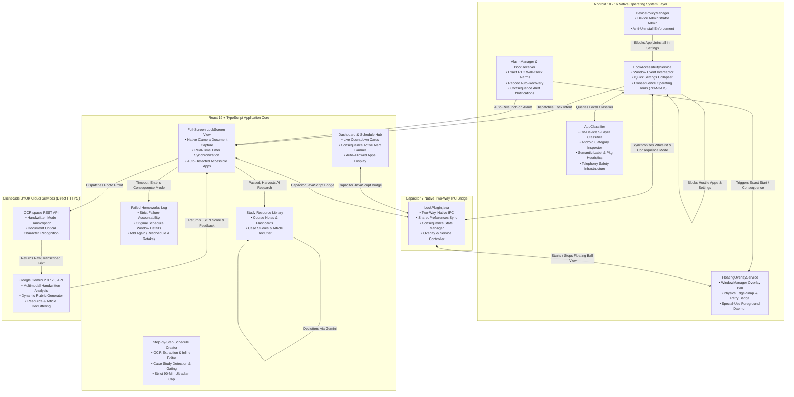
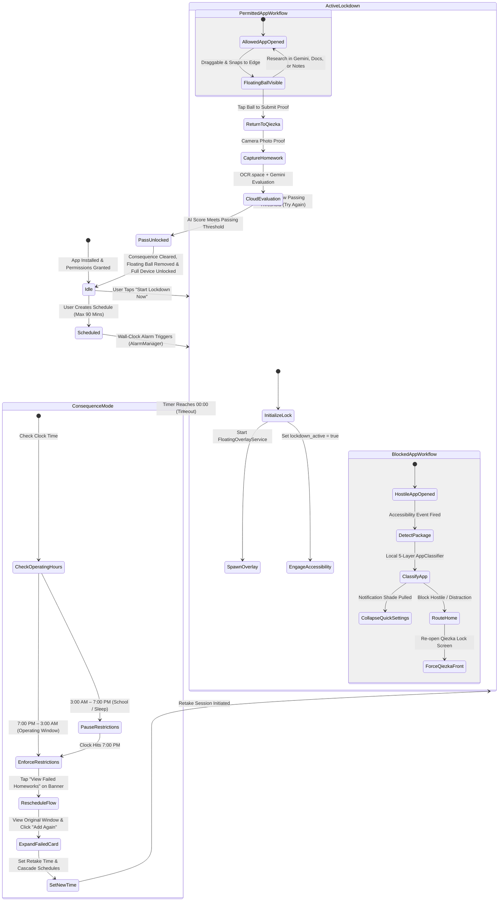
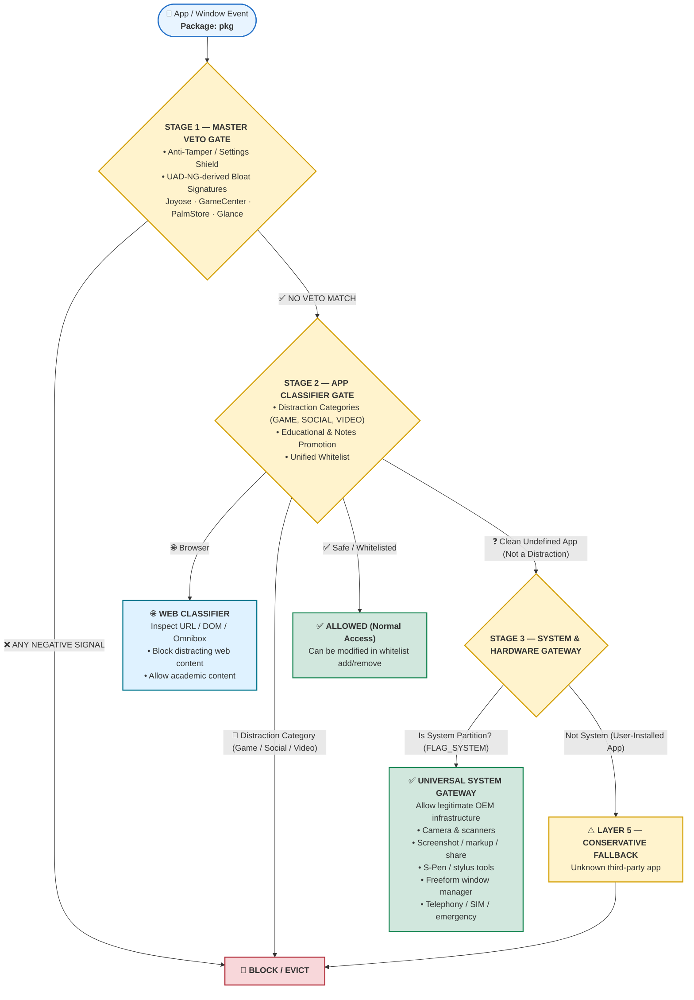
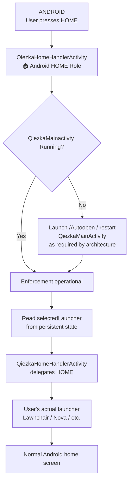
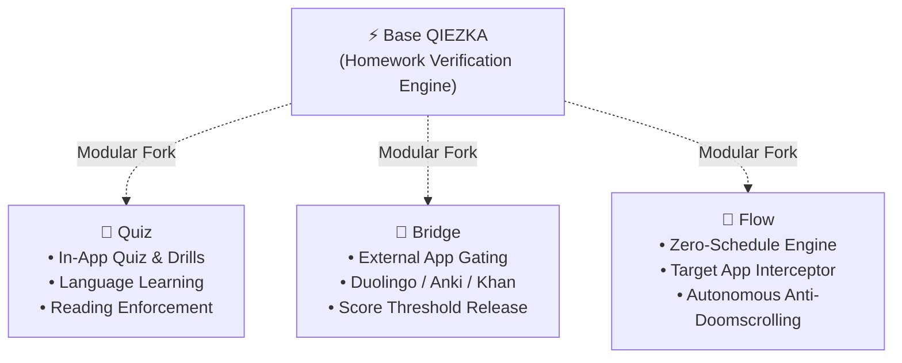
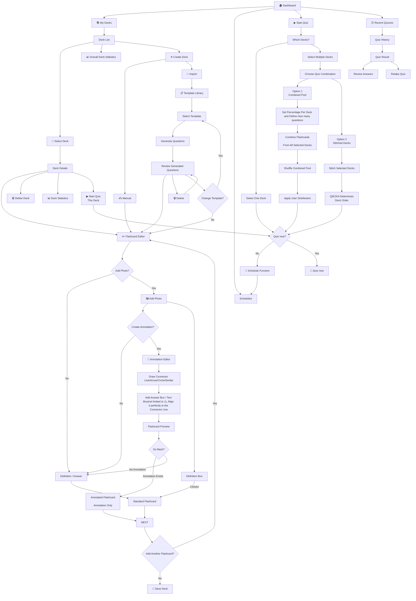

# ⚡ QIEZKA

<div align="center">

```
   ██████╗ ██╗███████╗███████╗██╗  ██╗ █████╗ 
  ██╔═══██╗██║██╔════╝╚══███╔╝██║ ██╔╝██╔══██╗
  ██║   ██║██║█████╗    ███╔╝ █████╔╝ ███████║
  ██║▄▄ ██║██║██╔══╝   ███╔╝  ██╔═██╗ ██╔══██║
  ╚██████╔╝██║███████╗███████╗██║  ██╗██║  ██║
   ╚══▀▀═╝ ╚═╝╚══════╝╚══════╝╚═╝  ╚═╝╚═╝  ╚═╝
```

### *This app is specifically made for me, do not blame me for bricked phones*

[-3DDC84?style=for-the-badge&logo=android&logoColor=white)](https://developer.android.com/)
[](https://react.dev/)
[](https://capacitorjs.com/)
[](https://vitejs.dev/)
[](https://tailwindcss.com/)
[](https://aistudio.google.com/)
[](https://developer.android.com/guide/topics/admin/device-admin)
[](https://developer.android.com/reference/android/view/WindowManager.LayoutParams#TYPE_APPLICATION_OVERLAY)
[](#-online-architecture--offline-resources-byok)
[](LICENSE)

<br/>

**[⚡ Philosophy](#-philosophy-procrastination-prevention)** • 
**[⚖️ Comparison Matrix](#%EF%B8%8F-qiezka-vs-traditional-app-blockers)** • 
**[🏗️ Architecture](#%EF%B8%8F-system-architecture)** • 
**[🧠 Local App Classifier](#-local-app-classifier-engine-on-device-5-layer-heuristics)** • 
**[🚨 Consequence Lockdown](#-consequence-lockdown--operating-hours-700-pm--300-am)** • 
**[⚡ Operating Modes: Safemode vs Hardcore](#-operating-modes-safemode-vs-hardcore-247)** • 
**[🌐 Web & Browser Protection](#-web--browser-protection-accessibility-guard--local-dns-sinkhole)** • 
**[📰 Case Studies](#-case-studies--article-declutter-system)** • 
**[🔮 Floating Ball Overlay](#-floating-assistive-timer-ball)** • 
**[📋 App Directory](#-complete-application-reference-blocked--allowed)** • 
**[🛡️ Anti-Cheat & Security](#%EF%B8%8F-security--anti-cheat-architecture)** • 
**[🚀 Setup & ADB](#-setup-guide)** • 
**[📱 OEM Guides](#-oem-rom-optimization-guide)** • 
**[📂 Codebase Tour](#-codebase-architecture--tour)** • 
**[📜 Engineering Changelog](#-engineering-changelog--architecture-evolution-log)** • 
**[🔮 Future Roadmap & Forks](#-future-roadmap--ecosystem-forks)** • 
**[❓ FAQ](#-frequently-asked-questions-faq)**

</div>

Most productivity apps fail because they operate at one of two counterproductive extremes:

1. **The "Honor System" (Too Soft)**: Apps like *Forest*, *StayFree*, or standard Pomodoro timers show polite reminder dialogs, draw virtual trees, or set soft timers. When a student feels cognitive friction or boredom, they dismiss the dialog with a single swipe, disable the timer, and plunge right back into endless scrolling.
2. **The "Dumb Phone" Brick (Blindly Restrictive)**: Traditional kiosk and extreme lockdown tools disable the entire phone or block every app except phone calls. This completely ruins modern academic workflows: students can't access lecture slides in Google Drive, consult PDF textbooks in Adobe Acrobat, write down thoughts in Obsidian or Samsung Notes, translate Latin or German homework in DeepL, or ask Google Gemini to explain a complex physics derivation.

**QIEZKA rejects both extremes.**

Our design directive is uncompromising: **Obliterate the algorithmic dopamine pits of wasted time, while keeping the full homework, research, and AI accessible.**

---

## 🏗️ System Architecture

### 1. Multi-Layer Component Flow



---

### 2. Lockdown Lifecycle State Machine



---

## 🧠 Local App Classifier Engine (On-Device 5-Layer Heuristics)

To solve the limitations of static lists without requiring central servers or consuming personal API keys on every app launch, QIEZKA includes an **On-Device Local App Classifier (`AppClassifier.java`)**.

### The 3-Tier Classification Model

```
APP LAUNCH
    │
    ▼
Is package hardcoded?
   / \
 YES  NO
  │    │
  ▼    ▼
Known ALLOWED       UNKNOWN APP
  │                     │
  ▼                     ▼
ALLOW             LOCAL 5-LAYER CLASSIFIER
                        │
          ┌─────────────┼─────────────┐
          ▼             ▼             ▼
        SAFE         UNKNOWN       HOSTILE
          │             │             │
          ▼             ▼             ▼
        ALLOW         BLOCK         BLOCK
```

1. **Known Allowed Apps**: Chrome, Google Docs, ChatGPT, Claude, Keep, OpenCamera, Gboard, etc. $\to$ **ALLOW** immediately.
2. **Known Hostile Apps**: TikTok, YouTube, Roblox, Netflix, Instagram, GameGuardian, ReVanced, VMOS $\to$ **BLOCK** immediately.
3. **Unknown Apps**: Analyzed locally in $<5\text{ms}$ using Android's native `PackageManager` and `ApplicationInfo`. Zero network requests, preserving BYOK.

### 5-Layer Local Decision Hierarchy

| Layer | Component Evaluated | Decision / Criteria |
|---|---|---|
| **Layer 1: Permanent Exemptions** | Core Framework & Telephony | Always allows OS (`android`, `com.android.systemui`), dialers (`com.android.phone`, `com.google.android.dialer`, `com.android.incallui`), keyboards/IMEs, launchers, and user-configured whitelist. |
| **Layer 2: Tampering & Blacklist** | Settings & Hostile Signatures | Blocks `com.android.settings` (prevents disabling Accessibility) and all `BlacklistConstants` signatures. |
| **Layer 3: Declared Android OS Category** | `ApplicationInfo.category` | • `CATEGORY_GAME` (0) $\to$ **BLOCK**<br/>• `CATEGORY_SOCIAL` (4) $\to$ **BLOCK**<br/>• `CATEGORY_VIDEO` (2) $\to$ **BLOCK**<br/>• `CATEGORY_NEWS` (5) $\to$ **BLOCK**<br/>• `CATEGORY_ACCESSIBILITY` (8) $\to$ **ALLOW**<br/>• `CATEGORY_MAPS` (6) $\to$ **ALLOW**<br/>• `CATEGORY_AUDIO` (1) & `IMAGE` (3) $\to$ **ALLOW** (if clean of distraction signals)<br/>• `CATEGORY_PRODUCTIVITY` (7) $\to$ Verified against negative signals |
| **Layer 4a: Negative Distraction Filter** | App Label & Package Substrings | Overrides declared categories. If the title contains gaming, gambling, dating, modding, or comics (`game`, `casino`, `poker`, `betting`, `dating`, `cloner`, `parallel`, `manga`, `webtoon`), it is strictly **BLOCKED**. |
| **Layer 4b: Positive Academic Promotion** | Educational Keywords | Promotes unlisted `CATEGORY_UNDEFINED` apps to **ALLOW** if the title/package contains educational terms (`study`, `school`, `university`, `college`, `campus`, `academy`, `reader`, `pdf`, `dictionary`, `formula`, `calculator`, `desmos`, `geometry`, `science`, `flashcard`, `homework`, `portal`). |
| **Layer 5: Conservative Fallback** | Unclassified / Ambiguous Apps | Defaults to **BLOCK**. Unknown apps without positive academic signals are never granted a free pass. |

### UI Recognition: "Auto" Allowed Badge
Unlisted apps recognized by the local classifier (e.g. regional school portals like *"CEU Study Hub"*, campus portals, or unlisted scientific calculators) appear in the **Allowed Applications** section on both the **Dashboard** and the **LockScreen** with a dedicated green **`Auto`** badge, confirming to the student that the app is permitted.

---

## 🚨 Consequence Lockdown & Operating Hours (7:00 PM – 3:00 AM)

### Eliminating the "Wait-It-Out" Loophole
Previous app blockers have an obvious vulnerability: a student can simply wait out the countdown timer (25–40 minutes) without doing any homework, knowing the device will unlock when the clock reaches 0:00.

**In QIEZKA, waiting out the clock has severe consequences:**
- When the timer expires without submitting passing homework proof, **the device does not auto-unlock**.
- **Consequence Mode (`consequenceActive`)** activates natively in `SharedPreferences` and in React state.
- Distracting apps remain restricted, while essential study tools (notes, research, camera, messaging, QIEZKA) stay accessible.
- The restriction persists continuously until the student reschedules the failed homework and **passes AI evaluation**.

### Operating Hours Window (7:00 PM – 3:00 AM)
QIEZKA strictly respects human circadian needs and daytime academic schedules:
- **7:00 PM to 3:00 AM**: Primary homework and study hours. Consequence failure restrictions are actively enforced.
- **3:00 AM to 7:00 PM**: QIEZKA pauses restrictions so the student can sleep and use their phone normally for daytime school and commuting.
- **At 7:00 PM sharp**: Consequence failure restrictions **automatically resume** if the failed homework has not yet been rescheduled and passed.

### Strict Retake Flow
1. **Dashboard Banner**: When consequence mode is active, a persistent red alert banner appears with a single action: **"View Failed Homeworks"** (no bypass shortcuts).
2. **Failed Homeworks Hub**: Expanding the failed session displays the original scheduled window, allotted duration, and an alert card.
3. **Reschedule & Retake**: User clicks **"Add Again (Reschedule)"** $\to$ sets a new start time with automatic cascading $\to$ completes the session $\to$ submits answers $\to$ **passing AI evaluation completely clears Consequence Mode and restores full phone access**.

---

## ⚡ Operating Modes: Safemode vs. Hardcore (24/7)

QIEZKA provides two distinct operating modes configured in **Settings > General > Operating Mode**:

```
┌─────────────────────────────────────────────────────────────┐
│                       OPERATING MODES                       │
├──────────────────────────────┬──────────────────────────────┤
│ 🛡️ SAFEMODE (Default)        │ ⚡ HARDCORE (24/7)           │
├──────────────────────────────┼──────────────────────────────┤
│ • 7:00 PM – 3:00 AM window   │ • 24/7 round-the-clock       │
│ • Daytime pause (3 AM - 7 PM)│ • Lockdown anytime (24h)     │
│ • Strict 3:00 AM curfew cap  │ • No 3:00 AM curfew cap      │
│ • School & sleep protection  │ • Consequence persists 24/7  │
└──────────────────────────────┴──────────────────────────────┘
```

### 1. Safemode (7:00 PM – 3:00 AM) — *Default*
- **Circadian & Academic Balance**: Focus sessions and consequence restrictions operate strictly during evening and night study hours (7:00 PM – 3:00 AM).
- **Daytime Truce (3:00 AM – 7:00 PM)**: Consequence app blocking pauses automatically during daytime hours so students can attend classes, commute, access banking/work portals, and rest without obstruction.
- **Automated 3:00 AM Curfew**: Cascaded schedule calculations enforce a 3:00 AM curfew cap. Any schedule series or break intervals that would spill past 3:00 AM are flagged as invalid, preventing unhealthy late-night study cycles.
- **Smart Rescheduling**: When retaking a failed assignment during daytime, the scheduler defaults to a 7:00 PM start time.

### 2. Hardcore Mode (24/7 Round-the-Clock)
- **Uncompromising Discipline**: Designed for intense study marathons, weekends, bar review, or users needing strict accountability all day long.
- **Anytime Scheduling**: Sessions can be scheduled and locked down at **any hour of the day or night (00:00 – 23:59)**.
- **No Curfew Cap**: Cascade schedules have no 3:00 AM cutoff; sessions can ripple across the morning and afternoon.
- **24/7 Consequence Enforcement**: If a session expires without passing submission, distracting apps remain blocked **continuously 24/7** without any daytime truce at 3:00 AM.
- **Native OS Persistence**: Capacitor bridge passes `operating_mode: "hardcore"` directly into Android `SharedPreferences`. `LockAccessibilityService` and `FloatingOverlayService` continuously intercept and block hostile packages 24 hours a day, 7 days a week.

### 🛡️ Safety Modal & Daytime Schedule Anti-Cheat Guard

To eliminate cheat vectors and prevent impulsive lockouts:

1. **High-Contrast Warning Modal**: Switching from Safemode to Hardcore triggers an explicit confirmation dialog warning that consequence restrictions will persist round-the-clock without daytime relief.
2. **Active Lockdown Guard**: Operating mode **cannot be changed** while a lockdown session is active or while Consequence Mode is active (`isLockedOrConsequence`).
3. **Daytime Schedule Downgrade Guard**: A user **cannot switch from Hardcore back to Safemode if an active schedule exists during daytime hours (03:01 AM – 06:59 PM)**. 
   - *Anti-Cheat Rationale*: Prevents a user from scheduling a daytime lock session in Hardcore mode, realizing they want to play games during the day, and downgrading to Safemode to escape the restriction.
   - *Requirement*: The user must complete or delete all daytime schedules first before Safemode can be restored.

---

## 🌐 Web & Browser Protection (Accessibility Guard & Local DNS Sinkhole)

While QIEZKA strictly blocks distracting apps (TikTok, Instagram, Reddit, Twitter, Netflix, etc.), students facing high academic friction often attempt to bypass restrictions using **mobile Chrome or alternative web browsers**. 

To close this backdoor without breaking legitimate web research (e.g. Wikipedia, Google Docs, AI assistants, or university portals), QIEZKA provides a multi-layer web defense system configured in **Settings > General > Web & Browser Protection**:

```
┌─────────────────────────────────────────────────────────────────────────┐
│                      WEB PROTECTION ARCHITECTURE                        │
├────────────────────────────────────┬────────────────────────────────────┤
│ 🛡️ ACCESSIBILITY URL GUARD         │ ⚡ LOCAL DNS SINKHOLE (VPN)        │
├────────────────────────────────────┼────────────────────────────────────┤
│ • Real-time browser URL inspection │ • On-device UDP port 53 loopback   │
│ • Immediate visual eviction (Back) │ • Sinkholes domains to 0.0.0.0     │
│ • Leaves VPN slot FREE             │ • Blocks all browsers & WebViews   │
│ • Zero battery / latency overhead  │ • Zero proxy delay for HTTPS       │
└────────────────────────────────────┴────────────────────────────────────┘
```

### 1. Protection Modes

| Mode | Technology | Best For | VPN Slot Used? |
|---|---|---|:---:|
| **🛡️ Accessibility URL Guard** *(Default)* | Inspects the address bar in Chrome, Samsung Internet, Firefox, Edge, and Brave using `LockAccessibilityService`. If a blacklisted domain is navigated to, QIEZKA triggers `GLOBAL_ACTION_BACK` and flashes an informative block toast. | Students who need external VPNs (university campus VPN, WireGuard, Tailscale, Cloudflare WARP) for research. | **No** (Slot free) |
| **⚡ DNS Sinkhole (Local VPN)** | Runs an on-device `LocalDnsVpnService` that routes virtual DNS queries (`10.111.222.1/32`). Blacklisted domains resolve to `0.0.0.0`, while legitimate research queries are relayed to upstream DNS (`1.1.1.1` / `8.8.8.8`) via protected sockets. | Maximum packet-level blocking across all obscure browsers, private tabs, and in-app WebViews. | **Yes** (1 VPN slot) |
| **🔒 Dual-Layer Hybrid** | Runs both Accessibility URL Guard and DNS Sinkhole concurrently for zero-tolerance discipline. | High-stakes exam periods, bar exams, and extreme focus sprints. | **Yes** (1 VPN slot) |
| **⚪ Off (Unrestricted)** | Web filtering is disabled; allowed browsers can navigate to any URL. | Users with high self-discipline who only want app blocking. | **No** |

### 2. YouTube Policy (Default Blocked & Academic Web Only)

To prevent procrastination loops while allowing legitimate lecture research:

1. **Native YouTube App Permanently Blocked**: 
   - The native YouTube application (`com.google.android.youtube`, YouTube Kids, YouTube Studio, ReVanced, NewPipe, etc.) is **strictly hardcoded in the distraction blacklist and can NEVER be launched or whitelisted**.
   - The only supported route to YouTube is through an allowed web browser.

2. **Blocked by Default**:
   - By default, YouTube web domains (`youtube.com`, `youtu.be`, `googlevideo.com`) are **completely blocked** both in the Accessibility URL Guard and the Local DNS Sinkhole.

3. **"Allow YouTube (Academic Only)" Option**:
   - In **Settings > General > Web & Browser Protection**, users can toggle **"Allow YouTube (Academic Only)"** (disabled by default).
   - **When Enabled**:
     - Long-form educational videos, documentaries, and academic searches on `youtube.com` are permitted in allowed browsers.
     - **YouTube Shorts (`youtube.com/shorts/*` or `#shorts`) are strictly blocked** in real-time, instantly issuing a `GLOBAL_ACTION_BACK` and displaying an alert toast.
     - The native YouTube app remains 100% blocked.

### 3. Web-Based Game Armor (250+ Domains, Dynamic Heuristics & Search Game Blocking)

When native games (such as *Coxeta*, *Genshin Impact*, or *Roblox*) are blocked by QIEZKA's hierarchical classifier, students frequently turn to allowed web browsers (Google Chrome, Samsung Internet, Firefox, Brave, Microsoft Edge) to play browser-based games. 

To eliminate this evasion vector without breaking legitimate academic research, QIEZKA implements an uncompromising **Web-Based Game Armor Protocol**:

#### A. Comprehensive 250+ Gaming Domain Database
Integrated into both the **Local DNS Sinkhole (`LocalDnsVpnService`)** and the **Real-Time Accessibility URL Guard (`LockAccessibilityService`)**:
- **Mega Portals & Hubs (60+ Domains)**: Poki (`poki.com`), CrazyGames (`crazygames.com`), Coolmath Games (`coolmathgames.com`), Kongregate, Armor Games, Newgrounds, Y8, Friv, Miniplay, Silvergames, Kizi, Agame, Snokido, Playhop, 1001 Games, etc.
- **Viral .IO Multiplayer Arena Games (50+ Domains)**: Slither.io, Agar.io, Diep.io, Krunker.io, 1v1.lol, Paper.io, Hole.io, Surviv.io, Skribbl.io, Gartic, Shell Shockers, Bloxd.io, Voxiom, Ev.io, Zombs, Bonk.io, Narrow.one, etc.
- **Cloud Gaming & Web APK Streaming Backdoors (15+ Domains)**: `now.gg` (the primary platform used by students to stream native Android APKs like Roblox and Coxeta inside web browsers), GeForce NOW, Xbox Cloud Gaming, Amazon Luna, Boosteroid.
- **Indie Web Runtimes & CDNs (15+ Domains)**: `*.itch.zone` (sandboxed iframe runtime hosting all 100,000+ HTML5 games on itch.io), GameJolt, Opera GX (`gx.games`), Simmer.io, Pico-8 (`lexaloffle.com`).
- **Web Emulators & Retro Gaming (25+ Domains)**: EmulatorOnline, RetroGames.cc, PlayRetroGames, Vimm's Lair, EmuPedia, Afterplay.io, EclipseEmu, PlayClassic.games, DosGames.
- **Dedicated School "Unblocked Games" Networks (40+ Domains)**: `unblocked-games.com`, `unblockedgames66/76/77/99/500/24h`, `classroom6x.com`, `slope-game.com`, `hoodamath.com`, `mathplayground.com`, `abcya.com`, etc.
- **Casual, Board & Puzzle Sites (30+ Domains)**: Chess.com, Lichess, GeoGuessr, 2048, Sudoku.com, Wordle clones, Tetr.io, Cookie Clicker.

#### B. Dynamic Heuristic Defense Engine
1. **Browser Internal Game Schemes**:
   - Blocks `chrome://dino` and `chrome://network-error/-106` (Chrome Dinosaur runner)
   - Blocks `edge://surf` and `opera://game`
   - *Action*: Automatically triggers `GLOBAL_ACTION_BACK` with alert toast: *"⚠️ Browser mini-games are blocked during study sessions"*.
2. **Google & Bing Search-Embedded Canvas Games**:
   - Detects interactive HTML5 canvas game triggers inside search result queries:
     `snake`, `play snake`, `tic tac toe`, `pacman`, `minesweeper`, `solitaire`, `atari breakout`, `dreidel`, `fidget spinner`, `earth day quiz`, `memory game`, `play game`
   - *Action*: Backs out of the search result with alert toast: *"⚠️ Search-embedded mini-games are blocked during focus mode"*.
3. **Unblocked Game Mirror & Proxy Heuristics**:
   - Detects unblocked game mirror signatures in URL host and path:
     - Host tokens: `unblocked`, `classroom6x`, `slope-game`, `slopegame`, `retrobowl`, `moto-x3m`
     - Hosting mirrors: `sites.google.com/view/*unblocked*`, `*.github.io/*slope*`, `*.github.io/*unblocked*`
4. **Sub-Path Game Blocking on Portal & News Sites**:
   - Blocks `/games/`, `/crosswords/`, `/puzzles/` on general news portals (`nytimes.com/games`, `washingtonpost.com/crossword`, `theguardian.com/crosswords`, `zone.msn.com`, `yandex.com/games`) while leaving legitimate news and research articles fully accessible.

#### C. Ironclad Academic Safe-List Immunity
Legitimate educational and documentation resources are explicitly exempted from keyword heuristics so research is never hindered:
- **Academic Platforms**: `wikipedia.org`, `wikimedia.org`, all university `.edu` domains (Stanford, MIT, Harvard, Berkeley, etc.), `khanacademy.org`, `coursera.org`, `edx.org`, `udemy.com`, `quizlet.com`, `brainly.com`, `chegg.com`, `duolingo.com`
- **Developer Documentation**: `developer.mozilla.org` (MDN), `github.com` (source repositories), `stackoverflow.com`, `stackexchange.com`, `docs.unity3d.com`, `docs.godotengine.org`, `unrealengine.com`
- **Scientific Journals**: `arxiv.org`, `researchgate.net`, `jstor.org`, `nature.com`, `sciencedirect.com`

#### D. Settings Toggle
In **Settings > General > Web & Browser Protection**, students can toggle **"Block Web-Based Games"** (enabled by default). Locked during active lockdown and consequence mode.

### 4. Multi-Genre On-Device Web Classification Engine (`WebClassifier`)

Instead of relying on third-party commercial DNS providers, QIEZKA features **`WebClassifier`**—an on-device semantic and heuristic web intelligence engine that operates as the unified decision brain across both **Accessibility Guard** (real-time DOM & browser address bar) and **DNS Sinkhole** (socket-level packet sinkhole).

```
┌────────────────────────────────────────────────────────────────────────────────────────┐
│                        ON-DEVICE WEB CLASSIFIER ARCHITECTURE                           │
├──────────────────────────┬─────────────────────────────┬───────────────────────────────┤
│ Layer 1: Search Gate     │ Layer 2: Threat Categories  │ Layer 3: Dual Enforcement     │
├──────────────────────────┼─────────────────────────────┼───────────────────────────────┤
│ Typing in address bar &  │ 10 major distraction genres │ Accessibility Guard (0 VPN)   │
│ search results (Google,  │ evaluated on-device with zero│ OR DNS Sinkhole (0.0.0.0)    │
│ Bing) are 100% immune.   │ external latency overhead.  │ OR Dual-Layer Hybrid Armor.   │
└──────────────────────────┴─────────────────────────────┴───────────────────────────────┘
```

The engine classifies websites across 10 distinct digital distraction categories:
1. **Web Games & Cloud Gaming**: 300+ game portals, .io arenas, unblocked mirrors, cloud APKs (`now.gg`).
2. **Online Gambling & Sportsbooks**: Casinos, sports betting, crypto slots, skin/case gambling.
3. **Adult, Explicit & NSFW**: Adult streaming, cams, adult subscriptions, erotica.
4. **Web Proxies & Unblockers**: CGI/PHP/Node web proxies and firewall bypass tunnels.
5. **Piracy Streaming & Manga**: Free movie/anime streaming, manga/webtoons, vertical short-dramas.
6. **Social Media Feeds**: TikTok, Instagram, Twitter/X, Reddit, Threads web interfaces.
7. **Dating & Random Cam Chat**: Dating platforms and random video chat services.
8. **Time-Wasters & Gossip**: Viral clickbait and gossip portals.
9. **Crypto Meme Coin Speculation**: Speculative DEX and meme coin casino portals.
10. **Suspicious gTLDs**: Direct blocking for `.casino`, `.bet`, `.poker`, `.adult`, `.porn`, `.xxx`, `.sex`, `.cam`.

### 5. Academic Safe-List Immunity
Critical educational platforms enjoy 100% hardcoded immunity with zero false positives:
- Google Classroom, Docs, Drive, Sheets, Slides, Scholar
- Wikipedia, Wikimedia, Khan Academy, Coursera, edX, Udemy
- Desmos, GeoGebra, WolframAlpha, Overleaf
- Quizlet, Brainly, Chegg, Duolingo, MDN, GitHub, StackOverflow
- All educational institutions ending in `.edu`, `.edu.*`, `.ac.uk`, and `.gov`

### 6. Anti-Cheat Lockout Guard
Just like Operating Mode settings, **Web & Browser Protection modes and settings cannot be changed or disabled during an active lockdown session or during Consequence Mode**. The student must complete and pass their homework submission first.

---

## 📰 Case Studies & Article Declutter System

Assignments requiring students to evaluate real-world issues (news clips, documentary transcripts, journal articles, or court cases) using foundational course concepts are supported through a specialized architecture:

### 1. Dedicated `articleDeclutter` Parser
Standard study decluttering compresses text into flashcard pairs (`[Trigger] | [Variable]`). Feeding news articles or legal briefs into a flashcard prompt destroys narrative continuity.
- **`articleDeclutter`** acts as a diagnostic research analyst, extracting:
  1. *Artifact & Source* (Title, author, publication, date).
  2. *Core Issue & Background* (Central operational failure or controversy).
  3. *Key Parties & Actors* (Entities, systems, individuals involved).
  4. *Timeline & Chronology* (Factual sequence of events).
  5. *Technical & Ethical Dilemmas* (Specific engineering or procedural dilemmas).
  6. *Outcomes & Impact* (Consequences, regulatory penalties, societal fallout).
  7. *Empirical Data & Quotes* (Exact measurements and key citations).

### 2. Step 2 Case Study Gating
When creating a schedule, if the AI detects the prompt is an external case study:
- Displays a dedicated **Case Study / Article Selection** section.
- Lets the user pick from their saved Case Studies library or click **"+ Add Case Study / Article"** to paste and clean up a document on the spot.
- **Gated Progression**: The "Next" button is disabled until an article is selected or General AI Knowledge is authorized.

---

## 🔮 Floating Assistive Timer Ball

When a lockdown session is initiated, QIEZKA summons a **Floating Assistive Ball Timer** that stays with you across all permitted apps:

```
          ┌────────────────────────────────────────────────────────┐
          │  Allowed Application (Google Docs / Keep / Gemini)     │
          │                                                        │
          │                                                        │
          │                   ┌──────────────┐                     │
          │                   │  ⏱️ 24:18    │ ◀─── Assistive Ball │
          │                   └──────────────┘                     │
          │                                                        │
          │  • Floats above all permitted applications             │
          │  • Drag anywhere & smoothly snaps to nearest edge      │
          │  • Real-time countdown synced with native bridge       │
          │  • Single tap instantly returns to QIEZKA submission   │
          └────────────────────────────────────────────────────────┘
```

### Engineering Specifications of the Floating Ball
* **System-Wide Overlay**: Rendered via native Android `WindowManager.LayoutParams.TYPE_APPLICATION_OVERLAY` with `FLAG_NOT_FOCUSABLE`. It never steals keyboard focus when you are typing essays in Google Docs or prompts in Gemini.
* **Physics-Based Edge Snapping**: You can drag the ball anywhere across the screen. On touch release (`ACTION_UP`), the service calculates the screen width and uses a smooth `ValueAnimator` with cubic deceleration to glide and snap the ball against the nearest left or right border.
* **Flicker-Free Debounce**: Digits are updated using a dedicated equality check (`if (!newText.equals(tvTimer.getText().toString()))`) before calling `setText()`. Rapid window switches or app taps never cause digit flashing or erratic frame stutter.
* **Foreground Service Persistence**: Supported by Android's `FOREGROUND_SERVICE_TYPE_SPECIAL_USE` daemon. Even under aggressive OEM memory pressure on Android 14, 15, and 16, the system will not kill the overlay timer.
* **One-Tap Quick Return**: Tapping the floating ball automatically fires a high-priority `Intent` with `FLAG_ACTIVITY_NEW_TASK | FLAG_ACTIVITY_REORDER_TO_FRONT` to summon QIEZKA's homework submission screen in milliseconds.

---

## 📋 Complete Application Reference (Blocked & Allowed)

QIEZKA utilizes dual-layer enforcement: **Exact Package ID Matching** and **Dynamic Substring / Signature Heuristics**. Below is the complete catalog of all hardcoded applications recognized by the frontend UI and the native Android Accessibility engine ([`blacklistedApps.ts`](file:///c:/Users/CxAdmin/Desktop/qiezka/uncode/src/constants/blacklistedApps.ts), [`BlacklistConstants.java`](file:///c:/Users/CxAdmin/Desktop/qiezka/uncode/android/app/src/main/java/com/uncode/app/BlacklistConstants.java), and [`LockPlugin.java`](file:///c:/Users/CxAdmin/Desktop/qiezka/uncode/android/app/src/main/java/com/uncode/app/LockPlugin.java)).

---

### 🟢 Hardcoded Allowed Applications ("ALWAYS" Accessible)

These applications are permanently whitelisted during lockdown. They appear in the app drawer and are never routed Home or blocked.

<details open>
<summary><b>🤖 1. AI Study Assistants (11 Packages)</b></summary>

| Application | Android Package ID | Academic Role |
|---|---|---|
| **Google Gemini** | `com.google.android.apps.bard` | Native Google multimodal AI assistant |
| **Google Gemini (Direct)** | `com.google.android.apps.gemini` | Standalone Google Gemini package |
| **Google Assistant / Gemini** | `com.google.android.apps.googleassistant` | Android voice & assistant trigger |
| **ChatGPT** | `com.openai.chatgpt` | OpenAI homework & concept tutor |
| **Claude** | `com.anthropic.claude` | Anthropic reasoning & writing tutor |
| **Microsoft Copilot** | `com.microsoft.copilot` | Microsoft GPT-4 & Bing search assistant |
| **Perplexity AI** | `ai.perplexity.app.android` | Citation-backed research engine |
| **DeepSeek** | `com.deepseek.chat` | DeepSeek AI assistant & math reasoning |
| **Poe by Quora** | `com.poe.android`, `com.quora.poe.android` | Multi-bot AI ecosystem by Quora |
| **Pi AI** | `ai.inflection.pi` | Conversational study coach |

</details>

<details open>
<summary><b>📂 2. System Document Pickers & Media Providers (Hidden Exemptions - 13 Packages)</b></summary>

*These packages are internal OS file providers. They are hardcoded as completely exempt so homework photo uploads and document attachments never get blocked, but are hidden from the user-facing Allowed Apps UI:*

| Component / Provider | Package ID | Role |
|---|---|---|
| **Google DocumentsUI** | `com.google.android.documentsui` | Stock Android file and storage picker |
| **AOSP DocumentsUI** | `com.android.documentsui` | Core Android system document provider |
| **Google Media Provider** | `com.google.android.providers.media.module` | Internal Android photo picker provider |
| **AOSP Media Provider** | `com.android.providers.media` | System media indexing & SAF provider |
| **Samsung My Files** | `com.sec.android.app.myfiles` | Samsung OneUI file manager |
| **Files by Google** | `com.google.android.apps.nbu.files` | Google official file explorer |
| **Xiaomi File Explorer** | `com.mi.android.globalFileexplorer` | MIUI / HyperOS file selector |
| **Oppo File Manager** | `com.coloros.filemanager` | ColorOS file manager |
| **OnePlus File Manager** | `com.oneplus.filemanager` | OxygenOS file selector |
| **Huawei Files** | `com.huawei.filemanager` | EMUI / HarmonyOS file browser |
| **Vivo File Manager** | `com.vivo.FileManager` | FuntouchOS file selector |
| **Motorola Files** | `com.motorola.filemanager` | Moto file manager |
| **Asus File Manager** | `com.asus.filemanager` | ZenUI storage browser |

</details>

<details open>
<summary><b>📄 3. Document Scanners & PDF Worksheets (8 Packages)</b></summary>

| Application | Android Package ID | Academic Role |
|---|---|---|
| **Adobe Acrobat Reader** | `com.adobe.reader` | PDF viewing, annotations, and worksheets |
| **Adobe Scan** | `com.adobe.scan.android` | Camera document scanning with OCR |
| **CamScanner** | `com.intsig.camscanner` | Document capture & homework PDF export |
| **WPS Office** | `cn.wps.moffice_eng` | Complete office suite (Word, Excel, PPT, PDF) |
| **Microsoft Lens** | `com.microsoft.office.officelens` | Whiteboard & document photo scanning |
| **ReadEra** | `org.readera` | Offline PDF, EPUB, and textbook reader |
| **Xodo PDF Reader** | `com.xodo.pdf.reader` | PDF worksheet form-filling & drawing |
| **Foxit PDF Reader** | `com.foxit.mobile.pdf.lite` | Lightweight PDF reading and annotating |

</details>

<details open>
<summary><b>🌐 4. Translation & Language Dictionaries (6 Packages)</b></summary>

| Application | Android Package ID | Academic Role |
|---|---|---|
| **Google Translate** | `com.google.android.apps.translate` | Multilingual text, speech, and camera translation |
| **DeepL Translate** | `com.deepl.mobiletranslator` | High-accuracy neural translation |
| **Duolingo** | `com.duolingo` | Foreign language vocabulary & grammar practice |
| **Merriam-Webster Dictionary** | `com.merriamwebster` | English vocabulary, definitions, and thesaurus |
| **Oxford Dictionary of English** | `com.mobisystems.msdict.embedded.wireless.oxford.dictionaryofenglish` | Academic English reference |
| **Cambridge Dictionary** | `org.cambridge.cclae` | Learner vocabulary and collocations |

</details>

<details open>
<summary><b>📝 5. Note-Taking & Brainstorming (15 Packages)</b></summary>

| Application | Android Package ID | Academic Role |
|---|---|---|
| **Google Keep** | `com.google.android.keep` | Quick notes, lists, and audio memos |
| **Samsung Notes** | `com.samsung.android.app.notes` | Handwritten stylus notes and lecture scribbles |
| **Microsoft OneNote** | `com.microsoft.office.onenote` | Multi-subject binder & notebook organizer |
| **Notion** | `notion.id` | Project planning, lecture databases, and wikis |
| **Obsidian** | `md.obsidian` | Markdown knowledge base & networked thought |
| **Evernote** | `com.evernote` | Cross-platform note archive |
| **Simplenote** | `com.automattic.simplenote` | Clean, distraction-free markdown notes |
| **ColorNote** | `com.socialnmobile.dictapps.notepad.color.note` | Simple sticky notes and checklists |
| **Zoho Notebook** | `com.zoho.notebook` | Visual card-based notebook system |
| **Squid** | `com.steadfastinnovation.android.pencilbook` | Handwritten PDF markup & vector paper |
| **Goodnotes** | `com.goodnotes.goodnotes` | Digital notebook and handwriting suite |
| **Nebo** | `com.myscript.nebo` | Handwriting-to-digital-text conversion |
| **UpNote** | `com.upnote.app` | Elegant rich-text note editor |
| **Standard Notes** | `com.standardnotes` | Encrypted, future-proof notes |
| **Noteshelf** | `com.fluidtouch.noteshelf3` | Digital planner & handwriting |

</details>

<details open>
<summary><b>🎓 6. Student Platforms, LMS & Office Suites (21 Packages)</b></summary>

| Application | Android Package ID | Academic Role |
|---|---|---|
| **Google Classroom** | `com.google.android.apps.classroom` | School assignments, announcements, and submissions |
| **Google Drive** | `com.google.android.apps.docs` | Cloud file management and lecture slides |
| **Google Docs** | `com.google.android.apps.docs.editors.docs` | Word processing and essay drafting |
| **Google Sheets** | `com.google.android.apps.docs.editors.sheets` | Spreadsheets, data analysis, and graphing |
| **Google Slides** | `com.google.android.apps.docs.editors.slides` | Presentation creation and lecture decks |
| **Google PDF Viewer** | `com.google.android.apps.pdfviewer` | Direct PDF viewing utility |
| **Canvas Student** | `com.instructure.cstudent` | University/school LMS portal and quiz hub |
| **Canvas Teacher** | `com.instructure.cancan` | Instructor grading and module inspection |
| **Blackboard Learn** | `com.blackboard.android.bbstudent` | University LMS portal & course syllabus |
| **Schoology** | `com.schoology.app` | K-12 and collegiate learning management |
| **Quizlet** | `com.quizlet.quizletandroid` | Flashcards, study sets, and memorization |
| **AnkiDroid** | `com.ichi2.anki` | Spaced repetition flashcard engine |
| **Brainly** | `co.brainly` | Peer-to-peer homework question & answer |
| **Photomath** | `com.photomath.android` | Step-by-step math solver with camera scanning |
| **Desmos Graphing Calculator** | `com.desmos.calculator` | Interactive graphing and Cartesian curves |
| **GeoGebra** | `org.geogebra.android` | Geometry, 3D graphing, and calculus models |
| **WolframAlpha** | `com.wolfram.android.alpha` | Computational knowledge & symbolic math engine |
| **Microsoft 365 (Office)** | `com.microsoft.office.officehubrow` | Integrated Word, Excel, and PowerPoint suite |
| **Microsoft Word** | `com.microsoft.office.word` | Academic essay and report editing |
| **Microsoft Excel** | `com.microsoft.office.excel` | Advanced formulas, tables, and statistics |
| **Microsoft PowerPoint** | `com.microsoft.office.powerpoint` | Slide deck review and presentation prep |

</details>

<details open>
<summary><b>🧮 7. STEM Solvers & Learning Hubs (7 Packages)</b></summary>

| Application | Android Package ID | Academic Role |
|---|---|---|
| **Khan Academy** | `org.khanacademy.android` | Free comprehensive courses in math, science, history |
| **Symbolab** | `com.devsense.symbolab` | Step-by-step calculus, algebra, and matrix solver |
| **Mathway** | `com.bagatrix.mathway.android` | Instant math problem step-by-step solver |
| **Chegg Study** | `com.chegg` | Textbook solutions and expert Q&A |
| **Brilliant** | `org.brilliant.android` | Interactive STEM, logic, and CS problem solving |
| **Periodic Table 2024** | `mendeleev.redlime` | Chemistry element data, isotopes, and properties |
| **Cymath** | `com.cymath.cymath` | Math problem solver with step derivations |

</details>

<details open>
<summary><b>☁️ 8. Cloud Storage & Sync (3 Packages)</b></summary>

| Application | Android Package ID | Academic Role |
|---|---|---|
| **Microsoft OneDrive** | `com.microsoft.skydrive` | University 365 cloud file storage |
| **Dropbox** | `com.dropbox.android` | Cloud file sharing and document archive |
| **Box** | `net.box.android` | Enterprise and collegiate cloud storage |

</details>

<details open>
<summary><b>💻 9. CS & Coding Environments (4 Packages)</b></summary>

| Application | Android Package ID | Academic Role |
|---|---|---|
| **Termux** | `com.termux` | Full-fledged Linux terminal emulator and package manager |
| **Acode** | `com.foxdebug.acode` | Powerful mobile code editor for web, JS, and Python |
| **Pydroid 3** | `ru.iiec.pydroid3` | Offline educational Python 3 IDE with pip |
| **GitHub** | `com.github.android` | Code repository review, issues, and pull requests |

</details>

<details open>
<summary><b>🛡️ 10. 2FA Authenticators (10 Packages)</b></summary>

| Application | Android Package ID | Security Role |
|---|---|---|
| **Google Authenticator** | `com.google.android.apps.authenticator2` | 2FA OTP codes for Google and academic portals |
| **Microsoft Authenticator** | `com.azure.authenticator` | University Single Sign-On (SSO) and 2FA |
| **Duo Mobile** | `com.duosecurity.duomobile` | Campus two-factor authentication push prompts |
| **Twilio Authy** | `com.authy.authy` | Multi-device cloud 2FA tokens |
| **2FAS Authenticator** | `com.twofasapp` | Open-source privacy-focused 2FA |
| **Aegis Authenticator** | `com.beemdevelopment.aegis` | Secure, open-source Android 2FA client |
| **Bitwarden Authenticator** | `com.bitwarden.authenticator` | Integrated password & TOTP generator |
| **LastPass Authenticator** | `com.lastpass.authenticator` | Two-factor verification tool |
| **FreeOTP** | `org.fedorahosted.freeotp` | Red Hat open-source 2FA |
| **Yubico Authenticator** | `com.yubico.yubioath` | Hardware security key companion |

</details>

<details open>
<summary><b>🌐 11. Web Browsers (8 Packages)</b></summary>

| Application | Android Package ID | Function |
|---|---|---|
| **Google Chrome** | `com.android.chrome`, `com.google.chrome` | General web research & portal access |
| **Mozilla Firefox** | `org.mozilla.firefox` | Independent web browser |
| **Samsung Internet** | `com.sec.android.app.sbrowser` | Optimized Samsung browser |
| **Microsoft Edge** | `com.microsoft.emmx` | Web research & Copilot sync |
| **Opera Browser** | `com.opera.browser` | Web browser |
| **Opera Mini** | `com.opera.mini.native` | Data-saving web browser |
| **Brave Browser** | `com.brave.browser` | Privacy-centric web browser |
| **DuckDuckGo** | `com.duckduckgo.mobile.android` | Tracker-free search browser |

</details>

<details open>
<summary><b>🎵 12. Deep Focus Music & Audio (9 Packages)</b></summary>

| Application | Android Package ID | Function |
|---|---|---|
| **Spotify** | `com.spotify.music` | Lo-Fi study beats, white noise, and focus playlists |
| **YouTube Music** | `com.google.android.apps.youtube.music` | Background study music streaming |
| **Apple Music** | `com.apple.android.music` | High-fidelity focus audio streaming |
| **Amazon Music** | `com.amazon.mp3` | Audio streaming |
| **Tidal** | `com.aspiro.tidal` | Lossless focus audio |
| **Deezer** | `deezer.android.app` | Music & podcast streaming |
| **SoundCloud** | `com.soundcloud.android` | Independent artist tracks and study mixes |
| **Samsung Music** | `com.sec.android.app.music` | Offline local audio player |
| **MIUI Music Player** | `com.miui.player` | Offline Xiaomi audio player |

</details>

<details open>
<summary><b>📸 13. System Camera Applications (12 Packages)</b></summary>

| Vendor / ROM | Android Package ID |
|---|---|
| **AOSP / Generic Camera** | `com.android.camera`, `com.android.camera2` |
| **Google Pixel Camera** | `com.google.android.GoogleCamera` |
| **Samsung Camera** | `com.sec.android.app.camera`, `com.samsung.android.camera` |
| **Huawei Camera** | `com.huawei.camera` |
| **Oppo / Realme Camera** | `com.oppo.camera` |
| **OnePlus Camera** | `com.oneplus.camera` |
| **Xiaomi / Redmi / POCO Camera** | `com.xiaomi.camera` |
| **Motorola Camera** | `com.motorola.camera`, `com.motorola.camera2` |
| **Sony Xperia Camera** | `com.sonyericsson.android.camera` |
| **LineageOS Snap** | `org.lineageos.snap` |

</details>

<details>
<summary><b>⚙️ 14. System Keyboards & IMEs (Under-the-Hood Exemptions - 18 Packages)</b></summary>

*These packages are native input-method infrastructure. They are automatically permitted so students can type in search boxes and notes, but are hidden from the UI app drawer:*

`com.google.android.inputmethod.latin` (Gboard), `com.samsung.android.honeyboard` (Samsung Keyboard), `com.touchtype.swiftkey` & `com.touchtype.swiftkey.beta` (SwiftKey), `com.android.inputmethod.latin` (AOSP), `com.syntellia.fleksy.keyboard` (Fleksy), `org.dslul.openboard.inputmethod.latin` (OpenBoard), `com.menny.android.anysoftkeyboard` (AnySoftKeyboard), `com.grammarly.android.keyboard` (Grammarly), `com.oppo.keyboard`, `com.coloros.keyboard`, `com.vivo.keyboard`, `com.huawei.ohos.inputmethod`, `com.sohu.inputmethod.sogou`, `com.baidu.input`, `com.google.android.tts`.

</details>

---

### 🔴 Hardcoded Blacklisted Applications (Strictly Blocked)

These applications represent high-dopamine distractions, bypass vectors, or cracking utilities. Any attempt to open them immediately triggers the native accessibility service to route the user Home in milliseconds.

<details open>
<summary><b>🍿 1. Asian Dramas, Anime & Streaming (26 Packages)</b></summary>

| Application | Android Package ID | Category |
|---|---|---|
| **KissKH TWA** | `id.kisskh.twa` | Pirated drama streaming PWA/TWA wrapper |
| **KissKH App** | `com.kisskh.app` | Asian drama streaming client |
| **KissAsian** | `com.kissasian.app` | Asian drama streaming portal |
| **Bilibili (Mainland China)** | `tv.danmaku.bili` | Video streaming & Danmaku community |
| **Bilibili Global / SEA** | `com.bstar.intl` | International Bilibili anime platform |
| **Bilibili India** | `com.bilibili.app.in` | Bilibili regional client |
| **Bilibili HD** | `tv.danmaku.bilibilihd` | Bilibili tablet edition |
| **Bilibili Comics** | `com.bilibili.comic`, `com.bilibili.comic.intl` | Manga & comic reader |
| **Bilibili Studio** | `com.bilibili.studio` | Content creator studio |
| **iQIYI / iQIYI International** | `com.iqiyi`, `com.iqiyi.i18n`, `com.qiyi.video` | Chinese drama & variety shows |
| **WeTV / Tencent Video** | `com.tencent.qqlivei18n`, `com.tencent.qqlive` | Asian drama streaming |
| **Viu** | `com.vuclip.viu` | Korean & Asian drama streaming |
| **Viki (Rakuten)** | `com.viki.android` | Asian drama streaming & community subs |
| **Youku / Youku International** | `com.youku.phone`, `com.youku.international` | Chinese video streaming |
| **Mango TV / MGTV** | `com.hunantv.imgo.activity`, `com.mgtv.tv` | Variety & entertainment streaming |
| **Crunchyroll** | `com.crunchyroll.crunchyroid` | Anime streaming service |
| **Funimation** | `com.funimation.funimationnow` | Anime streaming platform |
| **HIDIVE** | `com.hidive.android` | Anime streaming service |
| **RetroCrush** | `tv.cinedigm.retrocrush` | Classic retro anime streaming |

</details>

<details open>
<summary><b>🏴‍☠️ 2. Unofficial / Piracy / Third-Party Streaming (10 Packages)</b></summary>

| Application | Android Package ID | Threat Type |
|---|---|---|
| **Loklok** | `com.artem.scotepio`, `com.darmiu.folasia`, `com.tarparos.phigaea` | Pirated movie & drama aggregator |
| **CloudStream 3** | `com.lagradost.cloudstream3` | Open-source modular piracy streaming client |
| **MovieBoxPro** | `com.movieboxpro.android` | Third-party movie & series streaming |
| **Anilab** | `com.anilab.android`, `com.anilab.animtvappr` | Unofficial anime streaming app |
| **Stremio** | `com.stremio.one` | Torrent-based media streaming aggregator |
| **OnStream** | `com.onstream.app` | Third-party film & TV streaming client |
| **Popcorn Time** | `com.popcorntime` | Peer-to-peer torrent video player |

</details>

<details open>
<summary><b>📖 3. Webtoons, Manga & Light Novels (10 Packages)</b></summary>

| Application | Android Package ID | Description |
|---|---|---|
| **Line Webtoon** | `com.naver.linewebtoon` | Infinite-scroll Korean comic reader |
| **Tapas** | `com.tapastic` | Web comics and novel app |
| **KakaoPage / Kakao Webtoon** | `com.kakao.page`, `com.kakaowebtoon.app` | Webtoon reading portal |
| **Manga Plus by Shueisha** | `jp.co.shueisha.mangaplus` | Official Shonen Jump manga reader |
| **Tappytoon** | `com.contentsfirst.tappytoon` | Comics and light novel reader |
| **Tachiyomi** | `eu.kanade.tachiyomi` | Modular open-source manga reader |
| **Mihon** | `app.mihon` | Modern successor to Tachiyomi |
| **Aniyomi** | `eu.kanade.tachiyomi.anime`, `app.aniyomi` | Manga & anime fork of Tachiyomi |

</details>

<details open>
<summary><b>🎬 4. Micro-Drama & Vertical Short Series (6 Packages)</b></summary>

| Application | Android Package ID | Description |
|---|---|---|
| **ReelShort** | `com.newleaf.app.android.victor` | 1-minute episodic addictive drama reels |
| **DramaBox** | `com.storymatrix.drama` | Micro-drama vertical streaming |
| **ShortMax** | `live.shorttv.apps` | Short TV series and dramatic reels |
| **GoodShort** | `com.goodreels.app` | Micro-episodes & romance video drama |
| **MoboReels** | `com.chao.novel.moboreels` | Vertical mini-drama player |
| **TopShort** | `com.topshort.video` | Short drama entertainment |

</details>

<details open>
<summary><b>📺 5. Global Video Streaming & OTT (20 Packages)</b></summary>

| Application | Android Package ID |
|---|---|
| **Netflix** | `com.netflix.mediaclient`, `com.netflix.ninja` |
| **Disney+ / Hotstar** | `com.disney.disneyplus`, `in.startv.hotstar` |
| **Twitch** | `tv.twitch.android.app` |
| **Kick Streaming** | `com.kick.app` |
| **Amazon Prime Video** | `com.amazon.avod.thirdpartyclient`, `com.amazon.amazonvideo.livingroom` |
| **Hulu** | `com.hulu.plus` |
| **Max / HBO** | `com.wbd.stream`, `com.hbo.hbonow`, `com.hbo.gobro` |
| **Peacock TV** | `com.peacocktv.peacockandroid` |
| **Paramount+** | `com.cbs.app`, `com.cbs.ott` |
| **Apple TV** | `com.apple.atve.androidtv.appletv` |
| **Tubi TV** | `com.tubitv` |
| **Pluto TV** | `tv.pluto.android` |
| **Dailymotion** | `com.dailymotion.videoplayer` |
| **Vimeo** | `com.vimeo.android.videoapp` |
| **Plex** | `com.plexapp.android` |
| **JioCinema** | `com.jio.media.ondemand` |
| **Zee5** | `com.graymatrix.did` |
| **SonyLIV** | `com.sonyliv` |
| **MX Player** | `com.mxtech.videoplayer.ad` |

</details>

<details open>
<summary><b>💉 6. Game Modding, Memory Editors & Cracking (10 Packages)</b></summary>

| Application | Android Package ID | Bypass / Threat Vector |
|---|---|---|
| **Lucky Patcher** | `com.chelpus.luckypatcher`, `ru.chelpus.patcher`, `com.forpda.lp`, `com.dimonvideo.luckypatcher` | APK patching, in-app billing spoofing, signature removal |
| **GameGuardian** | `catch_.me_.if_.you_.can_`, `com.gameguardian` | Live process memory modification & speedhack |
| **SB Game Hacker** | `org.sbtools.gamehack` | Memory value scanner & trainer |
| **Creehack** | `org.cree.creehack` | Offline in-app purchase emulation |
| **Freedom APK** | `madkite.freedom`, `cc.madkite.freedom` | Google Play billing bypass daemon |

</details>

<details open>
<summary><b>📦 7. Virtual OS, Containers & Sandbox Bypass Tools (13 Packages)</b></summary>

| Application | Android Package ID | Bypass Mechanism |
|---|---|---|
| **VMOS / VMOS Pro** | `com.vmos.app`, `com.vmos.pro`, `com.vmos.vmospro` | Complete guest Android OS with independent root & zygote |
| **F1 VM** | `com.f1player.f1vm`, `com.f1vm.android` | Virtual machine sandbox bypassing system services |
| **VPhoneGaGa** | `com.vphonegaga.titan` | Parallel virtual Android runtime container |
| **X8 Sandbox** | `com.x8zs.sandbox` | Sandboxed Android environment with speed hacks |
| **Island** | `com.oasisfeng.island` | Managed work profile container |
| **Shelter** | `net.typeblog.shelter` | Work profile sandbox isolator |
| **MT Manager** | `bin.mt.plus` | Advanced APK editor, dex decompiler, signature cloner |
| **NP Manager** | `com.mcal.np` | Dex string decryptor, APK modding tool |
| **Apktool M** | `ru.maximoff.apktool` | Mobile decompilation & resource re-packager |
| **APK Editor** | `com.google.android.apps.apkeditor` | On-device manifest and byte modification |

</details>

<details open>
<summary><b>🛒 8. Modded App Stores & Cloners (11 Packages)</b></summary>

| Application | Android Package ID |
|---|---|
| **HappyMod** | `com.happymod.apk` |
| **Aptoide** | `cm.aptoide.pt` |
| **ACMarket** | `net.appx.acmarket` |
| **Mobilism** | `org.mobilism.android` |
| **Androeed** | `com.androeed` |
| **TutuApp** | `com.tutuapp.android` |
| **Parallel Space** | `com.lbe.parallel.intl` |
| **Dual Space** | `com.excelliance.dualaid`, `clone.app.dualspace` |
| **Super Clone** | `com.polestar.super.clone` |
| **App Cloner** | `com.applisto.appcloner` |

</details>

<details open>
<summary><b>✨ 9. Modded Social Media & Third-Party Clients (14 Packages)</b></summary>

| Application | Android Package ID | Base App / Target |
|---|---|---|
| **InstaPrime** | `com.instaprime.android` | Modded Instagram with media downloaders |
| **Instander** | `com.instander.android` | Modded Instagram client |
| **AeroInsta** | `com.aeroinsta.android` | Modded Instagram suite |
| **Honista** | `com.honista.app` | Modded Instagram client |
| **YouTube ReVanced** | `app.revanced.android.youtube` | Modded YouTube client |
| **ReVanced Extended** | `app.rvx.android.youtube` | Extended YouTube ReVanced fork |
| **NewPipe** | `org.schabi.newpipe` | Lightweight third-party YouTube player |
| **SmartTube** | `com.teamsmart.videomanager.tv` | Unofficial YouTube TV client |
| **YouTube Vanced (Legacy)** | `com.vanced.android.youtube` | Discontinued modded YouTube client |
| **GBWhatsApp** | `com.gbwhatsapp` | Modded WhatsApp client |
| **FMWhatsApp** | `com.fmwhatsapp` | Modded WhatsApp client |
| **YoWhatsApp** | `com.yowhatsapp` | Modded WhatsApp client |
| **Aero WhatsApp** | `com.aerowhatsapp` | Modded WhatsApp client |
| **Plus Messenger** | `org.telegram.plus` | Modded Telegram client |

</details>

<details open>
<summary><b>📱 10. Social Media & Short-Form Video (35 Packages)</b></summary>

| Application | Android Package ID |
|---|---|
| **TikTok** | `com.zhiliaoapp.musically`, `com.ss.android.ugc.trill` |
| **Douyin / Douyin Lite** | `com.ss.android.ugc.aweme`, `com.ss.android.ugc.aweme.lite` |
| **Kwai / Kuaishou** | `com.kwai.video`, `com.smile.gifmaker`, `com.kuaishou.nebula` |
| **Likee** | `video.like` |
| **CapCut (Video Editor)** | `com.lemon.lvoverseas`, `com.lemon.lv` |
| **Instagram / Instagram Lite** | `com.instagram.android`, `com.instagram.lite` |
| **Threads** | `com.instagram.barcelona` |
| **YouTube** | `com.google.android.youtube`, `com.google.android.apps.youtube.kids`, `com.google.android.apps.youtube.creator` |
| **Snapchat** | `com.snapchat.android` |
| **Facebook / Facebook Lite** | `com.facebook.katana`, `com.facebook.lite` |
| **X / Twitter / Twitter Lite** | `com.twitter.android`, `com.twitter.android.lite` |
| **Reddit** | `com.reddit.frontpage`, `com.rubenmayayo.reddit` (Infinity), `me.ccrama.redditslide` (Slide) |
| **Pinterest** | `com.pinterest` |
| **Tumblr** | `com.tumblr` |
| **BeReal** | `com.bereal.ft` |
| **Bluesky** | `xyz.blueskyweb.app` |
| **Mastodon** | `org.joinmastodon.android` |
| **Sina Weibo** | `com.sina.weibo` |
| **Xiaohongshu (RED)** | `com.xingin.xhs` |
| **Lemon8** | `com.bd.nproject` |
| **Amino** | `com.narvii.amino.master` |
| **9GAG** | `com.ninegag.android.app` |
| **Imgur** | `com.imgur.mobile` |
| **iFunny** | `mobi.ifunny` |

</details>

<details open>
<summary><b>🎮 11. Games, Gachas & Platforms (48 Packages)</b></summary>

| Application / Studio | Android Package ID |
|---|---|
| **Roblox** | `com.roblox.client` |
| **Discord** | `com.discord` |
| **Steam** | `com.valvesoftware.android.steam.community` |
| **HoYoverse Titles** | `com.mihoyo.genshinimpact`, `com.cognosphere.genshinimpact.oversea` (Genshin), `com.hoyoverse.hkrpgoversea`, `com.mihoyo.hkrpg` (Star Rail), `com.hoyoverse.nap`, `com.cognosphere.nap.oversea` (Zenless Zone Zero) |
| **Shooters & Battle Royales** | `com.tencent.ig`, `com.pubg.krmobile`, `com.pubg.imobile`, `com.vng.pubgmobile` (PUBG), `com.dts.freefireth`, `com.dts.freefiremax` (Free Fire), `com.activision.callofduty.shooter`, `com.activision.callofduty.warzone` (Call of Duty) |
| **MOBAs** | `com.mobile.legends` (Mobile Legends: Bang Bang), `com.riotgames.league.wildrift` (Wild Rift), `com.riotgames.league.teamfighttactics` (TFT), `com.garena.game.kgid` (Arena of Valor) |
| **Supercell Titles** | `com.supercell.brawlstars`, `com.supercell.clashofclans`, `com.supercell.clashroyale`, `com.supercell.squad`, `com.supercell.hayday`, `com.supercell.boombeach` |
| **Casual & Runners** | `com.king.candycrushsaga`, `com.king.candycrushsodasaga`, `com.king.farmheroessaga`, `com.kiloo.subwaysurf`, `com.imangi.templerun`, `com.imangi.templerun2`, `com.innersloth.spacemafia` (Among Us), `com.mojang.minecraftpe` (Minecraft) |
| **Sports & AR** | `com.ea.gp.fifamobile` (FC Mobile), `jp.konami.pesam` (eFootball), `com.nianticlabs.pokemongo`, `jp.pokemon.pokemonunite` |
| **Stores & Emulators** | `com.taptap`, `com.taptap.global`, `com.epicgames.portal`, `org.ppsspp.ppsspp`, `org.ppsspp.ppssppgold`, `com.retroarch`, `org.dolphinemu.dolphinemu`, `xyz.aethersx2.android` |

</details>

<details open>
<summary><b>🛍️ 12. Shopping & E-Commerce (19 Packages)</b></summary>

| Store | Android Package ID |
|---|---|
| **Shopee** | `com.shopee.ph`, `com.shopee.id`, `com.shopee.my`, `com.shopee.sg`, `com.shopee.th`, `com.shopee.vn`, `com.shopee.tw`, `com.shopee.br` |
| **Lazada** | `com.lazada.android` |
| **Amazon Shopping** | `com.amazon.mshop.android.shopping` |
| **Shein** | `com.zzkko` |
| **Temu** | `com.einnovation.temu` |
| **AliExpress / Taobao** | `com.alibaba.aliexpresshd`, `com.taobao.taobao` |
| **eBay** | `com.ebay.mobile` |
| **Tokopedia / Bukalapak** | `com.tokopedia.tkpd`, `com.bukalapak.android` |
| **Mercado Libre** | `com.mercadolibre` |

</details>

<details open>
<summary><b>📚 13. Fanfic, Web Novels & Light Novels (6 Packages)</b></summary>

| Application | Android Package ID | Description |
|---|---|---|
| **Wattpad** | `wp.wattpad` | Social storytelling and fanfiction platform |
| **Webnovel** | `com.qidian.Int.reader` | Serialized web novels and light novels |
| **MangaToon / NovelToon** | `mobi.mangatoon.novel`, `mobi.mangatoon.noveltoon` | Comics and light fiction reading |
| **Wuxiaworld** | `com.wuxiaworld.mobile` | Chinese/Korean martial arts & cultivation web novels |
| **Shosetsu** | `com.shosetsu.android` | Open-source novel aggregator |

</details>

<details open>
<summary><b>📹 14. Live Video Feeds & Stranger Chats (6 Packages)</b></summary>

| Application | Android Package ID | Description |
|---|---|---|
| **OmeTV** | `video.chat.ometv`, `com.duoduo.ometv` | Live video roulette with random strangers |
| **Bigo Live** | `sg.bigo.live` | Live streaming and virtual gifting broadcasts |
| **Tango** | `com.sgiggle.production` | Interactive live streaming and stranger chat |
| **17LIVE** | `com.machipopo.media17` | Live video social platform |
| **Yubo** | `co.yubo.mobile` | Social live streaming and friend discovery |

</details>

<details open>
<summary><b>💬 15. Dating & Swiping Apps (6 Packages)</b></summary>

| Application | Android Package ID | Description |
|---|---|---|
| **Tinder** | `com.tinder` | Swiping & dating app |
| **Bumble** | `com.bumble.app` | Dating, friends, and networking |
| **Hinge** | `co.hinge.app` | Relationship-oriented dating app |
| **Badoo** | `com.badoo.mobile` | Global dating community |
| **Omi** | `com.zenmen.omi` | Asian social dating app |
| **Grindr** | `com.grindrapp.android` | Location-based dating and chat |

</details>

<details open>
<summary><b>🎲 16. Gambling & Sports Betting (6 Packages)</b></summary>

| Application | Android Package ID | Description |
|---|---|---|
| **DraftKings** | `com.draftkings.dknative` | Sportsbook, casino, and daily fantasy |
| **FanDuel** | `com.fanduel.sportsbook` | Sportsbook & racing app |
| **PokerStars** | `com.pokerstars.android` | Real money poker and card tournaments |
| **Bet365** | `com.bet365Wrapper.Bet365` | Sports betting and live match odds |
| **1xBet** | `com.xbet.android` | Online sports betting client |
| **Stake** | `com.stake.mobile` | Crypto casino and sports betting |

</details>

<details open>
<summary><b>🏷️ 17. Resale & Second-Hand Bidding (4 Packages)</b></summary>

| Application | Android Package ID | Description |
|---|---|---|
| **Carousell** | `com.thecarousell.Carousell` | Classifieds marketplace for preloved goods |
| **Vinted** | `fr.vinted` | Second-hand clothes shopping & resale |
| **Depop** | `io.depop` | Vintage fashion marketplace |
| **Pinduoduo** | `com.xunmeng.pinduoduo` | Group-buying social shopping app |

</details>

<details open>
<summary><b>🌀 18. Hyper-Casual, .IO & Satisfying Time-Wasters (46 Packages)</b></summary>

| Application | Android Package ID | Publisher / Type |
|---|---|---|
| **Hole.io** | `io.voodoo.holeio` | VOODOO physics black-hole devourer |
| **Woodturning 3D** | `com.furunwang.woodturning`, `com.voodoo.woodturning` | VOODOO ASMR lathe carving simulator |
| **Paper.io & Paper.io 2** | `io.voodoo.paperio`, `io.voodoo.paper2` | VOODOO territory claiming .io game |
| **Helix Jump** | `com.h8games.helixjump` | VOODOO endless bouncy ball drop |
| **Crowd City** | `io.voodoo.crowdcity` | VOODOO crowd gathering .io battle |
| **Aquapark.io** | `com.cassette.aquapark` | VOODOO water slide racing .io |
| **Flappy Dunk** | `io.voodoo.flappydunk` | VOODOO winged basketball tapper |
| **Slither.io** | `air.com.hypah.io.slither` | Original snake multiplayer .io |
| **Agar.io / Diep.io** | `com.miniclip.agar.io`, `com.miniclip.diep.io` | Miniclip classic cellular & tank .io |
| **Snake.io** | `com.amelosinteractive.snake` | Modern arcade worm battle .io |
| **Survivor!.io** | `com.gorilla.boltrend.survivorio`, `com.habby.survivorio` | Habby roguelite zombie wave horde |
| **Archero** | `com.habby.archero` | Habby dungeon crawler shooter |
| **Join Clash 3D** | `com.freeplay.clash3d`, `com.superpow.snake` | Supersonic crowd runner battle |
| **Bridge Race** | `com.garawell.bridgerace` | Garawell brick collecting runner |
| **Going Balls** | `com.pronetis.ironball` | Supersonic rolling ball obstacle platformer |
| **Tall Man Run** | `com.supersonic.tallmanrun` | Supersonic scaling runner game |
| **Stumble Guys** | `com.kitkagames.fallbuddies` | Knockout multiplayer party royale |
| **Tiles Hop: EDM Rush!** | `com.amanotes.pamadiscodancing` | Amanotes rhythm ball hopper |
| **Magic Tiles 3** | `com.youmusic.magictiles` | Amanotes piano tile rhythm tapper |
| **Color Switch** | `com.fortafygames.colorswitch` | Color matching geometry reflex tapper |
| **Crossy Road** | `com.yodo1.crossyroad` | Endless road crossing arcade |
| **Fruit Ninja** | `com.halfbrick.fruitninjafree` | Halfbrick blade slashing reflex arcade |
| **Cut the Rope** | `com.zeptolab.ctr.ads` | ZeptoLab physics puzzle |
| **Blockudoku** | `com.easybrain.block.puzzle.game` | Easybrain spatial grid time sink |
| **2048** | `com.androbaby.game2048` | Sliding tile math puzzle |
| **Stack / Knife Hit / Rider** | `com.ketchapp.stack`, `com.ketchapp.knifehit`, `com.ketchapp.rider` | Ketchapp minimalist reflex games |
| **Sand Balls** | `com.mhappsgaming.sandballs` | SayGames sand digging physics puzzle |
| **Johnny Trigger** | `com.saygames.johnnytrigger` | SayGames slow-motion platform shooter |
| **My Perfect Hotel** | `com.redfox.myhotel` | SayGames idle hotel tycoon runner |
| **Race Master 3D** | `com.saygames.racemaster` | SayGames high-octane mini racer |
| **Hair Challenge / High Heels!** | `com.rolllic.hairchallenge`, `com.zynga.highheels` | Rollic / Zynga endless fashion runners |
| **Tie Dye / ASMR Slicing / Soap Cutting** | `com.crazylabs.tiedye`, `com.crazylabs.asmr.slicing`, `com.crazylabs.soapcutting` | CrazyLabs satisfying ASMR simulations |
| **Happy Glass / Save The Girl / Mr Bullet** | `com.lionstudios.happyglass`, `com.lionstudios.savethegirl`, `com.lionstudios.mrbullet`, `com.lionstudios.pullhimout` | Lion Studios puzzle & pin-pulling teasers |

</details>

---

### 🛡️ Dynamic Substring & Heuristic Defense

In addition to exact package ID matching, QIEZKA runs real-time **substring signature evaluation** on every foreground window change event in [`blacklistedApps.ts`](file:///c:/Users/CxAdmin/Desktop/qiezka/uncode/src/constants/blacklistedApps.ts) and [`BlacklistConstants.java`](file:///c:/Users/CxAdmin/Desktop/qiezka/uncode/android/app/src/main/java/com/uncode/app/BlacklistConstants.java).

Any application whose package identifier contains any of the following substrings is **automatically recognized as hostile and blocked**, instantly neutralizing rebranded clones, third-party APK forks, and modded sideloads:

```
kisskh • bilibili • danmaku.bili • chelpus • luckypatcher • instaprime • instander • aeroinsta • honista • gameguardian • happymod • acmarket • dramabox • reelshort • shortmax • goodshort • moboreels • loklok • cloudstream • movieboxpro • anilab • stremio • onstream • revanced • gbwhatsapp • fmwhatsapp • yowhatsapp • vmos • f1vm • vphonegaga • x8zs • wattpad • webnovel • wuxiaworld • ometv • bigo • tinder • bumble • pokerstars • bet365 • draftkings • fanduel • carousell • vinted • depop • holeio • woodturning • paperio • helixjump • crowdcity • aquapark • slither • agar.io • snake.io • survivorio • bridgerace • stumbleguys • voodoo • saygames • lionstudios • crazylabs • ketchapp
```

---

## 📖 Feature Deep Dive

### 1. Step-by-Step Schedule Creator with Editable OCR (Step 2)
Creating a schedule is intuitive and friction-free:
1. **Step 1: Select Attached Resources**: Choose from your local library or toggle 🌐 **General AI Knowledge**.
2. **Step 2: Homework Content & Requirements**: Upload an image, `.docx`, or text file to extract instructions via OCR. **The text is fully interactive and editable in a dedicated editor**, allowing students to fix typos, add notes, or write custom problem sets from scratch.
3. **Step 3: Define Grading Rubric**: Generate a criteria rubric using Google Gemini AI or write custom instructions.
4. **Step 4: Timing & Duration (Max 90 Minutes)**: Set activation time (between 7:00 PM and 3:00 AM) and duration. **Duration is strictly capped at 90 minutes** to enforce scientifically optimal deep work cycles (ultradian rhythms) and prevent burnout.

---

### 2. Active Schedules: Clickable Read-Only Homework Viewer
On the main Dashboard, active schedule cards feature a clickable **Homework Content** section:
- Provides a neat 3-line preview with an interactive **"View Full"** action.
- Tapping it summons an instant, distraction-free modal viewer displaying the complete homework prompt in full-fidelity read-only text.

---

### 3. Homeworks Log & Timeout Failure Tracking
All study activity is permanently tracked under the **Homeworks Log** (accessible via the file icon in the dashboard header):
- **Passed Sessions**: Displays green verification badges, OCR transcriptions, and AI feedback.
- **Failed / Expired Sessions**: If a timer expires before homework is submitted and passed, QIEZKA logs the attempt with a red `Failed / Expired` badge and timestamp to keep students accountable.
- Includes a 1-click **Clear All** action when desired.

---

### 4. AI General Knowledge Auto-Harvesting with `declutterResource`
When a student completes a homework session where 🌐 **General AI Knowledge** was enabled alongside a notebook resource:
- The AI answer and research are merged with the existing resource.
- The combined text is automatically processed by `declutterResource` using Google Gemini in the background.
- Redundant greetings, conversational filler, and markdown fluff are stripped away, leaving a clean, highly structured reference document in your offline resource library.

---

## 🌐 Online Architecture & Offline Resources (BYOK)

QIEZKA is designed as a **hybrid online/offline system** with a strict **Bring Your Own Key (BYOK)** privacy model:

```
                                  QIEZKA SYSTEM
                                        │
        ┌───────────────────────────────┴───────────────────────────────┐
        ▼                                                               ▼
[ ONLINE FEATURES ]                                             [ OFFLINE FEATURES ]
Requires Internet + Personal API Key                            Works 100% Without Internet
 • Handwritten Homework AI Evaluation (Gemini)                   • Study Resource Library & Notes Editor
 • Real-time Photo OCR Transcription (OCR.space)                 • Local Document Parsing (.docx, .txt, .md)
 • AI Prompt Refinement & Dynamic Rubrics                        • Focus Session Timers & Floating Ball
 • Cloud Model Selection (Gemini 2.5/2.0/Flash/Pro)              • Selective App Blocking (Accessibility)
 • Automatic Knowledge Harvesting & Decluttering                 • Quick Settings Shield & Recents Guard
                                                                 • Device Admin Anti-Uninstall Protection
                                                                 • Full JSON Data Backup & Restore
```

### 1. What Works Offline (Resources & Lockdown Only)
- **Local Study Resources**: Create, edit, search, organize, and review all notes, syllabi, and study materials with zero internet connection.
- **Client-Side Document Parsing**: Ingestion of `.txt`, `.md`, and Microsoft Word `.docx` documents is processed directly inside your browser/WebView using local in-memory engines ([Mammoth](https://github.com/mwilliamson/mammoth.js)).
- **Focus Enforcement & Lockdown Engine**: Android Accessibility service app-blocking, Quick Settings tile collapse, Device Administrator uninstall prevention, and boot recovery operate strictly on-device via native Android OS APIs.
- **Data Backups**: Export and import complete JSON backups of your settings, resources, and schedules offline.

### 2. What Requires an Online Connection & Your Own API Key (BYOK)
- **AI Homework Evaluation**: Grading your handwritten homework photo against your study rubric requires connecting to the Google Gemini API.
- **Photo OCR Transcription**: Extracting text from photographed papers requires connecting to the OCR.space API.
- **Users Must Provide Their Own API Key (BYOK)**:
  - **Zero Central Servers**: QIEZKA has no middleman servers, no proxy backends, and no proprietary accounts.
  - **100% Private**: Your API keys and homework photos travel directly from your phone to Google / OCR.space over encrypted HTTPS.
  - **Always Free**: Both Google Gemini and OCR.space provide generous **free tiers** that require no payment.

---

## 🔑 How to Get Your Free API Keys

QIEZKA takes 1 minute to configure with free keys:

### 1. Google Gemini API Key (Required for AI Evaluation)
1. Visit [Google AI Studio](https://aistudio.google.com/app/apikey).
2. Sign in with any Google account.
3. Click **"Create API Key"** and copy the generated key (starts with `AIzaSy...`).
4. In QIEZKA, tap the **Settings (gear icon)** at the top right, paste it into **Gemini API Key**, and tap **Save**.

### 2. OCR.space API Key (Required for Image Transcription)
1. Visit [OCR.space Free API Registration](https://ocr.space/ocrapi/freekey).
2. Enter your email and name; your free API key will be delivered instantly.
3. In QIEZKA, paste it into **Simple OCR API Key** or **Formatted OCR API Key** under Settings and tap **Save**.

---

## 🚀 Setup Guide

QIEZKA offers two distinct setup paths. Both yield the exact same security and app-blocking capabilities:

```
                            Choose Your Setup Path
                                      │
              ┌───────────────────────┴───────────────────────┐
              ▼                                               ▼
      [ Method A: On-Device ]                     [ Method B: PC ADB Script ]
       • 100% on your phone                        • Automated via qiezka.bat
       • No PC or USB cable needed                 • Takes 5 seconds
       • Step-by-step guided UI                    • Pre-grants all permissions
```

---

### Method A: On-Device Setup (No PC Required)

Ideal for everyday use. Complete all 4 steps inside the in-app **Permission Walkthrough** screen:

1. **Step 1: Enable Accessibility Service (Required)**
   - Tap **Open Accessibility Settings**.
   - Navigate to *Installed Apps* / *Downloaded Services*.
   - Tap **QIEZKA** and toggle it **ON**.
2. **Step 2: Activate Device Administrator (Recommended)**
   - Tap **Activate Device Admin**.
   - Confirm the system prompt to prevent uninstallation during a lockdown session.
   - *(If the direct prompt does not open on your OEM ROM, tap "Open Device Admin Apps list" and toggle QIEZKA on manually).*
3. **Step 3: Unrestricted Battery / Background (Recommended)**
   - Tap **Allow Unrestricted Background Usage**.
   - Tap **Allow** on Android's native battery optimization exemption prompt (`ACTION_REQUEST_IGNORE_BATTERY_OPTIMIZATIONS`) to stop OEM task killers from freezing timers.
4. **Step 4: Allow Notifications (Recommended)**
   - Tap **Allow Notifications** to enable persistent timer alerts and lock completion alerts.
5. **Tap "Proceed to Dashboard"** to finish setup!

> [!TIP]
> #### Android 13/14/15/16 "Restricted setting" Bypass Guide
> Modern Android automatically marks sideloaded apps with a *"Restricted setting"* warning for Accessibility and Device Admin. You can unlock it in 10 seconds:
> 1. In the QIEZKA walkthrough, tap **Step 1** or **Step 2** once (this triggers Android to register the restriction attempt).
> 2. Tap the **Open App Info** button inside the walkthrough banner.
> 3. In the top-right corner of QIEZKA's App Info page, tap the **3 dots (⋮)** menu.
> 4. Tap **Allow restricted settings** and confirm with your device PIN or fingerprint.
> 5. Return to QIEZKA and complete the steps normally!

---

### Method B: PC Automated Setup (`qiezka.bat`)

Ideal for power users, developers, or anyone with a PC who wants an instant, 1-click setup:

1. Enable **Developer Options** on your Android phone (Go to *Settings > About Phone* and tap *Build Number* 7 times).
2. Go to *Settings > Developer Options* and turn on **USB Debugging**.
3. Connect your phone to your PC via USB cable and allow the USB Debugging authorization prompt on your phone screen.
4. Double-click **`qiezka.bat`** (or execute it in Command Prompt / PowerShell).
5. The script automatically verifies your device, checks if QIEZKA is installed (or installs a local APK), unlocks restricted settings, whitelists battery, enables accessibility, activates device admin, and launches QIEZKA!

---

## ⚙️ Customizing `qiezka.bat`

[`qiezka.bat`](file:///c:/Users/CxAdmin/Desktop/qiezka/uncode/qiezka.bat) includes a **User Configuration Section** at the very top. You can open `qiezka.bat` in any text editor to customize every function using simple `true` or `false` flags:

```bat
:: ============================================================================
::                     USER CONFIGURATION / PREFERENCES
::  Edit the values below (true or false) to tailor the setup to your needs.
:: ============================================================================

:: 1. Force re-install local APK even if already installed on device (default: false)
set "FORCE_REINSTALL_APK=false"

:: 2. Unlock Android 13/14+ Restricted Settings automatically via ADB
set "BYPASS_RESTRICTED_SETTINGS=true"

:: 3. Grant elevated system permissions (WRITE_SECURE_SETTINGS, DUMP, POST_NOTIFICATIONS)
set "GRANT_SECURE_PERMISSIONS=true"

:: 4. Whitelist QIEZKA from aggressive OS battery savers (Samsung, Xiaomi, etc.)
set "WHITELIST_BATTERY=true"

:: 5. Automatically enable QIEZKA's Accessibility Service via ADB
set "ENABLE_ACCESSIBILITY=true"

:: 6. Activate Device Administrator to prevent uninstallation during lockdown
set "ACTIVATE_DEVICE_ADMIN=true"

:: 7. Automatically launch QIEZKA on your phone after setup completes
set "LAUNCH_APP_ON_FINISH=true"
```

---

## 🛡️ Security & Anti-Cheat Architecture

```
                            ┌────────────────────────┐
                            │   Active Lock Session  │
                            └───────────┬────────────┘
                                        │
          ┌─────────────────────────────┼─────────────────────────────┐
          ▼                             ▼                             ▼
  [ App Interception ]          [ SystemUI Defense ]          [ Anti-Bypass Guard ]
   • Window events monitored     • Quick Settings collapsed    • Device Admin prevents
   • Whitelisted: Allowed          in real time                  uninstallation
   • Blacklisted: Routed Home    • Notification shade stays    • Settings app: Blocked
   • Camera & File Pickers:        accessible for alerts       • BootReceiver: Resumes
     Exempt for homework         • Recents overview: Auto        lock after reboot
     submission without kick       re-launches if swiped
```

### 1. Canonical State Machine & Teardown Architecture
To eliminate race conditions, state drift, and lingering lock states, QIEZKA routes all session transitions through two centralized routines in `LockPlugin.java`:

- **`clearLockdownState(Context context)` [Authoritative Teardown]**:
  - Clears `lockdown_active`, `consequence_mode`, `consequence_schedule_id`, and `scheduled_end_time` in `SharedPreferences`.
  - Cancels all pending `AlarmManager` alarms.
  - Stops `FloatingOverlayService` (removes floating ball).
  - Stops `LocalDnsVpnService` (restores normal DNS resolution).
  - Cancels ongoing foreground and alert notifications.
  - Unblocks Device Owner uninstall blocks via `DevicePolicyManager.setUninstallBlocked(admin, pkg, false)`.
  - *All exit points* (`endLockdown()`, `setConsequenceActive(false)`, and `getLockStatus()` automatic timeout expiration) invoke this authoritative routine.

- **`startConsequenceState(Context context, String scheduleId, Set<String> whitelist)` [Authoritative Engagement]**:
  - Persists consequence flags and whitelisted package IDs.
  - Activates anti-uninstall protection via Device Policy Manager.
  - Launches `LocalDnsVpnService` (DNS sinkhole for distracting domains).
  - Starts `FloatingOverlayService` with the "⚠️ RETRY" state badge.
  - Displays persistent high-priority notification with quick-reschedule actions.
  - Immediately triggers `enforceBlock()` via `LockAccessibilityService` to evict any active hostile app.

### 2. Operating Hours Gate: Safemode vs. Hardcore Mode
During **Consequence Mode**, enforcement depends on your active operating mode:
- **Safemode (Default)**: Consequence enforcement is restricted to **7:00 PM – 3:00 AM**. During daytime hours (3:00 AM – 7:00 PM), enforcement is suspended so university students can freely attend daytime lectures, consult campus portals, and navigate public transit. If tested at 1:00 PM under Safemode, the app will pause blocking until 7:00 PM.
- **Hardcore Mode**: Enforcement is **24/7 continuous**. Once Consequence Mode is triggered, all distracting apps and blacklisted domains remain blocked around the clock until the student reschedules and successfully passes the homework submission.

### 3. Emergency ADB Recovery Procedures
If Device Administrator lock states ever need to be manually reset from a host PC:
```bash
# Force-remove Device Administrator privileges:
adb shell dpm remove-active-admin com.uncode.app/.AdminReceiver

# Force-stop the app process and background services:
adb shell am force-stop com.uncode.app

# (Optional) Clear app data if a clean slate is desired:
adb shell pm clear com.uncode.app
```

### 4. Sandbox Isolation & Anti-Tampering
- **Restricted FileProvider**: Configured strictly to app-private cache and files directories (`Pictures/` and `cache/`), preventing host path traversal or external storage leaks.
- **Backup Disabled**: `android:allowBackup="false"` in `AndroidManifest.xml` prevents users or malicious tools from exporting or restoring stale SharedPreferences to bypass active lockdown sessions.

### 5. App Installation & Update Policy (Manual APKs & Google Play Store)
- **Non-Interrupted Updates & Installs**: Official OEM package installers (`com.google.android.packageinstaller`, `com.android.packageinstaller`, `com.samsung.android.packageinstaller`, etc.) and the Google Play Store (`com.android.vending`) are declared as infrastructure exemptions. Sideloading APKs, accepting system updates, and updating study tools through Google Play Store will never be aborted or kicked to the home screen.
- **Real-Time Defense on Launch**: Even if a student downloads or updates a distracting app (e.g. TikTok, a game, or a streaming app), QIEZKA's real-time Accessibility interceptor evaluates the package the moment it attempts to open. Any blacklisted or non-whitelisted app is instantly intercepted and routed back to the Home Screen / Lock overlay within 50ms.
- **Clean UI**: Package installers and store components are marked as internal infrastructure exemptions (`isHiddenSystemExemptApp`), ensuring they never clutter the user's study app launcher grid on the Dashboard or Lock Screen.
---

## 📱 OEM ROM Optimization Guide

Aggressive OEM background managers can prematurely terminate background accessibility monitors. Follow your manufacturer's checklist below:

<details>
<summary><b>🔵 Samsung (One UI)</b></summary>

1. **Battery Exemption**: Go to *Settings > Apps > QIEZKA > Battery* and choose **Unrestricted**.
2. **Never Sleeping Apps**: Go to *Settings > Battery > Background usage limits > Never auto-sleeping apps* and tap **+** to add QIEZKA.
3. **Lock in Recents**: Open the App Switcher (Recents), tap the QIEZKA app icon, and tap **Lock this app**.

</details>

<details>
<summary><b>🟠 Xiaomi / Redmi / POCO (MIUI / HyperOS)</b></summary>

1. **Autostart**: Go to *Settings > Apps > Manage Apps > QIEZKA* and toggle **Autostart** to **ON**.
2. **Battery Saver**: In the same menu, tap **Battery Saver** and select **No restrictions**.
3. **Lock in Task Switcher**: Open Recents, long-press the QIEZKA card, and tap the **Padlock icon**.
4. **Display Pop-up Windows**: Enable *Display pop-up windows while running in the background*.

</details>

<details>
<summary><b>🟢 Oppo / Realme / OnePlus (ColorOS / OxygenOS)</b></summary>

1. **Allow Background Activity**: Go to *Settings > Apps > App Management > QIEZKA > Battery Usage* and enable **Allow background activity** and **Allow auto-launch**.
2. **App Lock**: In Recents, tap the **3 dots** next to QIEZKA and select **Lock**.

</details>

<details>
<summary><b>🔴 Vivo / iQOO (Funtouch OS / OriginOS)</b></summary>

1. **High Background Power Consumption**: Go to *Settings > Battery > Background power consumption management* and set QIEZKA to **Don't restrict background power use**.
2. **Autostart**: Go to *Settings > Applications and Permissions > Autostart* and turn QIEZKA **ON**.

</details>

<details>
<summary><b>⚪ Google Pixel & Stock Android</b></summary>

1. Go to *Settings > Apps > See all apps > QIEZKA > App battery usage*.
2. Select **Unrestricted**.

</details>

---

## 📂 Codebase Architecture & Tour

```
qiezka/
├── android/app/src/main/java/com/uncode/app/
│   ├── AdminReceiver.java            # DeviceAdminReceiver: intercepts & prevents uninstall attempts
│   ├── AlarmReceiver.java            # BroadcastReceiver: triggers exact wall-clock schedule alarms
│   ├── AppClassifier.java            # On-device 5-layer heuristic application classifier
│   ├── BlacklistConstants.java       # Native blacklist database: package IDs & heuristic regexes
│   ├── BootReceiver.java             # Auto-resumes active lockdown sessions after device reboot
│   ├── FloatingOverlayService.java   # Draggable WindowManager floating ball timer with edge-snapping
│   ├── LocalDnsVpnService.java       # On-device loopback DNS sinkhole blocking distracting web domains
│   ├── LockAccessibilityService.java # Core Accessibility engine: window monitoring & app interception
│   ├── LockPlugin.java               # Capacitor two-way IPC bridge & canonical lockdown state machine
│   ├── MainActivity.java             # Android activity entry point & Capacitor bridge initializer
│   └── ScheduleManager.java          # Native schedule persistence & AlarmManager coordinator
├── src/
│   ├── api/
│   │   ├── buildRubric.ts            # AI rubric generation from homework prompts
│   │   ├── declutterResource.ts      # Gemini pipeline to strip chat fluff & clean study notes
│   │   ├── evaluate.ts               # Gemini multimodal handwritten homework grading
│   │   ├── generateAnswer.ts         # Generates reference answers & scoring rubrics
│   │   ├── parseResource.ts          # Client-side .docx (Mammoth), .txt, and .md document parsing
│   │   └── validateHomework.ts       # Validates photographed homework against rubric criteria
│   ├── components/
│   │   ├── CreateSchedule.tsx        # 4-step schedule creator with editable OCR text & 90-min cap
│   │   ├── Dashboard.tsx             # Active schedule countdown cards & modal homework viewer
│   │   ├── EditRubric.tsx            # Interactive grading criteria editor
│   │   ├── EvaluationResult.tsx      # Visual score breakdown & feedback card
│   │   ├── HomeworksPage.tsx         # Homeworks Log archive (passed & failed/expired records)
│   │   ├── LockScreen.tsx            # Full-screen lock enforcement & camera submission
│   │   ├── Onboarding.tsx            # First-run welcome & mission statement
│   │   ├── PermissionWalkthrough.tsx # In-app permission setup wizard with direct intent links
│   │   └── SettingsOverlay.tsx       # BYOK API key configuration & system preferences
│   ├── constants/
│   │   ├── allowedApps.ts            # Hardcoded whitelisted apps & hidden system file pickers
│   │   └── blacklistedApps.ts        # Hardcoded blacklisted apps & signature substring lists
│   ├── App.tsx                       # Root application coordinator, state management & routing
│   └── systemBridge.ts               # TypeScript wrapper for native LockPlugin Capacitor calls
├── qiezka.bat                        # Automated Windows ADB setup, permission grant & launch script
└── package.json                      # Project metadata, scripts, and dependencies
```

---

## 📜 Engineering Changelog & Architecture Evolution Log

This section details every major engineering revision, architectural refinement, and bug fix implemented in QIEZKA, documenting **why** specific mechanisms were introduced (the underlying problem, bypass vector, or usability trap) and **what** exact classes, components, and logic were modified.

---

### 1. Patch 1: The Core Selective Focus Protocol
- **Why It Was Added**:
  - Existing app blockers failed at two extremes: soft "honor system" timers (easily bypassed during cognitive fatigue) or blunt "dumb phone" locks (disabling academic tools like lecture PDFs, notes, and AI explanation).
  - Modern academic workflows require active access to reference materials, course slide viewers, and AI tutors while completely cutting off algorithmic dopamine feeds (reels, games, social feeds).
- **What Was Implemented**:
  - **90-Minute Ultradian Limit**: Hard ceiling on scheduled sessions matching human biological attention spans to prevent burnout.
  - **BYOK Gemini Multimodal Evaluation**: Client-side direct HTTPS grading of photographed handwritten homework against custom rubrics without proprietary backends.
  - **Device Administrator Anti-Uninstall**: Blocks premature uninstallation or app removal via Android's `DevicePolicyManager`.
  - **Draggable WindowManager Overlay Ball**: Custom Android `TYPE_APPLICATION_OVERLAY` service with physics edge-snapping and timer countdown, keeping students oriented across allowed apps.

---

### 2. Patch 2: Phantom Alarm Elimination & Exact Alarm Cancellation
- **Why It Was Changed**:
  - Students reported alarms triggering upcoming schedule notifications and starting lockdowns even after schedules were deleted, disabled, or updated to a different time.
  - When opened, no schedule was active for that time, causing the app to cancel the lock and return to the dashboard without blocking apps.
- **Root Cause & Technical Fix**:
  - In `ScheduleManager.java`, `cancelAllScheduledAlarms()` previously used a bare `Intent` with `action = null`. Because the scheduled alarms used `ACTION_SCHEDULE_START` and `ACTION_SCHEDULE_WARNING`, Android's `Intent.filterEquals()` failed to match them, leaving orphaned pending intents active in `AlarmManager`.
  - In `AlarmReceiver.java`, alarms were executed blindly without verifying whether the schedule still existed in persistent storage.
- **Modifications**:
  - [ScheduleManager.java](file:///c:/Users/CxAdmin/Desktop/qiezka/uncode/android/app/src/main/java/com/uncode/app/ScheduleManager.java): Systematically cancels pending intents matching explicit action strings (`ACTION_SCHEDULE_START`, `ACTION_SCHEDULE_WARNING`, and legacy `null`). Clamps `targetEndSim` so it cannot exceed `effectiveNow + durationMs`.
  - [AlarmReceiver.java](file:///c:/Users/CxAdmin/Desktop/qiezka/uncode/android/app/src/main/java/com/uncode/app/AlarmReceiver.java): Added verification that `scheduleId` exists and is marked `isActive: true` in `schedules_json` before firing notifications or launching lock sessions.

---

### 3. Patch 3: Floating Ball Timer Clamping & LockScreen Countdown Synchronization
- **Why It Was Changed**:
  - The floating overlay ball timer frequently started at `1:00:00` (1 hour) regardless of whether the schedule duration was set to 25, 40, or 60 minutes.
  - On the full-screen `LockScreen.tsx`, the timer remained frozen at `40:00` and would not tick down until 20 minutes later (when 1 hour dropped below 40 minutes).
- **Root Cause & Technical Fix**:
  - `FloatingOverlayService` had no knowledge of `durationMinutes` and blindly computed `(lockEndTime - effectiveNow) / 1000L`. If `lock_end_time` in `SharedPreferences` had a stale 1-hour timestamp from a previous session, it displayed `1:00:00`.
  - In `LockScreen.tsx`, `const remaining = Math.min(maxAllowedSec, rawRemaining)` clamped `timeLeft` to 2400 seconds (40 min) while `rawRemaining` was 3600 seconds, freezing the visual display until `rawRemaining` caught up.
- **Modifications**:
  - [FloatingOverlayService.java](file:///c:/Users/CxAdmin/Desktop/qiezka/uncode/android/app/src/main/java/com/uncode/app/FloatingOverlayService.java): Added `getActiveScheduleDurationMinutes(prefs)` to inspect `active_schedule_id` and clamp `remainingSec = maxDurationMinutes * 60L` and adjust `lock_end_time` in `SharedPreferences`.
  - [LockScreen.tsx](file:///c:/Users/CxAdmin/Desktop/qiezka/uncode/src/components/LockScreen.tsx): Added `effectiveEndTime` clamping against `initialNow + maxAllowedSec * 1000` so countdown starts immediately (39:59, 39:58...) without delay.
  - [LockPlugin.java](file:///c:/Users/CxAdmin/Desktop/qiezka/uncode/android/app/src/main/java/com/uncode/app/LockPlugin.java): Added strict clamping in `startLockdown()` so `lockEndTime` cannot exceed `effectiveNow + (durationMinutes * 60L * 1000L)`.

---

### 4. Patch 4: Evaluation Completion Dismissal & State Deactivation
- **Why It Was Changed**:
  - When students submitted homework and passed AI evaluation, the floating timer ball remained on screen, continuing to count down. Tapping or exiting returned the student back into the locked schedule.
- **Root Cause & Technical Fix**:
  - In `FloatingOverlayService.java`, `updateTimerDisplay()` required `if (!isLockdownActive && lockEndTime == 0L)` to dismiss the ball. When `endLockdown()` removed `lock_end_time` from preferences, `storedEnd` was 0, so `this.lockEndTime` was not reset and remained > 0, bypassing dismissal.
  - In `App.tsx`, `handleSubmitHomework()` called `endLockdown()` but did not mark the schedule as inactive (`schedule.isActive = false`). Because the current wall-clock time was still within the schedule window, the native background accessibility ticker saw `isActive: true` and re-locked the device.
- **Modifications**:
  - [FloatingOverlayService.java](file:///c:/Users/CxAdmin/Desktop/qiezka/uncode/android/app/src/main/java/com/uncode/app/FloatingOverlayService.java): Resets `lockEndTime = 0L` when `storedEnd <= 0`. If `!isLockdownActive`, immediately removes the floating view from `WindowManager`, stops the foreground service, and calls `stopSelf()`.
  - [LockPlugin.java](file:///c:/Users/CxAdmin/Desktop/qiezka/uncode/android/app/src/main/java/com/uncode/app/LockPlugin.java): In `endLockdown()`, writes `last_completed_window_end_<scheduleId>` to `SharedPreferences`.
  - [LockAccessibilityService.java](file:///c:/Users/CxAdmin/Desktop/qiezka/uncode/android/app/src/main/java/com/uncode/app/LockAccessibilityService.java) & [ScheduleManager.java](file:///c:/Users/CxAdmin/Desktop/qiezka/uncode/android/app/src/main/java/com/uncode/app/ScheduleManager.java): Skips lock engagement if `windowEnd <= lastCompletedEnd`.
  - [App.tsx](file:///c:/Users/CxAdmin/Desktop/qiezka/uncode/src/App.tsx): In `handleSubmitHomework()`, when evaluation passes, immediately sets `isActive: false`, syncs via `syncSchedules()`, and invokes `endLockdown()`.

---

### 5. Patch 5: Intelligent Resource & AI General Knowledge Validation
- **Why It Was Changed**:
  - When students selected both course notes and "AI General Knowledge", Step 2 in the Schedule Creator previously skipped validation entirely.
  - If an assignment was completely answerable using course notes alone (e.g. Student Grade Calculator), leaving AI General Knowledge enabled caused the auto-harvester to harvest scenario-specific details (like quiz weights and formulas) into clean resource notes upon passing.
  - If a student didn't select AI knowledge and validation failed, they were stuck on Step 2 with no clear progression path.
- **Modifications**:
  - [defaultPrompts.ts](file:///c:/Users/CxAdmin/Desktop/qiezka/uncode/defaultPrompts.ts): Added Rule 3 to `validateHomework`: self-contained problem scenarios, formulas, or parameters where core principles exist in notes are explicitly validated as complete without needing outside AI knowledge.
  - [CreateSchedule.tsx](file:///c:/Users/CxAdmin/Desktop/qiezka/uncode/src/components/CreateSchedule.tsx): Validates homework against course notes first. If notes are sufficient, displays the **"AI General Knowledge May Not Be Needed"** modal offering **"Turn Off AI Knowledge & Continue" (Recommended)** to prevent note pollution. If notes are insufficient and AI wasn't selected, provides an inline **"Enable AI General Knowledge & Proceed"** one-click shortcut.

---

### 6. Patch 6: Homeworks Log "Add Again" Cascade Rescheduling (Option B)
- **Why It Was Added**:
  - Students with failed or expired homework sessions in the Homeworks Log needed a way to re-attempt their assignments without causing schedule overlap conflicts.
- **What Was Implemented**:
  - In [HomeworksPage.tsx](file:///c:/Users/CxAdmin/Desktop/qiezka/uncode/src/components/HomeworksPage.tsx):
    - **Midpoint Preemption**:
      - If requested emergency time is **below midpoint (< 50%)** of an existing schedule: the Emergency schedule preempts the conflicting schedule at the chosen time; the conflicting schedule starts after the emergency session + 30-minute buffer.
      - If requested emergency time is **at or above midpoint (≥ 50%)**: the conflicting schedule finishes its duration; the Emergency schedule starts after it + 30-minute buffer.
    - **30-Minute Break Buffer**: Enforces mandatory 30-minute rest intervals between consecutive sessions (no buffer trailing the final session).
    - **3:00 AM Curfew Enforcement**: Rejects schedule cascades exceeding 3:00 AM with `"Too many schedules / exceeds 3:00 AM curfew"`.

---

### 7. Patch 7: Simulated Time Bridge & Clock Synchronization
- **Why It Was Added**:
  - Testing schedule triggers, countdown transitions, and consequence operating windows required waiting hours for real wall-clock time.
  - Simulating time purely in React caused severe desynchronization with native Android `AlarmManager`, `FloatingOverlayService`, and `LockAccessibilityService`.
- **What Was Implemented**:
  - In [Dashboard.tsx](file:///c:/Users/CxAdmin/Desktop/qiezka/uncode/src/components/Dashboard.tsx): Added simulated time header with live clock, time override picker, and quick reset.
  - In [systemBridge.ts](file:///c:/Users/CxAdmin/Desktop/qiezka/uncode/src/systemBridge.ts) & [LockPlugin.java](file:///c:/Users/CxAdmin/Desktop/qiezka/uncode/android/app/src/main/java/com/uncode/app/LockPlugin.java): Implemented `syncTimeOffset(offsetMs)` persisting `simulated_time_offset` into `SharedPreferences`.
  - In [FloatingOverlayService.java](file:///c:/Users/CxAdmin/Desktop/qiezka/uncode/android/app/src/main/java/com/uncode/app/FloatingOverlayService.java) & [LockAccessibilityService.java](file:///c:/Users/CxAdmin/Desktop/qiezka/uncode/android/app/src/main/java/com/uncode/app/LockAccessibilityService.java): All calculations use `effectiveNow = System.currentTimeMillis() + timeOffset`.

---

### 8. Patch 8: Accessibility Service Self-Exemption & Safe Schedule Start
- **Why It Was Changed**:
  - Under certain race conditions when lockdown engaged, opening QIEZKA to view instructions or capture homework photos caused QIEZKA itself to be intercepted or minimized by its own accessibility service.
- **What Was Implemented**:
  - In [AppClassifier.java](file:///c:/Users/CxAdmin/Desktop/qiezka/uncode/android/app/src/main/java/com/uncode/app/AppClassifier.java) & [LockAccessibilityService.java](file:///c:/Users/CxAdmin/Desktop/qiezka/uncode/android/app/src/main/java/com/uncode/app/LockAccessibilityService.java): Added explicit self-package exemption (`pkg.equals(context.getPackageName())`) at Tier 1 before any heuristic checks.

---

### 9. Patch 9: Consequence Mode Accountability & Failed Homework Archiving
- **Why It Was Changed**:
  - When a student abandoned a session or let the timer expire without submitting, the app previously closed itself and left the failed schedule in limbo, failing to enforce accountability.
- **What Was Implemented**:
  - In [App.tsx](file:///c:/Users/CxAdmin/Desktop/qiezka/uncode/src/App.tsx): When timer expires, `handleTimeout()` logs the failed session into `completedHomeworks` with detailed diagnostic feedback and transitions smoothly to Dashboard.
  - Distracting apps remain locked during operating hours (7 PM – 3 AM in Safemode, or 24/7 in Hardcore) until the failed homework is rescheduled and passed.
  - In [Dashboard.tsx](file:///c:/Users/CxAdmin/Desktop/qiezka/uncode/src/components/Dashboard.tsx): Prominently displays the red **"⚠️ Consequence Active: Homework Failed"** banner with a direct link to the Homeworks Log.

---

### 10. Patch 10: Preserving App Installation & Play Store Package Installers
- **Why It Was Changed**:
  - Updating or installing apps (via Google Play Store, Samsung Galaxy Store, or manual APK installation) was blocked by the accessibility window monitor during study hours because package installer activities had unknown or system category.
- **What Was Implemented**:
  - In [AppClassifier.java](file:///c:/Users/CxAdmin/Desktop/qiezka/uncode/android/app/src/main/java/com/uncode/app/AppClassifier.java) & [LockAccessibilityService.java](file:///c:/Users/CxAdmin/Desktop/qiezka/uncode/android/app/src/main/java/com/uncode/app/LockAccessibilityService.java):
    - Added `INSTALLER_AND_STORE_PACKAGES` whitelist containing Google Play Store, Google Package Installer, AOSP Package Installer, Samsung Galaxy Store, MIUI Package Installer, ColorOS Package Installer, and Huawei AppGallery.
    - Implemented `isInstallerOrStorePackage(pkg)` checking package name signatures (`.packageinstaller`, `.installer`).
    - Added package installer exemption to Tier 1 of the classification engine so installations and updates run uninterrupted.

---

### 11. Patch 11: Operating Modes (Safemode vs Hardcore 24/7) & Local DNS Sinkhole VPN
- **Why It Was Added**:
  - Standard Consequence Mode operates only during study hours (7:00 PM – 3:00 AM). University students requested a "Hardcore" mode enforcing 24/7 round-the-clock restrictions.
  - In-app browser tabs and WebViews allowed bypassing app-level blocks to access distracting websites.
- **What Was Implemented**:
  - In [SettingsOverlay.tsx](file:///c:/Users/CxAdmin/Desktop/qiezka/uncode/src/components/SettingsOverlay.tsx) & [App.tsx](file:///c:/Users/CxAdmin/Desktop/qiezka/uncode/src/App.tsx): Added Operating Mode toggle (`safemode` vs `hardcore`) with a dedicated Hardcore confirmation dialog.
  - In [LocalDnsVpnService.java](file:///c:/Users/CxAdmin/Desktop/qiezka/uncode/android/app/src/main/java/com/uncode/app/LocalDnsVpnService.java): Integrated on-device DNS loopback sinkhole intercepting UDP port 53 DNS queries and returning `0.0.0.0` for blacklisted domains (TikTok, Instagram, Netflix, KissKH, etc.).
  - Added Web Protection Mode selector (`accessibility`, `dns_vpn`, `dual_hybrid`, `off`) with native permission triggers.

---

### 12. Patch 12: YouTube Academic Browsing Mode
- **Why It Was Added**:
  - STEM students require access to YouTube coding tutorials, physics lectures, and 3Blue1Brown explanations, but the native YouTube app is an extreme distraction vector with Shorts and algorithm feeds.
- **What Was Implemented**:
  - In [SettingsOverlay.tsx](file:///c:/Users/CxAdmin/Desktop/qiezka/uncode/src/components/SettingsOverlay.tsx), [LockAccessibilityService.java](file:///c:/Users/CxAdmin/Desktop/qiezka/uncode/android/app/src/main/java/com/uncode/app/LockAccessibilityService.java), and [LocalDnsVpnService.java](file:///c:/Users/CxAdmin/Desktop/qiezka/uncode/android/app/src/main/java/com/uncode/app/LocalDnsVpnService.java):
    - Added **"Allow YouTube in Browser"** toggle.
    - **Native App Strictly Blocked**: `com.google.android.youtube` remains strictly blocked under all circumstances.
    - **Browser Filtering**: Web browsers are permitted to load `m.youtube.com` and `youtube.com/watch`, but URL keywords matching `shorts`, `feed/explore`, and `gaming` are immediately intercepted by Accessibility Guard.

---

### 13. Patch 13: 5-Step Interactive Onboarding Wizard & Device Permissions Setup
- **Why It Was Changed**:
  - First-run setup was too brief, missing interactive explanations of selective focus, proof-of-work expectations (photographing/screenshotting handwritten work or code), terms and conditions, and system permission verification.
- **What Was Implemented**:
  - In [Onboarding.tsx](file:///c:/Users/CxAdmin/Desktop/qiezka/uncode/src/components/Onboarding.tsx):
    - Re-architected into a 5-step interactive wizard with full vertical touch scrolling (`overflow-y-auto`, `overscroll-contain`):
      1. **Step 1: The Protocol**: Explains selective focus, floating timer ball, unlocking via photograph/screenshot of completed homework, and consequence mode.
      2. **Step 2: Nuclear Agreement**: Transparent Terms & Conditions with individual acknowledgment cards and "Accept All Terms" shortcut.
      3. **Step 3: Device Permissions**: In-app permission manager with live status badges and direct intent launchers for Accessibility Service (with Android 13+ restricted settings shortcut), Post Notifications, Battery Optimization, and Device Administrator.
      4. **Step 4: Optional Quick Setup**: Front-loads BYOK Gemini API key, Free OCR key, Operating Mode (with Hardcore confirmation modal), and Web Protection (with Android system VPN prompt). Includes **"Skip for Now"** button.
      5. **Step 5: Ready to Focus**: Summary overview card and direct launch into the Dashboard.

---

### 14. Patch 14: Consequence Mode Import Protection & Orphan Auto-Recovery
- **Why It Was Changed**:
  - A user attempted to reset the app by importing a blank JSON backup (with empty schedules, empty completedHomeworks, and `consequenceActive: false`).
  - However, native Android SharedPreferences (`uncode_lock.xml`) still had `consequence_active = true`. On boot, `getLockStatus()` queried native preferences and reinstated `consequenceActive: true`, leaving the user deadlocked in Consequence Mode with 0 failed homeworks available to reschedule and pass.
  - Furthermore, allowing students to import backups during active lockdown or consequence mode would undermine the anti-cheat protocol.
- **What Was Implemented**:
  - In [SettingsOverlay.tsx](file:///c:/Users/CxAdmin/Desktop/qiezka/uncode/src/components/SettingsOverlay.tsx):
    - "Import Backup" is disabled during active lockdown or consequence mode (`isLockedOrConsequence`) with a lock badge and tooltip: `"🔒 Backup import is disabled during active lockdown or consequence mode. Complete and pass your session first."`.
    - "Export Backup" remains 100% functional at all times so students never lose their data.
    - On valid import outside lockdown/consequence, native preferences are synchronized via `endLockdown()`, `setConsequenceActive(false)`, and `syncSchedules(...)`.
  - In [Dashboard.tsx](file:///c:/Users/CxAdmin/Desktop/qiezka/uncode/src/components/Dashboard.tsx):
    - Consequence banner checks if `completedHomeworks` has any failed sessions (`completedHomeworks.some(h => !h.passed)`).
    - If false (orphaned state), renders an amber card: **"⚠️ Consequence Mode Active (No Failed Homeworks Found)"** with a direct **"Clear Orphaned Consequence"** button.
    - Added **"Reset All Locks"** quick-action button in the simulated time debug header.
  - In [App.tsx](file:///c:/Users/CxAdmin/Desktop/qiezka/uncode/src/App.tsx):
    - In `loadAll()`, auto-heals orphaned consequence states if native consequence is active but failed homework count is 0.
    - In `handleVisibilityChange()`, checks `completedHomeworksRef` before reinstating consequence mode.

---

### 15. Patch 15: Web-Based Game Armor & Browser Gaming Defense Protocol
- **Why It Was Added**:
  - When native game apps (like *Coxeta*, *Genshin*, or *Roblox*) were blocked, students bypassed restrictions by opening allowed browsers (Chrome, Samsung Internet, Firefox, Brave, Edge) to play web-based games, viral .IO multiplayer games, retro emulators, cloud-streamed APKs (`now.gg`), or search-embedded mini-games (Chrome Dino, Google Snake).
- **What Was Implemented**:
  - In [LocalDnsVpnService.java](file:///c:/Users/CxAdmin/Desktop/qiezka/uncode/android/app/src/main/java/com/uncode/app/LocalDnsVpnService.java):
    - Integrated a comprehensive **250+ gaming domain database** covering web game mega-portals (Poki, CrazyGames, Coolmath Games, Kongregate, Armor Games, Newgrounds, Y8, Friv), viral .IO arenas (Slither, Agar, Krunker, 1v1.lol, Paper.io, Hole.io, Surviv, Bloxd, Ev.io), cloud APK streaming (`now.gg`, GeForce NOW, Luna), indie iframe runtimes (`*.itch.zone`), web emulators, and unblocked game networks.
    - Sinkholes UDP port 53 DNS lookups for gaming domains to RFC-standard `NXDOMAIN` responses.
  - In [LockAccessibilityService.java](file:///c:/Users/CxAdmin/Desktop/qiezka/uncode/android/app/src/main/java/com/uncode/app/LockAccessibilityService.java):
    - **Real-Time Address Bar Interception**: Synchronized with the 250+ web gaming domain set.
    - **Browser Internal Mini-Game Scheme Defense**: Intercepts `chrome://dino`, `chrome://network-error/-106`, `edge://surf`, and `opera://game`, immediately executing `GLOBAL_ACTION_BACK` with alert toast: *"⚠️ Browser mini-games are blocked during study sessions"*.
    - **Search-Embedded Interactive Canvas Game Defense**: Detects Google Search and Bing query parameters launching embedded HTML5 games (`snake`, `play snake`, `tic tac toe`, `pacman`, `minesweeper`, `solitaire`, `atari breakout`, `dreidel`, `fidget spinner`, `earth day quiz`, `memory game`), backing out before the game canvas renders.
    - **Unblocked Game Mirror & Proxy Heuristics**: Detects unblocked game mirror signatures across `sites.google.com/view/*`, `*.github.io/*`, and keywords (`unblocked-games`, `classroom6x`, `slope-game`, `retrobowl`, `moto-x3m`).
    - **Sub-Path Game Blocking**: Blocks `/games/`, `/crosswords/`, `/puzzles/` on general news portals (`nytimes.com/games`, `zone.msn.com`, `yandex.com/games`) while keeping legitimate news articles readable.
    - **Ironclad Academic Safe-List Immunity**: Explicitly exempts Wikipedia, university `.edu` domains, MDN Web Docs, Khan Academy, Coursera, GitHub repositories, and game engine documentation from heuristic filters to guarantee zero false positives during research.
  - In [LockPlugin.java](file:///c:/Users/CxAdmin/Desktop/qiezka/uncode/android/app/src/main/java/com/uncode/app/LockPlugin.java) & [systemBridge.ts](file:///c:/Users/CxAdmin/Desktop/qiezka/uncode/src/systemBridge.ts):
    - Added `setBlockWebGames(boolean)` persisting `block_web_games` into `SharedPreferences`.
  - In [SettingsOverlay.tsx](file:///c:/Users/CxAdmin/Desktop/qiezka/uncode/src/components/SettingsOverlay.tsx):
    - Added dedicated **"Block Web-Based Games"** card with toggle switch (enabled by default) with badge `250+ Sites • Portals, .IO & Cloud APKs Protected`. Disabled during active lockdown and consequence mode.
  - In [App.tsx](file:///c:/Users/CxAdmin/Desktop/qiezka/uncode/src/App.tsx):
    - Synchronizes `block_web_games` preference to native bridge on boot and upon saving settings.

---
### 16. Patch 16: Unified Tri-Mode Web Protection Architecture (Accessibility, DNS Sinkhole & Dual Hybrid)
- **Why It Was Added**:
  - Manually updating blocklists or relying on inflexible, external upstream family filters proved either too narrow or created unwanted network side-effects. Students require reliable, device-wide web defense that seamlessly integrates with their study environment while preserving battery life and device compatibility.
  - To accommodate diverse student needs and device environments, QIEZKA introduced a unified tri-mode web protection architecture:
    1. **`accessibility` (Default — Zero VPN Overhead)**: Uses Android's native Accessibility Service to continuously inspect active browser address bars and page structures in real time. Requires zero VPN slots, leaving the device's VPN slot completely open for school, university, or work VPNs.
    2. **`dns` (Local DNS Sinkhole VPN)**: Runs an on-device local UDP port 53 DNS sinkhole engine that intercepts network-level DNS queries phone-wide across all applications, synthesizing RFC-compliant `NXDOMAIN` responses for blocked distraction destinations in <1ms without routing external data through third parties.
    3. **`dual` (Dual-Layer Hybrid)**: Combines local DNS packet sinkholing with real-time accessibility DOM/URL eviction for defense-in-depth protection.
- **Architectural Implementation**:
  - In [LocalDnsVpnService.java](file:///c:/Users/CxAdmin/Desktop/qiezka/uncode/android/app/src/main/java/com/uncode/app/LocalDnsVpnService.java):
    - All incoming DNS queries are evaluated on-device directly against `WebClassifier.classifyDomain(lowerDomain, allowYoutube)`.
    - Blocked domains receive instant local `NXDOMAIN` (RCODE 3) responses.
    - Legitimate academic and research lookups are forwarded to high-speed upstream DNS resolvers (Cloudflare `1.1.1.1` & Google `8.8.8.8`) with built-in failover redundancy.
    - DoH canary endpoints (`use-application-dns.net`, `cloudflare-dns.com`, `dns.google`) are sinkholed to enforce system-level resolution in Chromium and Firefox.
  - In [SettingsOverlay.tsx](file:///c:/Users/CxAdmin/Desktop/qiezka/uncode/src/components/SettingsOverlay.tsx) & [App.tsx](file:///c:/Users/CxAdmin/Desktop/qiezka/uncode/src/App.tsx):
    - Added dedicated **"Web Protection Engine"** visual card selector (`accessibility`, `dns`, `dual`) with clear status indicators and explanations.
    - Fully locked and immutable during active lock sessions and consequence mode to prevent evasion.

---

### 17. Patch 17: Multi-User Anti-Evasion, App Cloner Elimination & Wide Recognition Engine
- **Why It Must Be Implemented**:
  - Traditional Android app blockers operate on a naive single-user, single-instance model: they inspect package IDs on the primary user account (`UserHandle 0`).
  - When students experience high cognitive friction during difficult study sessions, their brain actively searches for technical escape routes. In modern Android, the OS provides virtualization and multi-tenancy frameworks that circumvent basic package checks:
    1. **App Cloners & Virtual Spaces (`Parallel Space`, `Dual Apps`, `Multi Space`, `Island`, `Shelter`)**: Apps running in secondary containers or cloned packages (e.g. `com.lbe.parallel.intl`, `com.lbe.parallel.intl.arm64`, `com.dualspace.multispace.android`) bypass exact package equality checks.
    2. **Multi-User Environments & Second Space**: Xiaomi "Second Space", Android 15 "Private Space", and Android guest accounts run isolated user profiles (`u10_a123`). Switching users leaves QIEZKA dormant on User 0 while the secondary space is unrestricted.
    3. **Samsung Secure Folder & Knox Containers**: Encrypted enterprise sandboxes with separate package registries.
    4. **Fake "Calculator" Vaults**: Apps disguised as simple arithmetic calculators that reveal media vaults, social media wrappers, or games upon typing a secret PIN (e.g. `1234=`).
    5. **Virtual Android Environments (VMOS, VPhoneGaGa, F1VM)**: Complete guest Android virtual machines running inside an app container that conceal all distraction activity from host accessibility services.
    6. **PWA & WebAPK Shortcuts**: Web apps running under `org.chromium.chrome.browser.webapps.SameTaskWebApkActivity` masquerading as standalone apps.
- **Architectural Implementation**:
  - **Comprehensive Parallel Space & Cloner Runtime Blacklist**:
    - Hardcoded all major variations of Parallel Space (`com.lbe.parallel.intl`, `com.lbe.parallel.intl.arm64`, `com.lbe.parallel.intl.arm32`, `com.lbe.parallel.parallel`, `com.lbe.parallel.pro`, `com.lbe.doubleinstance`, `com.parallel.space.lite`, `com.trendmicro.tpacket.parallellite`), Dual Space, Multi Space, Super Clone, 2Accounts, Clone App, App Cloner, Island, Shelter, VMOS Pro, VPhoneGaGa, F1VM, GSpace, and X8 Sandbox into `BlacklistConstants.java`.
    - Added heuristic signature filters in `isBlacklisted()` for `.parallel.`, `.dualspace.`, `.multispace.`, `.superclone.`, `.appcloner.`, `.2accounts.`, and `.cloner.`.
  - **Vastly Widened App Recognition Engine (`AppClassifier.java`)**:
    - Broadened recognition across all distraction genres: comprehensive gaming keywords (action, RPG, MMO, battle royale, idle clicker, gacha, visual novel, hypercasual, simulator, card game, board game, puzzle, tower defense, crafting), gambling, short-dramas (ReelShort, DramaBox, ShortMax, GoodShort), webtoons/manga, web novels (Wattpad, Wuxia), dating apps, and live-streaming platforms.
    - Android Category Guard: Evaluates `CATEGORY_GAME`, `CATEGORY_SOCIAL`, `CATEGORY_VIDEO`, and `FLAG_IS_GAME` to block distractors regardless of package naming.
  - **Fake Calculator & Secret Vault Detection**: Inspects apps declared as "Calculator" or "Calc" requesting `READ/MANAGE_EXTERNAL_STORAGE`, `CAMERA`, or `INTERNET`, or containing vault activity signatures (`*vault*`, `*gallerylock*`, `*secret*`, `*hidestore*`).
  - **Explicit Allowance of Package Installers**:
    - Per user configuration, Android System Package Installers (`com.google.android.packageinstaller`, `com.android.packageinstaller`, and system installer components) are **explicitly allowed** across both lockdown and consequence modes, ensuring seamless app installation, sideloading, and updates.

---

### 18. Patch 18: Massive Multi-Genre WebClassifier & Autocomplete Typing Immunity Guard
- **Why It Was Mandated**:
  - Narrow, hardcoded game lists proved insufficient against modern digital distractions: students easily wandered onto web-based gambling, adult content, proxy tunnels, piracy streaming, vertical short-dramas, viral gossip, and crypto speculation.
  - Crucially, previous URL evaluation mechanisms suffered from an **autocomplete eviction trap**: when a student typed the letter `y` in Chrome to search or navigate to `yale.edu`, Chrome's inline autocomplete pre-filled `y8.com`. The accessibility service extracted `y8.com` on the keystroke text-change event and fired `GLOBAL_ACTION_BACK`, booting the student out mid-keystroke. The student was unable to type any word starting with `y`, `p`, `r`, or `t`.
- **Architectural Enhancements**:
  - **Unified On-Device Intelligence Engine (`WebClassifier.java` & `WebBlocklistConstants.java`)**:
    - Operates as the single authoritative brain across both `LockAccessibilityService` (DOM & address bar) and `LocalDnsVpnService` (DNS socket layer).
    - **600+ Distraction Domains across 10 Categories**:
      1. *Web Games & Cloud APKs (400+ Domains)*: Poki, CrazyGames, CoolMath, Y8, Friv, ArmorGames, Newgrounds, .IO arenas (Slither, Agar, Krunker, 1v1.lol, Smash Karts), retro emulators (vimm, retrogames), unblocked networks (classroom6x, 3kh0, slope, retro bowl, moto-x3m), and cloud APK runtimes (`now.gg`).
      2. *Online Gambling & Sportsbooks (100+ Domains)*: Stake, Roobet, Bet365, Bovada, DraftKings, FanDuel, BetMGM, Caesars, PokerStars, 1xBet, 888casino, CSGO gambling, skin betting.
      3. *Adult & Explicit NSFW (100+ Domains)*: Major adult tube networks, live cam portals, OnlyFans, Fansly, nHentai, Rule34, adult webcomics, and erotica.
      4. *Web Proxies & School Unblockers (50+ Domains)*: CroxyProxy, ProxySite, 4everproxy, BlockAway, Rammerhead, Ultraviolet, Womginx, Ludicrous, Interstellar, and CGI bypass tunnels.
      5. *Piracy Streaming, Manga & Short-Dramas (100+ Domains)*: 123movies, Fmovies, Putlocker, Soap2Day, Aniwave, MangaDex, AsuraScans, ReelShort, DramaBox, ShortMax, GoodShort, ThePirateBay, FitGirl.
      6. *Social Media & Algorithmic Feeds (40+ Domains)*: TikTok, Instagram, Twitter/X, Reddit, Threads, Snapchat, Discord, Twitch, Kick, Bilibili, Pinterest, Tumblr.
      7. *Casual Dating & Random Video Cam Chat (50+ Domains)*: Tinder, Bumble, Hinge, Badoo, OkCupid, Match, Grindr, Omegle, OmeTV, Chatroulette, Emerald Chat, Monkey App.
      8. *Viral Gossip & Clickbait Time-Wasters (30+ Domains)*: BuzzFeed, BoredPanda, TheChive, DailyMail, TMZ, HollywoodLife, E! Online, Cracked, Ranker.
      9. *Crypto Meme Coin Speculation (10+ Domains)*: Pump.fun, DexScreener, Birdeye, Raydium, PancakeSwap, Uniswap, SushiSwap.
      10. *Suspicious gTLDs*: `.casino`, `.bet`, `.poker`, `.adult`, `.porn`, `.xxx`, `.sex`, `.cam`, `.dating`, `.vodka`, `.bingo`.
  - **Vast Tier 1 Academic & Developer Safe-List (100+ Domains & Worldwide TLDs)**:
    - *Reference & Encyclopedias*: Wikipedia, Wiktionary, Britannica, Merriam-Webster, Oxford, Cambridge, Stanford Encyclopedia of Philosophy.
    - *Learning Management Systems (LMS)*: Canvas, Blackboard, Schoology, Moodle, Google Classroom, PowerSchool, Infinite Campus, College Board, ACT.
    - *Science, Mathematics & STEM Tools*: Desmos, GeoGebra, WolframAlpha, Symbolab, Mathway, Integral/Derivative calculators, Khan Academy, Brilliant, PhET Interactive Simulations, ChemGuide, PTable, HyperPhysics.
    - *Scholarly Journals & Scientific Repositories*: arXiv, bioRxiv, medRxiv, ResearchGate, JSTOR, Nature, Science, ScienceDirect, Springer, Wiley, IEEE Xplore, ACM Digital Library, PubMed, NCBI, Google Scholar, NASA, NOAA, USGS.
    - *Courseware & Study Guides*: Coursera, edX, Udemy, Quizlet, Brainly, Chegg, Gutenberg, Internet Archive, SparkNotes.
    - *Language Learning*: Duolingo, Babbel, Memrise, Busuu, AnkiWeb, DeepL, Google Translate.
    - *Computer Science & Developer Docs*: MDN Web Docs, W3Schools, GeeksforGeeks, StackOverflow, GitHub, GitLab, LeetCode, HackerRank, FreeCodeCamp, Oracle Java Docs, Python Docs, Node.js, React, Angular, Vue, Android Developers, Apple Developer, Microsoft Learn, AWS, Google Cloud, Overleaf, LaTeX.
    - *Student Productivity Suites*: Google Docs, Drive, Sheets, Slides, Forms, Notion, Obsidian, Trello, Miro, Figma, Canva, Microsoft Office 365, OneDrive.
    - *Worldwide TLD Immunity*: Hardcoded whitelist for `.edu`, `.ac.uk`, `.ac.jp`, `.ac.in`, `.edu.au`, `.edu.sg`, `.edu.ph`, `.edu.cn`, `.edu.br`, `.gov`, `.gov.uk`, `.gov.au`, `.mil`.
  - **Browser Autocomplete Typing Immunity & Address Bar Focus Guard (`LockAccessibilityService.java`)**:
    - **Keystroke & Selection Event Filtering**: `TYPE_VIEW_TEXT_CHANGED` and `TYPE_VIEW_TEXT_SELECTION_CHANGED` events from browser packages are immediately ignored in `onAccessibilityEvent`. Typing a character never triggers mid-keystroke URL evaluation.
    - **Address Bar Focus Guard**: Before evaluating candidate address bar view IDs, checks `root.findFocus(AccessibilityNodeInfo.FOCUS_INPUT)` and `node.isFocused()`. If an address bar, search box, or text field is actively focused, URL extraction immediately returns `null`. Autocomplete suggestions are never evaluated.
    - **Dropdown Suggestion Isolation**: Excluded autocomplete suggestion list view IDs (such as `com.android.chrome:id/line_1`) from address bar targets, ensuring suggestion lists are never mistaken for destination URLs.
    - **Committed Navigation Transition**: Only when the student commits navigation (presses Enter or taps a search suggestion) does the address bar lose focus (`node.isFocused() == false`), the keyboard dismisses, and the page renders. `WebClassifier` then evaluates the loaded destination with zero false positives during typing and zero bypasses upon page load.
---

### 19. Patch 19: Notification Sound/Vibration & Background Notification Guard
- **Why It Was Mandated**:
  - **Silent / Non-Vibrating Alerts**: Students need unambiguous audio and tactile feedback for time-sensitive study warnings (30m, 15m, 5m, 1m, 30s before lockdown), lockdown activation, homework expiration, and unlock completion. Missing `VIBRATE` permission in `AndroidManifest.xml` and default channel settings caused alerts to be silent on several devices.
  - **Background Notification Hijacking**: Whenever a blocked app (e.g., WhatsApp, Discord, YouTube) received a background notification or performed background sync, Android dispatched an `AccessibilityEvent`. `LockAccessibilityService` was checking `isPackageBlocked(pkg)` on all event types, causing `enforceBlock()` to immediately launch QIEZKA full-screen over the user's active study session (e.g. Google Docs, Anki, Classroom), even though the user never touched or opened the notification.
- **What Was Implemented**:
  - **Hardware Haptic Feedback & Audio Notification Engine (`AlarmReceiver.java`, `AndroidManifest.xml`)**:
    - Added `<uses-permission android:name="android.permission.VIBRATE" />` to `AndroidManifest.xml`.
    - Configured notification channels (`qiezka_alerts_v2`, `qiezka_status_v2`) with `AudioAttributes.USAGE_NOTIFICATION_EVENT`, `NotificationManager.IMPORTANCE_HIGH`, lights, system notification sound, and a double-pulse vibration pattern (`new long[]{0, 350, 200, 350}`).
    - Added direct hardware `Vibrator` / `VibrationEffect` triggering in `showNotificationStatic()` to guarantee tactile vibration across aggressive OEM skins (OneUI, MIUI, ColorOS).
  - **Background Notification Interception Guard (`LockAccessibilityService.java`)**:
    - Restricted `lastForegroundPackage` updates: ONLY updates on `AccessibilityEvent.TYPE_WINDOW_STATE_CHANGED` where `event.getPackageName()` is not `com.android.systemui`.
    - In `onAccessibilityEvent()`, `enforceBlock(pkg)` is now strictly guarded: it is ONLY triggered if the blocked app is actively entering the foreground (`TYPE_WINDOW_STATE_CHANGED`) or is confirmed as the active focused foreground window (`pkg.equals(detectCurrentForegroundPackage())`).
    - Background notifications alone (`TYPE_NOTIFICATION_STATE_CHANGED`, background `TYPE_WINDOW_CONTENT_CHANGED`) remain peacefully in the notification shade without yanking the user to QIEZKA.
    - If the user taps the notification from the shade to launch the blocked app, Android triggers a foreground `TYPE_WINDOW_STATE_CHANGED`, which QIEZKA immediately intercepts and blocks.

---

### 20. Patch 20: PWA (WebAPK) Deep Inspection & Recents Task-Switching Guard
- **Why It Was Mandated**:
  - **PWA (WebAPK) & Trusted Web Activity (TWA) Reality**:
    - Progressive Web Apps and TWAs (such as KissKH, Loklok, KissAsian, DramaBox, etc.) appear on the home screen as WebAPK or TWA stubs (e.g. `id.kisskh.twa`, `org.chromium.webapk.*`).
    - *On Initial Launch*: The launcher briefly triggers the stub APK, which was caught by static package checks.
    - *On Android Recents Resume (Android 16 QPR1 AOSP & Galaxy A30 Android 11 One UI 2.x)*: The running task attaches directly to the Chromium host wrapper: `com.android.chrome/org.chromium.chrome.browser.customtabs.CustomTabActivity` (or `SameTaskWebApkActivity` / `WebappActivity`). When resumed from Recents, Android OS attaches directly to the running Chrome window. The package reported by WindowManager is `com.android.chrome`—NOT `id.kisskh.twa` or `org.chromium.webapk.*`.
    - Because `com.android.chrome` is an allowed browser tool, static package blacklisting returned `false` and routed the event to browser inspection.
  - **The Null Address Bar & The Single Gate Flaw**:
    - Standalone PWAs and TWAs run in fullscreen / standalone display mode with **no omnibox or address bar**.
    - `extractUrlFromBrowser()` always returned `null`.
    - Prior `WebClassifier.classify()` logic gated execution on `if (!isDestinationUrl(cleanUrl)) return allowed();`. When `cleanUrl` was null/empty, it immediately granted an automatic pass without ever checking the DOM, giving KissKH an automatic pass.
  - **Chromium View Nesting & `MAX_DOM_DEPTH` Barrier**:
    - Live forensic dumping via ADB on device revealed that in Chromium-based activities (`CustomTabActivity`, `WebView`), native view groups (`action_bar_root`, `edge_to_edge_base_layout`, `coordinator`, `compositor_view_holder`) consume the first 8-9 levels of the view hierarchy.
    - Web page elements (such as `"kisskh"`, video titles, `"continue watching"`, and episode tags) reside between depths 10 and 22.
    - Because `MAX_DOM_DEPTH` was previously capped at 8, DOM traversal terminated prematurely before reaching any HTML/web content.
  - **`CustomTabActivity` Exemption in `isStandalonePwa()`**:
    - `isStandalonePwa()` previously only audited `WebappActivity` and `WebApk`. It failed to identify `CustomTabActivity` used by TWAs (`id.kisskh.twa`) and standalone web wrappers.
  - **WindowManager Window Title Blindness on Android 11+ Custom Tabs**:
    - On Android 11 One UI and Android 16 AOSP, `AccessibilityWindowInfo.getTitle()` returns `null` or empty for `CustomTabActivity` windows. Relying solely on window title checks caused the engine to skip classification.
- **Architectural Enhancements**:
  - **Z-Order Window Hierarchy Audit for Blocked Tasks (`detectCurrentForegroundPackage()`)**:
    - Audits all application windows in `getWindows()`. If any application window in the active task belongs to a blacklisted package (e.g. `id.kisskh.twa`), `detectCurrentForegroundPackage()` returns that blocked package directly, bypassing Chrome's foreground wrapper.
  - **Deep DOM Traversal with Safety Budget (`WebClassifier.java`)**:
    - Increased `MAX_DOM_DEPTH` from 8 to 25 to penetrate Chromium compositor view holders and inspect live web elements.
    - Added `MAX_NODE_SCAN_COUNT = 350` to guarantee high-performance execution (<2ms) without UI thread lag.
  - **CustomTab & Standalone WebApp Interception (`LockAccessibilityService.java`)**:
    - Expanded `isStandalonePwa()` to include `customtab`, `customtabs`, and `customtabactivity`.
    - Guaranteed fallback: In any browser package where `url == null` (no address bar present), the engine **always** audits the DOM via `WebClassifier.classifyStandalonePwa()` instead of granting an automatic pass.
  - **Streaming & Drama Token Signatures (`WebClassifier.java`)**:
    - Expanded `DOM_PIRACY_TOKENS` with live tokens extracted from device dumps: `"continue watching"`, `"lastest update"`, `"latest update"`, `"top k-drama"`, `"top c-drama"`, `"k-drama"`, `"c-drama"`, `"watch history"`, `"sign in now to save your watch history"`.
    - Integrated direct matching against `BlacklistConstants.isBlacklisted("", val)`.
  - **Continuous Ticker Hardening**:
    - Updated `inspectBrowserForBlockedPwaOrContent()`: when hostile web content or blocked URLs are caught by the background ticker, the engine invokes `enforceBlock(pkg)` (minimizing to Home + bringing QIEZKA Lock to front with retry post-delays) rather than merely pressing Back.
  - **Runtime Event Subscription Integrity**:
    - Maintained programmatic subscription to `TYPE_WINDOW_STATE_CHANGED`, `TYPE_WINDOWS_CHANGED`, `TYPE_WINDOW_CONTENT_CHANGED`, `TYPE_VIEW_CLICKED`, `TYPE_VIEW_FOCUSED`, and `TYPE_VIEW_SCROLLED`.
  - **Direct Lock Screen Redirection (`enforceBlock()`) — Zero Home Redirection**:
    - Completely eliminated `goHome()` / `GLOBAL_ACTION_HOME` from the eviction pathway. Previously, simultaneously dispatching `goHome()` and `launchLockOverlay()` created an OS animation race condition where the launcher and QIEZKA fought each other in a visible stutter loop until one side won.
    - All blocked, unwanted, or distracting apps/PWAs now point directly and instantly to QIEZKA Lock (`MainActivity`) via `FLAG_ACTIVITY_NEW_TASK | FLAG_ACTIVITY_CLEAR_TOP | FLAG_ACTIVITY_SINGLE_TOP | FLAG_ACTIVITY_REORDER_TO_FRONT`, immediately locking the device without ever bouncing through the Home launcher.

---

### Maintenance Patch (Post-P20): Comprehensive MMS, SIM Card Toolkit (STK) & Carrier Push Exemption Protocol
- **Why It Was Mandated**:
  - Cellular carriers (such as Globe Telecom, Smart Communications, and DITO in the Philippines) and global telecom providers routinely dispatch proactive push notifications, Flash SMS (Class 0 SMS alerts), USSD interactive menus (e.g. `*143#`, `*123#`), SIM Toolkit (STK) Display Text prompts (load balance updates, promo expirations, network advisories), and native MMS incoming alerts.
  - These carrier alerts are hosted by specialized system activities and dialogs:
    - Samsung One UI: `com.sec.android.app.simappdialog` (SIM Application Dialog for Flash SMS & proactive SIM pushes), `com.sec.android.app.simsetting`, `com.samsung.android.app.telephonyui`.
    - AOSP & Google: `com.android.stk`, `com.android.stk2`, `com.google.android.stk`, `com.android.mms`, `com.android.mms.service`, `com.google.android.apps.messaging`.
    - MediaTek & Transsion (Infinix, Tecno, Itel): `com.mediatek.stk`, `com.mediatek.simprocessor`, `com.transsion.simtoolkit`, `com.transsion.stk`, `com.transsion.mms`.
    - Qualcomm & other OEMs: `com.qualcomm.qti.simcontacts`, `com.qualcomm.qti.uim`, `com.vivo.stk`, `com.coloros.simsettings`, `com.huawei.stk`.
  - *The Trap*: These telephony components declare `CATEGORY_UNDEFINED` (`-1`) and were absent from `ALWAYS_EXEMPT` and `TELEPHONY_PACKAGES`. Whenever a carrier alert popped onto the screen, `AppClassifier`'s Layer 5 conservative fallback judged it as an unknown distracting application, and `LockAccessibilityService` instantly triggered `enforceBlock()`, taking over the screen and blocking the user from reading or acknowledging their carrier message.
- **Architectural Enhancements Implemented**:
  - **Exhaustive Telephony & SIM Exemption (`ALWAYS_EXEMPT` & `TELEPHONY_PACKAGES`)**:
    - Expanded both static hash sets across `LockAccessibilityService.java` and `AppClassifier.java` to cover 40+ standardized telephony, SIM Toolkit, MMS, Cell Broadcast, and carrier configuration packages across all major Android OEMs.
    - Added explicit coverage for Philippine carrier services (`ph.com.globe`, `ph.com.globe.globeathome`, `ph.com.globe.globeonesuperapp`, `com.globe.services`, `com.globe.telecom`, `ph.com.smart`, `com.smart.services`, `ph.dito.telecommunity`, `com.dito.services`).
  - **Dynamic Multi-Vector Heuristic Engine (`isSimOrCarrierService`)**:
    - *Dynamic Substring Matching*: Inspects package names for `.stk`, `simtoolkit`, `simapp`, `simsetting`, `simprocessor`, `simcard`, `simcontacts`, `.mms`, `mms.service`, `cellbroadcast`, `emergencyalert`, `carrierdefaultapp`, `carrierconfig`, `telephonyui`, and `ims`.
    - *Localized Label Heuristics*: Automatically recognizes system labels including `"sim toolkit"`, `"sim card toolkit"`, `"sim menu"`, `"menu ng sim"` (Philippine Tagalog localized SIM menu), `"stk"`, `"globe services"`, `"smart menu"`, `"dito menu"`, `"cell broadcast"`, `"wireless emergency alerts"`, and `"mms service"`.
    - *Anti-Collision Guard*: Explicitly excludes third-party social chat apps (Facebook Messenger, WhatsApp, Telegram) to ensure social distractions remain strictly restricted.
  - **Layer 4c Pipeline & Instant Fast-Path Clearance**:
    - In `LockAccessibilityService.isPackageBlocked()`: checks `isSimOrCarrierService(pkg, appLabel)` immediately after metadata retrieval, granting instant pass-through before blacklist or fallback evaluation.
    - In `AppClassifier.java`: evaluates `isSimOrCarrierService` at Tier 1b and as Layer 4c before the Layer 5 conservative fallback.
  - **Whitelist State Persistence & UI Integration (`LockPlugin.java`)**:
    - Automatically injects `ALWAYS_EXEMPT` into the persisted whitelist in SharedPreferences during `startLockdown` and `startConsequenceState`.
    - In `getInstalledApps`: maps carrier/SIM packages to the `MessageSquare` icon with `isAutoAllowed: true`.

---

### Maintenance Patch (Post-P20): Browser Tab Remediation & Prevention of Infinite Chrome Lockout
- **Why It Was Mandated**:
  - **The Infinite Lockout Trap**: Google Chrome (and OEM browsers like Samsung Internet) is an essential allowed academic tool for coursework, Google Docs, Anki web, Wikipedia, and homework research.
  - When a student navigated to a distracting site (e.g. `reddit.com`, `youtube.com`, `poki.com`) and QIEZKA evicted them, Chrome remained suspended in the background with the blocked URL loaded as the active tab.
  - When the student subsequently re-opened Chrome to do schoolwork, Chrome automatically restored the active tab from disk.
  - Within 50ms, `WebClassifier` detected the restored URL and immediately triggered `enforceBlock("com.android.chrome")`, kicking the student out to the QIEZKA Lock screen.
  - Because the eviction fired before the user's finger could tap the omnibox or close the tab, the student became **indefinitely locked out of Chrome**, completely preventing legitimate academic usage.
- **Architectural Enhancements Implemented**:
  - **The Autonomous Browser Remediation Cascade (`remediateBlockedBrowserTab`)**:
    - Replaced the blunt, indiscriminate `enforceBlock(pkg)` on general browsers with an intelligent two-step remediation cascade inside `LockAccessibilityService.java`.
    - **Step 1: Rapid History Rollback (`GLOBAL_ACTION_BACK`)**: If the student arrived at the blocked site via a hyperlink from a legitimate research page (e.g. Wikipedia or Google Search), Back immediately steps them back to their study page, allowing uninterrupted research.
    - **Step 2: Safe Tab Neutralization via `about:blank` Intent Injection**: If the tab has no prior history (e.g. cold-started, restored from previous session, or trapped by JavaScript `history.pushState`), QIEZKA dispatches an explicit `ACTION_VIEW` intent with `Browser.EXTRA_APPLICATION_ID`:
      ```java
      Intent safeIntent = new Intent(Intent.ACTION_VIEW, Uri.parse("about:blank"));
      safeIntent.setPackage(pkg);
      safeIntent.putExtra("com.android.browser.application_id", pkg);
      safeIntent.putExtra(Browser.EXTRA_APPLICATION_ID, pkg);
      safeIntent.addFlags(Intent.FLAG_ACTIVITY_NEW_TASK | Intent.FLAG_ACTIVITY_CLEAR_TOP);
      startActivity(safeIntent);
      ```
      This replaces the toxic URL with a clean, offline `about:blank` canvas inside the same tab in under 1ms, permanently disarming the restored session without spawning unwanted tabs.
    - **Step 3: Guaranteed Academic Safe-List Immunity**: Added `about:blank`, `about:`, `chrome://newtab`, and `edge://newtab` to `WebBlocklistConstants.isAcademicExempt` to guarantee that blank/clean tabs never re-trigger classification.
  - **Preserved Standalone PWA Strict Eviction**:
    - Dedicated media streaming stubs and TWAs lacking omniboxes (e.g. `id.kisskh.twa`) bypass remediation and remain subject to immediate, uncompromising `enforceBlock()` eviction.
  - **Educational HUD Toast**:
    - Informs the student with debounced HUD feedback: `"⚠️ [Reason]. Resetting to safe tab."`, clearly explaining why the tab was reset without disorienting the student.

---

### Maintenance Patch (Post-P20): Lockdown False-Positive Resolution, Consequence Backup Restore & Hardcore Notification Guard
- **Why It Was Mandated**:
  - **False-Positive Lockdown Detection in Import/Export**: In `SettingsOverlay.tsx`, `isLockedOrConsequence` was computed from `settings.schedules?.some(s => s.isActive)`. In QIEZKA, all user schedules default to `isActive: true` (indicating enabled status). Consequently, even after tapping "Reset All Locks", the app permanently treated the user as locked down, displaying `"🔒 Backup import is disabled during active lockdown or consequence mode"` and locking out settings.
  - **Consequence Mode Backup Import Blindspot**: In `SettingsOverlay.tsx`, `handleImport` only handled `if (!data.settings.consequenceActive)`. If a backup was imported with `consequenceActive: true`, native Android (`uncode_lock.xml`) was never informed, leaving `LockAccessibilityService` disarmed until a schedule was manually triggered.
  - **Hardcoded Notification Body in Hardcore Mode**: In `LockAccessibilityService.java`, `AlarmReceiver.java`, and `LockPlugin.java`, consequence expiration notifications hardcoded `"during operating hours (7 PM – 3 AM)"`. In **Hardcore Mode** (24/7 round-the-clock restrictions), this was factually erroneous and misleading to students.
  - **Stale Device Owner Remnants**: Dead `isDeviceOwner` properties remained in `Onboarding.tsx`, `PermissionWalkthrough.tsx`, `App.tsx`, and setup scripts from an obsolete enterprise experiment.
- **Architectural Enhancements Implemented**:
  - **Accurate Real-Time Lock Coupling**:
    - Passed real-time lockdown state (`isLockActive={appState === 'locked' || !!activeScheduleId}`) from `App.tsx` directly to `SettingsOverlay.tsx`.
    - Decoupled `isLockedOrConsequence` from static schedule arrays so clearing active locks via "Reset All Locks" restores backup import and settings access immediately.
  - **Full-Spectrum Native Bridge Sync on Backup Import**:
    - Enhanced `handleImport` to synchronize `consequenceActive` (`setConsequenceActive(true, ...)`), `operatingMode`, `webProtectionMode`, `allowYoutube`, `blockWebGames`, and `timeOffset` to native Android.
    - Enhanced `App.tsx` `loadAll()` to automatically detect imported consequences and arm `LockAccessibilityService` immediately on launch.
  - **Dynamic 24/7 Hardcore Notification Guard**:
    - Updated `LockAccessibilityService.java`, `AlarmReceiver.java`, and `LockPlugin.java` to check `operating_mode`.
    - If in Hardcore Mode, displays: `"⚠️ Homework Expired — Consequence Active (Hardcore)"` with body: `"Study session expired without passing. Distracting apps remain restricted 24/7 (Hardcore Mode) until rescheduled and passed."`.
  - **Complete Device Owner Purge**:
    - Purged dead `isDeviceOwner` references from `App.tsx`, `Onboarding.tsx`, `PermissionWalkthrough.tsx`, `qiezka.bat`, and documentation while preserving full Device Administrator (`isAdminActive`, `DeviceAdminReceiver`) uninstallation protection.

---

### Patch 21: Browser Web Filtering Remediation & Academic Immunity Protocol
- **Why It Was Mandated**:
  - **The Standalone PWA False-Identity Trap**: In `LockAccessibilityService.java`, whenever `url == null` (which naturally occurs during active typing, search autocomplete, page loading, or when Chrome scrolls the address bar off-screen), the engine mistakenly classified standard Google Chrome (`com.android.chrome`) as a standalone PWA. It executed `WebClassifier.classifyStandalonePwa` across the DOM, detected mentions of gaming domains (`y8.com` in Wikipedia articles and footnotes), and called `enforceBlock("com.android.chrome")`—booting the student to the QIEZKA lock screen.
  - **In-Page Form Input Scraping**: `findUrlInHierarchy` inspected any node with `node.isEditable() == true` or `className.contains("EditText")`. When a student typed `y8.com` into Wikipedia's in-page search input box, QIEZKA scraped that input as the browser's address bar URL before the student even hit Enter, triggering false-positive eviction.
  - **Academic Exemption Window Title Blindness**: Chrome formats tab titles as `"Chrome: Freeciv - Wikipedia"` or `"Platforms - Wikipedia"`. `WebBlocklistConstants.isAcademicExempt` strictly checked for `"wikipedia.org"`, failing to protect encyclopedic tabs from DOM inspection.
  - **Remediation Lockout Trap**: `remediateBlockedBrowserTab` invoked `performGlobalAction(GLOBAL_ACTION_BACK)` as its primary defense. When a tab had no prior history stack (e.g. opened directly or restored on startup), Android minimized Chrome and resumed QIEZKA. Reopening Chrome restored the same tab, causing an inescapable infinite lockout loop.
- **Architectural Enhancements Implemented**:
  - **Strict Browser / PWA Separation**:
    - General browsers (`com.android.chrome`, `com.sec.android.app.sbrowser`, `org.mozilla.firefox`, `com.microsoft.emmx`, `com.brave.browser`, `com.opera.browser`) are strictly segregated from standalone PWAs.
    - If `url == null` in a general browser (due to scrolling, typing, or tab transitions), the engine immediately returns safely. No DOM scanning is performed, and `enforceBlock` is never invoked.
  - **In-Page Web Form Input Isolation**:
    - Restricted `findUrlInHierarchy` strictly to nodes bearing verified native browser toolbar resource IDs (`url_bar`, `location_bar`, `address_bar`, `omnibar`, `url_field`).
    - Explicitly pruned anonymous `EditText` nodes (`resId == null`) and blocked traversal into `WebView`, `RenderCoordinates`, and `ContentView` trees. Typing inside Wikipedia, Google, or form fields is never scraped as an omnibox URL.
  - **Universal Academic Safe-List Immunity**:
    - Expanded `WebBlocklistConstants.isAcademicExempt` to recognize `"wikipedia"`, `"wikimedia"`, `"wiktionary"`, `"wikibooks"`, `"wikidata"`, `"britannica"`, `"canvaslms"`, `"instructure"`, `"classroom.google"`, `"desmos"`, `"khanacademy"`, `"arxiv"`, `"jstor"`, `"github"`, and `"stackoverflow"` across both URLs and window titles.
    - Added academic score guards in `WebClassifier.inspectDom`: when an academic page is active, keyword mentions of game or media domains in article bodies or references are unconditionally allowed.
  - **In-Place Tab Neutralization & Safe Navigation Guard**:
    - Discovered that passing Chrome's package name as `Browser.EXTRA_APPLICATION_ID` triggers Chromium's `DONT_CLOBBER_TABS_WITH_CHROME_APP_ID`, which forces `TabOpenType.OPEN_NEW_TAB` on every call and blows up the open tab count. Passing `getPackageName()` (`"com.uncode.app"`) ensures Chrome reuses at most one tab.

---

### Patch 22: Native Auto-Back & In-Place Unload Web Remediation
- **Why It Was Mandated**:
  - **Omnibox Decoupling in Chromium**: In Patch 21, setting the Omnibox text to `about:blank` via accessibility `ACTION_SET_TEXT` only modified the visual text of the toolbar `EditText` widget. Because Chromium decouples the toolbar UI from Chromium's native C++ `WebContents` navigation pipeline, the underlying blocked page (e.g. `y8.com`) remained running and playable on screen.
  - **Student Continuity Loss**: Students navigating from legitimate research (e.g. Wikipedia, Google Classroom) to a blocked link or typing an address need to be reversed smoothly to their prior safe origin without tab accumulation or browser termination.
- **Architectural Enhancements Implemented**:
  - **Tier 1 Native Auto-Back Unload (`GLOBAL_ACTION_BACK`)**:
    - When a blocked URL is first detected (`consecutiveBlockedUrlHits <= 1`), `remediateBlockedBrowserTab` executes `performGlobalAction(GLOBAL_ACTION_BACK)`.
    - Causes Chrome's native navigation controller to pop the session history entry, completely destroying and unloading the blocked page/DOM and returning the user to the safe origin (e.g. Wikipedia, Google) in the exact same tab.
    - Zero new tabs created; tab count remains strictly constant.
  - **Tier 2 In-Place Home Button Reset (`com.android.chrome:id/home_button`)**:
    - If a tab has no navigation history stack (e.g. fresh tab with 0 history entries or tab reopened from app launch) and the blocked URL persists on repeat passes (`consecutiveBlockedUrlHits >= 2`), the service clicks `com.android.chrome:id/home_button` directly on the active toolbar.
    - Resets the active tab in-place to `chrome-native://newtab`, unloading all blocked content with zero tab accumulation.
  - **Tier 3 Reusable Safe Single Tab Intent Fallback**:
    - If toolbar accessibility nodes cannot be located (e.g. fullscreen video), dispatches an intent with `Browser.EXTRA_APPLICATION_ID = getPackageName()` and `Browser.EXTRA_CREATE_NEW_TAB = false`. Chromium routes this to `TabOpenType.REUSE_APP_ID_MATCHING_TAB_ELSE_NEW_TAB`, guaranteeing at most one safety tab is ever opened or reused.
- **Verification**:
  - Verified on live connected device `f678bc48`:
    1. Navigating Wikipedia $\rightarrow$ `y8.com` in Omnibox $\rightarrow$ Enter: Immediately auto-backs to Wikipedia; `y8.com` is completely unloaded; tab count stays constant (86 tabs).
    2. Navigating New Tab Page $\rightarrow$ `y8.com` in Omnibox $\rightarrow$ Enter: Auto-back / Home button cleanly neutralizes tab in-place to New Tab Page; tab count remains at 86 tabs with zero lockout.

---

### Patch 23: Universal Android Debloater (UAD-NG) Standalone Allowlist, AOSP Screenshot Markup/Share & Emergency Safety Immunity Protocol
*(Reflected from user request: New Patch 21 / Patch 23 update)*

- **Why It Was Mandated**:
  - **AOSP Screenshot Interception False-Positive**: On clean AOSP (Android 14/15/16), taking a screenshot generates a bottom preview card offering "Share" and "Edit" actions:
    - Tapping **"Share"** launches Android's native system share sheet: `com.android.intentresolver` (`ChooserActivity` / `ChooserActivityLauncher`).
    - Tapping **"Edit"** launches Android's native image annotation and crop tool: `com.google.android.markup` (`AnnotateActivity`).
    - In Android's package metadata, both packages declare `ApplicationInfo.category = -1` (`CATEGORY_UNDEFINED`). Because neither package contains overt academic keywords (like "study" or "school"), `AppClassifier` Layer 5 Conservative Fallback classified them as unknown third-party apps, triggering immediate lockdown interception and kicking the user back to the lock screen.
  - **The Modular "Sub-APK" Trap & OEM Fragmentation**:
    - Modern Android OEMs (Xiaomi/HyperOS, Samsung One UI, Oppo/ColorOS, Google Pixel) no longer bundle features into monolithic apps. Instead, they split system capabilities into **modular sub-APKs / companion packages**:
      - **Camera**: Decouples document scanning (`com.xiaomi.scanner`, `com.samsung.android.app.vex.scanner`), Bokeh/portrait rendering (`com.miui.extraphoto`, `com.samsung.android.app.siofviewer`), and scene AI (`com.xiaomi.cameramind`, `com.oneplus.camera.pictureprocessing`).
      - **Gallery**: Decouples photo markup/retouching into standalone editor sub-APKs (`com.miui.mediaeditor`, `com.sec.android.mimage.photoretouching`, `com.coloros.photoeditor`, `com.google.android.markup`).
      - **Notes & Study**: Decouples stylus drawing into canvas sub-APKs (`com.miui.creation` - Mi Canvas).
      - **Multitasking**: Decouples floating windows (`com.miui.freeform`), split-screen frameworks (`com.oplus.pscanvas`, `com.motorola.freeform`), and quick tool docks (`com.coloros.smartsidebar`, `com.samsung.android.app.cocktailbarservice`).
      - **On-Device AI**: Decouples neural OCR and live text recognition (`com.xiaomi.aiservice`, `com.xiaomi.aicr`, `com.samsung.android.scs`, `com.google.android.as`).
    - When a student switches the Camera to "Document Mode", taps "Edit" in the Gallery, or opens split-screen, Android transitions the active foreground window to that companion sub-APK. Because these sub-APKs declare `category = -1` (`CATEGORY_UNDEFINED`) and lack academic keyword markers, QIEZKA previously misidentified them as foreign third-party apps and evicted the student.
    - Manually tracking and curating every proprietary sub-APK across dozens of OEMs is **brutal, fragile, and far too extensive to maintain alone**. We leveraged **Universal Android Debloater Next Generation (UAD-NG)**—cross-referencing 5,300+ packages to systematically isolate genuine system tools from bloatware.

- **Brand, Manufacturer & OS Partitioning (191 Essential System Packages & Sub-APKs)**:
  The standalone allowlist categorizes all allowed system services into distinct, phone brand / manufacturer / OS sets:
  1. **AOSP & Google Pixel (`AOSP_AND_GOOGLE_PACKAGES` - 82 packages)**:
     - **Screenshot, Share & Pickers**: `com.google.android.markup` (AOSP Edit), `com.android.intentresolver` (AOSP Share), `com.android.photopicker`, `com.android.documentsui`.
     - **Document Scanning & Camera Services**: `com.google.android.apps.photos.scanner` (Google PhotoScan), `com.google.android.apps.camera.services`, `com.google.pixel.camera.services`.
     - **On-Device AI Engine**: `com.google.android.as` (Android System Intelligence - Live OCR & smart clipboard).
     - **Emergency & Safety**: `com.android.emergency`, `com.google.android.apps.safetyhub` (Car Crash Detection & Personal Safety), `com.android.cellbroadcastreceiver`.
     - **Hardware & Dialogs**: `com.android.captiveportallogin`, `com.android.vpndialogs`, `com.android.printspooler`.
  2. **Samsung One UI (`SAMSUNG_ONEUI_PACKAGES` - 32 packages)**:
     - **Screenshot & Photo Editing**: `com.sec.android.app.smartcapture`, `com.sec.android.mimage.photoretouching` (Photo Editor), `com.samsung.android.app.sharelive` (Quick Share).
     - **Document Scanner & Camera**: `com.samsung.android.app.vex.scanner` (Samsung VEX Document Scanner in Camera/Gallery), `com.samsung.android.app.siofviewer` (Live Focus portrait depth).
     - **On-Device AI Engine**: `com.samsung.android.scs` (Samsung Core Services - On-device OCR & Smart Select).
     - **Multitasking & Sidebars**: `com.samsung.android.app.cocktailbarservice` (Edge Screen / Edge Panels).
     - **Emergency & Safety**: `com.sec.android.emergencymode.service`, `com.samsung.android.emergency`.
  3. **Xiaomi MIUI / HyperOS (`XIAOMI_MIUI_HYPEROS_PACKAGES` - 11 packages)**:
     - **Screenshot & Photo Editing**: `com.miui.screenshot`, `com.miui.mediaeditor` (Mi Gallery Editor), `com.miui.mishare.connectivity` (Mi Share), `com.miui.gallery`.
     - **Document Scanner & Camera Sub-APKs**: `com.xiaomi.scanner` (Mi Scanner / QR & Document scanner), `com.miui.extraphoto` (Camera Bokeh & ID document mode), `com.xiaomi.cameramind` (Camera AI features).
     - **On-Device AI Engine**: `com.xiaomi.aiservice` (HyperOS local AI inference for OCR & translation), `com.xiaomi.aicr` (Mi AI computational vision).
     - **Multitasking & Freeform**: `com.miui.freeform` (MIUI Floating Window & Mini Window manager).
     - **Notes & Stylus Drawing**: `com.miui.creation` (Xiaomi Mi Canvas - Stylus drawings, diagrams & notes).
  4. **Oppo, OnePlus & Realme ColorOS / OxygenOS (`OPPO_ONEPLUS_REALME_COLOROS_PACKAGES` - 18 packages)**:
     - **Screenshot & Photo Editing**: `com.coloros.screenshot`, `com.oplus.screenshot`, `com.oneplus.screenshot`, `com.coloros.photoeditor`, `com.oplus.photoeditor`, `com.coloros.oshare`.
     - **Document Scanner & Camera**: `com.coloros.ocrscanner` (ColorOS OCR document scanner), `com.oneplus.camera.pictureprocessing`.
     - **Multitasking & Sidebars**: `com.oplus.pscanvas` (Open Canvas - OnePlus fluid split-screen), `com.coloros.smartsidebar` (ColorOS Smart Sidebar quick tool drawer).
     - **Emergency & Safety**: `com.oplus.sos`, `com.oppo.sos`.
  5. **Vivo & iQOO FuntouchOS / OriginOS (`VIVO_IQOO_FUNTOUCH_PACKAGES` - 3 packages)**:
     - `com.vivo.smartshot` (Smart Capture), `com.vivo.easyshare`, `com.vivo.card` (Smart Sidebar).
  6. **Motorola My UX / Hello UI (`MOTOROLA_MYUX_PACKAGES` - 3 packages)**:
     - `com.motorola.screenshoteditor`, `com.motorola.photoeditor`, `com.motorola.freeform` (Freeform window mode).
  7. **Huawei & Honor EMUI / MagicOS (`HUAWEI_HONOR_EMUI_MAGICOS_PACKAGES` - 12 packages)**:
     - `com.huawei.smartshot`, `com.hihonor.smartshot`, `com.huawei.photos`, `com.huawei.sos`, `com.huawei.printservice`, `androidx.camera.extensions.impl` (Camera Bokeh & HDR extensions).
  8. **Transsion (Infinix, Tecno, Itel) XOS / HiOS (`TRANSSION_INFINIX_TECNO_XOS_PACKAGES` - 1 package)**:
     - `com.transsion.screencapture`.
  9. **Sony, Asus, LG, TCL & Other Vendors (`SONY_ASUS_TCL_OTHERS_PACKAGES` - 13 packages)**:
     - `com.sonyericsson.photoeditor`, `cn.nubia.supersnap`, `com.lge.nextcapture`, `com.tcl.sos`, `com.asus.dialer`.
  10. **Universal Core Framework & Hardware Overlays (`UNIVERSAL_CORE_FRAMEWORK_PACKAGES` - 16 packages)**:
     - System UI overlays, emergency watchfaces, MTP host services, and carrier configuration overlays.

- **Critical Security & Anti-Distraction Exclusions**:
  - **Joyose (`com.xiaomi.joyose`) — EXCLUDED**: Xiaomi's Game Turbo optimization daemon and telemetry collector. Exists specifically to boost gaming frame rates; has zero study utility and is not granted allowlist immunity.
  - **MIUI Security App (`com.miui.securitycenter`) — UI EXCLUDED**: While internal bootloop-prevention hooks (`com.miui.securityadd`) are protected, the interactive UI of `securitycenter` remains strictly blocked because its "Manage Apps" screen allows students to force-stop QIEZKA or revoke Accessibility/Admin permissions during lockdown.
  - **Multitasking Anti-Bypass Proof**: Allowing `com.miui.freeform` or `com.oplus.pscanvas` **never** allows blocked apps. QIEZKA's Accessibility Service inspects individual window task nodes; opening YouTube or TikTok inside split-screen or from a sidebar immediately triggers lockdown eviction on that specific app while leaving the student's notes intact.

- **Architectural Enhancements Implemented**:
  - **Zero-Allocation $O(1)$ Hash Set + Dynamic Heuristic Fallback (`SystemUadAllowlist.java`)**:
    - Aggregates all 191 brand-partitioned packages into an unmodifiable master `UAD_SYSTEM_ALLOWLIST` set for blazing-fast $O(1)$ checks.
    - Added pattern matching in `isUadSystemPattern` for `ocrscanner`, `scanner`, `cameramind`, `extraphoto`, `siofviewer`, `aiservice`, `aicr`, `freeform`, `pscanvas`, `smartsidebar`, `cocktailbar`, and `creation`.
  - **LockAccessibilityService & Student Apps Integration**:
    - Integrated `SystemUadAllowlist.isUadSystemAllowed(pkg, appLabel)` into `isPackageBlocked` and `isSystemOrLauncher`.
    - Added `creation` (Mi Canvas) to `isNotesApp` and `scanner` to `isStudentApp`.
  - **AppClassifier Tier 1 & Layer 4 Integration**:
    - `SystemUadAllowlist.isUadSystemAllowed` executes at Tier 1b-2 and Layer 4d before Layer 5 Conservative Fallback, permanently eliminating false-positive evictions on modular OEM sub-APKs.
  - **Life Safety & Emergency Services Guarantee**:
    - Crash detection, personal safety hubs, wireless emergency alerts, and emergency SOS services across all manufacturers now have uncompromised, unblockable system access during lockdown.

---

### Patch 24: Unified App Classifier Architecture & Universal System Partition Protocol

- **Why It Was Mandated (The Paradigm Shift & Allowlist Unification)**:
  - **The Positive Whitelist Treadmill**: In Patch 23, we manually extracted and partitioned 191 packages from Universal Android Debloater (UAD-NG). However, Android's ecosystem is fragmented across thousands of device models. Every minor OEM OTA update (One UI 7, HyperOS 2, OxygenOS 15) invents new proprietary sub-APK package names for camera document scanners, S-Pen tools, live Bokeh, and screenshot crop handlers. Attempting to maintain an ever-growing positive whitelist of package names was an endless, fragile treadmill where students on unlisted devices got unexpectedly evicted to the lock screen.
  - **The "Do We Need UAD-NG & Hardcoded Blacklists in the First Place?" Breakthrough**:
    - UAD-NG is **not useless**—its purpose was simply inverted. Instead of attempting to use UAD-NG as an incomplete positive whitelist of "good" packages, UAD-NG provides the **authoritative ground truth for what system bloat, Game Turbo daemons, and instant game stores to VETO in Stage 1**.
    - Furthermore, previously putting the System Gateway *before* the App Classifier caused a trap: because YouTube is pre-installed in `/system` on Pixel and Samsung, a general system gateway would have passed YouTube, forcing us to maintain a rigid, hardcoded blacklist of consumer app package IDs (`com.google.android.youtube`, `com.zhiliaoapp.musically`, etc.).
    - **The Solution**: By swapping the order and placing the **App Classifier (Stage 2) BEFORE the System Gateway (Stage 3)**:
      1. The App Classifier evaluates the nature of the application *first* (`CATEGORY_GAME`, `CATEGORY_SOCIAL`, `CATEGORY_VIDEO`).
      2. YouTube, TikTok, Netflix, and mobile games are identified as Distractions right here—regardless of whether they were pre-installed by the OEM or downloaded by the user!
      3. All consumer entertainment and streaming packages were **completely retired from hardcoded blacklist constants**, allowing clean, unified whitelist control (e.g. for forks, teachers, or custom lecture permissions).
      4. The System & Hardware Gateway in Stage 3 only receives what was *not* flagged as a distraction: genuine OEM camera document scanners, S-Pen tools, live Bokeh processors, screenshot crop/markup, and freeform window managers.
  - **Effectively Unified Allowlist for Developers & Forks**:
    - **The Developer / Fork Problem Solved**: Previously, if another developer or organization wanted to fork QIEZKA—for example, to build a dedicated school tablet distribution, an enterprise kiosk, or an educational study app where specific video lectures (e.g. YouTube or custom educational streaming) were permitted—they were trapped. They would have to hunt down and comment out package IDs across fragmented hardcoded blacklists in both Java (`BlacklistConstants.java`) and TypeScript (`blacklistedApps.ts`), risking broken builds or accidental bypasses.
    - **Single-Source Unified Whitelist**: With this architecture, the allowlist is **effectively and completely unified**. Consumer applications are no longer hardcoded into rigid blacklist sets. Instead, Stage 2's category gate blocks distractions by default, but any app explicitly selected by the user (or pre-configured by a developer's fork in AppSettings) cleanly passes through Stage 2b. Developers creating their own fork can now configure their allowed apps in a single place without hacking or fighting the underlying security engine.

- **The Consolidated 3-Stage Architecture (The Execution Flow)**:



  1. **Stage 1: Master Veto Gate (Supreme Negative Filter)**:
     - **Anti-Tamper Shield (`isSettingsOrDeviceManager`)**: Android Settings (`com.android.settings`), MIUI Security Center (`com.miui.securitycenter`), ColorOS Phone Manager (`com.coloros.safecenter`), Samsung Device Care (`com.samsung.android.lool`), Transsion Phone Master, Vivo iManager, and any package/label containing *"Settings"*, *"Phone Manager"*, *"Device Care"*, *"Security Center"*, *"Cleaner"*, or *"Battery Saver"*. Students cannot open system management hubs to force-stop QIEZKA or revoke Accessibility.
     - **UAD-NG Hardware Bloatware & Game Boosters (`isStage1Bloat`)**:
       - `"joyose"`, `"gamecenter"`, `"gamebooster"`, `"gamemode"`, `"gamehome"`, `"gamespace"`, `"shortvideo"`, `"mipicks"` (GetApps), `"palmstore"`, `"glance"`.
       - Matches here are immediately terminated with zero exceptions.
  2. **Stage 2: App Classifier Gate (Categorical Evaluation & Whitelist)**:
     - **Web Browser Interception**: Browsers (Chrome, Samsung Internet, Firefox) are intercepted and routed directly to `WebClassifier` (real-time DOM & Omnibox URL inspection; gaming sites trigger auto-back remediation).
     - **Category Distraction Veto**:
       - `CATEGORY_GAME` $\rightarrow$ BLOCKED (Cannot be whitelisted).
       - `CATEGORY_SOCIAL` $\rightarrow$ BLOCKED (Cannot be whitelisted).
       - `CATEGORY_VIDEO` $\rightarrow$ BLOCKED by default (Catches YouTube, Netflix, TikTok, Bilibili; but can be explicitly whitelisted by user/forks).
       - Negative distraction heuristics (`.casino.`, `.bet.`, `.dating.`, `.clone.`, `.vault.`, etc.) $\rightarrow$ BLOCKED.
     - **Safe Study Promotion**: Recognized notes apps (Keep, OneNote, Notion, Mi Canvas), student tools (Anki, Desmos, Photomath), AI assistants (ChatGPT, Claude, Gemini), and positive academic signals $\rightarrow$ ALLOWED.
     - **Unified User Whitelist**: Non-game, non-social apps explicitly selected in AppSettings $\rightarrow$ ALLOWED.
  3. **Stage 3: Universal System & Hardware Gateway**:
     - Whatever non-distracting app is left (`CATEGORY_UNDEFINED = -1` without academic keywords) is checked for `FLAG_SYSTEM` / `FLAG_UPDATED_SYSTEM_APP`.
     - **If System Partition App**: ALLOWED as legitimate OEM hardware infrastructure (`com.xiaomi.scanner`, `com.google.android.markup`, `com.android.intentresolver`, `com.samsung.android.app.vex.scanner`, `com.miui.freeform`, S-Pen Air Command, laser focus, printing).
  4. **Layer 5: Conservative Fallback**:
     - If `FLAG_SYSTEM == 0` (user-downloaded app with no safe signals and not whitelisted) $\rightarrow$ **BLOCKED**.

- **Architectural Enhancements Implemented**:
  - **AppClassifier.java**: Reordered pipeline so Stage 2 Category Evaluation occurs prior to Stage 3 System Gateway. Added `isStage1Bloat` and `isSettingsOrDeviceManager`.
  - **BlacklistConstants.java**: Retired all consumer app package strings; retained Stage 1 Anti-Tamper and web window title substring detection (`hasHostileSubstring`).
  - **blacklistedApps.ts**: Updated frontend package lists to focus exclusively on Anti-Tamper, allowing unified app whitelisting.
  - **LockAccessibilityService.java**: Integrated Stage 1 Anti-Tamper and Bloatware veto directly into `isPackageBlocked`, delegating unified category evaluation to `AppClassifier`.
  - **LockPlugin.java**: Replaced hardcoded blacklist vetoes with `isSettingsOrDeviceManager` and `isForbiddenDistraction`.
  - **PunishmentManager.java**: Updated punishment app selection to target `AppClassifier.isForbiddenDistraction`.

---

### Patch 25: 3-Stage Security Pipeline Decoupling, Screen-Share Bypass Closure & Dynamic Allowlist Streamlining

- **Why Patch 24 Was Amended (Root Cause Analysis & Forensic Breakdown)**:
  1. **Telegram & Facebook Messenger Evictions**:
     - *The Flaw*: In Android, direct messaging applications (Telegram, Messenger, WhatsApp, Signal) are classified by the OS and Play Store under `CATEGORY_SOCIAL`. Android has no distinct `CATEGORY_MESSAGING`.
     - In Patch 24, `AppClassifier.isForbiddenDistraction()` unconditionally treated all `CATEGORY_SOCIAL` apps as unforgivable distractions *before* evaluating `userWhitelist.contains(pkg)`.
     - *Result*: Even when Telegram (`org.telegram.messenger`) and Messenger (`com.facebook.orca`) were selected in Allowed Apps, they were hard-blocked and forwarded the user back to QIEZKA.
     - *Remedy*: Implemented `isMessagingApp(pkg, appLabel)` to decouple direct messaging apps and forks from infinite-scroll social media feeds (`katana`, `instagram`, `twitter`, `tiktok`, `reddit`). Whitelisted messaging apps now cleanly pass Stage 2.
  2. **Consumer Distractions (TikTok, YouTube, Reddit) in Allowed Apps**:
     - *The Flaw*: TikTok (`com.zhiliaoapp.musically` and `com.ss.android.ugc.trill`) declared `CATEGORY_UNDEFINED (-1)` in its manifest; YouTube declared `CATEGORY_VIDEO`, and Reddit declared `CATEGORY_NEWS`.
     - In Patch 24, `isForbiddenDistraction()` did not evaluate `CATEGORY_VIDEO` or `CATEGORY_NEWS`, nor did it match TikTok's package IDs.
     - *Result*: Because `LockPlugin.java` populated candidate apps using `isForbiddenDistraction()`, TikTok, YouTube, and Reddit slipped into the Allowed Apps modal. Once selected, TikTok was added to `userWhitelist` and bypassed lockdown.
     - *Remedy*: Added explicit package, category, and keyword checks for TikTok, YouTube (including ReVanced/NewPipe), Reddit, and mobile games to `isForbiddenDistraction()`. They are completely stripped from `getInstalledApps()` so students cannot select them, and Stage 2 intercepts them even if whitelisted.
  3. **Remote Desktop & Screen-Share Bypass Loophole (TeamViewer, AnyDesk, Kali NetHunter KeX)**:
     - *The Flaw*: TeamViewer (`com.teamviewer.teamviewer.market.mobile`) declares `CATEGORY_PRODUCTIVITY` in its Android manifest.
     - In Patch 24, Stage 2 auto-allowed any app claiming `CATEGORY_PRODUCTIVITY`. Students could use TeamViewer, AnyDesk, or Kali NetHunter KeX (desktop VNC / screen share module `com.offsec.nethunter.kex`) to remotely control or stream a PC/Linux desktop, accessing games, Discord, and social media during lockdown.
     - *Remedy*: Implemented `isRemoteDesktopOrScreenShare(pkg, appLabel)` covering TeamViewer, AnyDesk, RustDesk, Chrome Remote Desktop, Splashtop, VNC viewers, AirDroid, Vysor, and **Kali NetHunter KeX / DroidVNC-NG / Termux:X11**. Intercepted and blocked in Stage 2 before productivity promotion.
  4. **The "Legacy Allowlist Relics" Insight (Dynamic Classification Over Static Arrays)**:
     - *The Flaw*: Both `allowedApps.ts` and `LockPlugin.java` contained hundreds of lines of legacy hardcoded package IDs (50+ student packages, 15 note packages, 13 camera packages, 10 authenticator packages, etc.).
     - These static arrays were remnants from early QIEZKA versions before `AppClassifier` had 3-stage dynamic classification.
     - *Remedy*: Streamlined the codebase to rely on **dynamic `AppClassifier.isPackageBlocked` and semantic substring heuristics**. Preserved only direct messaging package/fork signatures (`KNOWN_MESSAGING_PACKAGES`), minimal UI mock fallbacks (`DEFAULT_HARDCODED_APPS`), and silent infrastructure guards (keyboards & document pickers).

- **The Amended 3-Stage Security Pipeline (Execution Flow)**:

```mermaid
flowchart TD

    BOOT_START(["🔄 User Restarts Device<br>Device Reboots / Powers On"]):::startNode --> OS_INIT["📱 Android OS Boot Completed<br>System Server Initializes"]:::actionNode
    OS_INIT --> BROADCAST_BOOT["📡 Android Dispatches<br>ACTION_BOOT_COMPLETED"]:::actionNode

    OS_INIT --> BIND_A11Y["⚙️ Android AccessibilityManager<br>Binds LockAccessibilityService"]:::actionNode

    subgraph SUB_BOOT ["1. BootReceiver Execution"]
        BROADCAST_BOOT --> BOOT_RCV["📥 BootReceiver.kt onReceive()"]:::actionNode
        BOOT_RCV --> RESCHED_ALL["⏰ ScheduleManager.rescheduleAll()<br>Re-register AlarmManager exact alarms"]:::actionNode
        RESCHED_ALL --> READ_PREFS_BOOT["📖 Read uncode_lock.xml<br>lockdown_active, lock_end_time, schedules"]:::actionNode

        READ_PREFS_BOOT --> CHECK_WAS_LOCKED{"Was lockdown active<br>before restart?"}:::gateNode
        
        CHECK_WAS_LOCKED -- "Yes" --> CHECK_TIME_EXP{"Did timer expire while<br>device was powered off?"}:::gateNode
        CHECK_TIME_EXP -- "Yes (now >= lockEndTime)" --> EXPIRE_TO_CONSEQUENCE["Clear lockdown_active<br>Set consequence_active = true"]:::blockNode
        CHECK_TIME_EXP -- "No (Lockdown still active)" --> RESCHED_ALARM["Reschedule Alarm &<br>Relaunch QIEZKA to foreground"]:::actionNode

        CHECK_WAS_LOCKED -- "No" --> CHECK_BOOT_SCHED{"Check Active Schedules<br>Status on Boot"}:::gateNode
        CHECK_BOOT_SCHED -- "Window Missed While Off<br>(now >= scheduledEnd)" --> MISSED_CONSEQUENCE["⚠️ Missed lock while powered off<br>Set consequence_active = true"]:::blockNode
        CHECK_BOOT_SCHED -- "Currently Inside Window<br>(start <= now < end)" --> BOOT_START_LOCK["🔒 Lockdown starts immediately<br>Relaunch QIEZKA to foreground"]:::actionNode
        CHECK_BOOT_SCHED -- "Upcoming Schedule<br>(now < start)" --> EVENT_OR_TICK
        CHECK_BOOT_SCHED -- "No Schedules Exist" --> ALLOW_IDLE
    end

    subgraph SUB_A11Y ["2. LockAccessibilityService Startup"]
        BIND_A11Y --> A11Y_CONNECTED["🔌 onServiceConnected()"]:::actionNode
        A11Y_CONNECTED --> START_TICKER["⏱️ Start 500ms Ticker<br>onTickerTick()"]:::actionNode
        A11Y_CONNECTED --> USER_UNLOCK["🔓 User Unlocks Device /<br>Launcher Homescreen Loads"]:::actionNode
    end

    USER_UNLOCK --> EVENT_OR_TICK["📱 App Launch / Window Event / Ticker"]:::actionNode
    START_TICKER --> EVENT_OR_TICK
    RESCHED_ALARM --> EVENT_OR_TICK
    EXPIRE_TO_CONSEQUENCE --> EVENT_OR_TICK
    MISSED_CONSEQUENCE --> EVENT_OR_TICK
    BOOT_START_LOCK --> EVENT_OR_TICK

    EVENT_OR_TICK --> CHECK_LOCK_STATE{"Is Consequence Active<br>or Lockdown Active?"}:::gateNode

    CHECK_LOCK_STATE -- "Lockdown is Active" --> S1
    CHECK_LOCK_STATE -- "Consequence is Active" --> CHECK_MODE{"Operating Mode?"}:::gateNode

    %% STANDBY ENFORCEMENT GATE
    CHECK_LOCK_STATE -- "Neither Active" --> CHECK_ACTIVE_SCHED{"Are there any<br>Active Schedules?"}:::gateNode
    CHECK_ACTIVE_SCHED -- "No (Zero Schedules)" --> ALLOW_IDLE["✅ <b>ALLOW ALL (Total System Idle)</b><br>Settings, launcher & uninstall allowed"]:::allow
    CHECK_ACTIVE_SCHED -- "Yes (Standby Protection)" --> S1

    CHECK_MODE -- "Hardcore" --> ENFORCE_247["🛡️ Enforce 24/7 Consequence"]:::gateNode --> S1
    CHECK_MODE -- "Safemode" --> CHECK_HOURS{"Time between<br>7:00 PM & 3:00 AM?"}:::gateNode
    CHECK_HOURS -- "Yes (Night)" --> S1
    CHECK_HOURS -- "No (Daytime 3am-7pm)" --> ALLOW_IDLE

    S1{"<b>STAGE 1 — MASTER VETO GATE</b><br>• Anti-Tamper (Settings, Security Center, Device Care)<br>• Hardware Task Killers (Joyose, GameSpace, Glance)<br>• Uninstall Dialog & Home Launcher Selection Dialog"}:::stage

    S1 -- "❌ ANY VETO MATCH" --> BLOCK["🚫 <b>BLOCK AND EVICT TO QIEZKA (not route EVICT TO HOMESCREEN</b>)"]:::block
    
    %% STAGE 1 PASSED: ROUTE BY STATE
    S1 -- "✅ PASSED VETO" --> CHECK_ACTIVE_LOCK{"Is Lockdown or<br>Consequence Active?"}:::gateNode

    CHECK_ACTIVE_LOCK -- "No (Active Schedule Standby)" --> ALLOW_STANDBY["✅ <b>ALLOW NORMAL APP (Standby)</b><br>TikTok, games, browsers usable until schedule lock starts"]:::allow
    CHECK_ACTIVE_LOCK -- "Yes (Lockdown/Consequence)" --> S2{"<b>STAGE 2 — APP CLASSIFIER GATE</b><br>"}:::stage

    S2 -- "🌐 Web Browser" --> WEB["🌐 <b>WEB CLASSIFIER</b><br>Inspect URL / DOM<br>• Block web games & distraction sites<br>• Allow academic domains (.edu, LMS)"]:::web
    WEB -- "Academic / Safe" --> ALLOW["Allowed on sites, For Apps Auto add to Userconfigurable on ui Allow List</b>"]:::allow
    WEB -- "Distracting" --> BLOCKS["Auto Back Until Safe Site, If theres nothing to back on then go to HomePage"]

    MSG_GATE3{"Initial App Policy Result CLasifier"} -- NO — Not KnownDistracting, not KnownSafe --> NO{"Secondary App CLassifier"}
    MSG_GATE3 -- Yes KnownDistracting, No KnownSafe --> BLOCK
    NO -- Detected as Distracting 🚫 Distraction Category<br>(Games, Video, Social Feeds, Remote Screen Share/VNC, Vaults --> BLOCK
    NO -- Detected Academic & Productivity --> ALLOW

    S2 -- "Known Distracting" --> MSG_GATE["<b>KnownDistracting CHECK</b><br>Is the package currently classified in the internal KnownDistracting?"]:::stage
    MSG_GATE --> MSG_GATE2["<b>KnownSafe CHECK</b><br>Is the package currently classified in the internal KnownSafe? + this is where User Configured in APP UI Youtube Policy Applies"]
    MSG_GATE3 -- YES KnownDistracting + KnownSafe -->ALLOW
    MSG_GATE2 --> MSG_GATE3

    NO -- "❓ Clean Undefined App (Not a Distraction)" --> S3{"<b>STAGE 3 — UNIVERSAL SYSTEM GATEWAY</b>"}:::stage

    S3 -- "System Partition (FLAG_SYSTEM == true)" --> SYSALLOW["✅ <b>ALLOWED SYSTEM UTILITY</b><br>Camera, markup, share sheet, stylus, SIM/STK"]:::allow
    S3 -- "User-Installed (FLAG_SYSTEM == false)" --> FALLBACK["⚠️ <b>LAYER 5 FALLBACK</b><br>Unknown 3rd-party binary"]:::fallback --> BLOCK

    classDef startNode fill:#1e293b,stroke:#64748b,stroke-width:2px,color:#fff;
    classDef gateNode fill:#1e1b4b,stroke:#818cf8,stroke-width:2px,color:#fff;
    classDef actionNode fill:#0f172a,stroke:#38bdf8,stroke-width:2px,color:#fff;
    classDef stage fill:#fff3cd,stroke:#d39e00,stroke-width:2px,color:#000;
    classDef block fill:#f8d7da,stroke:#b02a37,stroke-width:2px,color:#000;
    classDef allow fill:#d1e7dd,stroke:#198754,stroke-width:2px,color:#000;
    classDef web fill:#dff2ff,stroke:#087990,stroke-width:2px,color:#000;
    classDef fallback fill:#fff3cd,stroke:#d39e00,stroke-width:2px,color:#000;
    classDef blockNode fill:#7f1d1d,stroke:#ef4444,stroke-width:2px,color:#fff;

### Patch: Veto Direct QIEZKA Eviction, AppSettings YouTube Policy Resolution & Web Auto-Back (Flow Update V4)
1. **Eviction Race Condition Neutralized**:
   - Replaced `performGlobalAction(GLOBAL_ACTION_HOME)` in `evictHomeLauncherChange()` with direct `launchLockOverlay()`.
   - Eliminates the corrupt fighting loop where Android's WindowManager was simultaneously commanded to navigate home while active lockdown enforcement commanded QIEZKA lock overlay to front.
   - All Stage 1 Master Veto actions (Settings, Security Center, Device Care, Joyose/GameSpace, and Default Home selection dialogs) now cleanly evict directly to QIEZKA overlay (`🚫 BLOCK AND EVICT TO QIEZKA (not route EVICT TO HOMESCREEN)`).
2. **AppSettings YouTube Policy Integration (`MSG_GATE2` Resolution)**:
   - Wired `isYoutubeAllowedByPolicy()` directly into `AppClassifier.isKnownSafe()`.
   - Checks `allow_youtube` and `youtube_policy` ("academic", "unrestricted") from `uncode_lock.xml` SharedPreferences for all official and third-party YouTube packages (`com.google.android.youtube`, `com.google.android.youtube.tv`, `app.revanced.android.youtube`, `org.schabi.newpipe`, `app.libre_tube`, etc.).
   - Added cache invalidation (`AppClassifier.clearCache()`) to `LockPlugin.setAllowYoutube` and `setYoutubePolicy` so policy updates in AppSettings UI take effect instantaneously.
3. **Web Browser Auto-Back Isolation (`BLOCKS`)**:
   - Web browser packages (Chrome, Firefox, Edge, Opera, Brave, Samsung Internet, etc.) are formally exempted from package-level blocking and Layer 5 Fallback in `AppClassifier.isPackageBlocked()`.
   - Distracting websites inside browsers are handled strictly through native Auto-Back (Hits 1-2) or browser Home button reset (Hit 3+), isolating web remediation without evicting the entire browser or launching QIEZKA.
4. **Purged Legacy `PunishmentManager` & `PACKAGE_USAGE_STATS`**:
   - Removed obsolete legacy `PunishmentManager.java` (previously querying 7-day screen time for top 10 app locks, which was superseded by Consequence Mode + dynamic on-device `AppClassifier`).
   - Removed unused special permission `android.permission.PACKAGE_USAGE_STATS` from `AndroidManifest.xml`, eliminating unnecessary Play Protect warnings and onboarding permission overhead.
   - Fixed variable scope collision (`activeRoot` $\rightarrow$ `browserRoot`) in `LockAccessibilityService.onTickerTick()` for clean Java compilation.
5. **Cleaned Legacy `blacklistedApps.ts` Substrings**:
   - Refined frontend `isAppBlacklisted` in [`blacklistedApps.ts`](file:///src/constants/blacklistedApps.ts) to strictly guard the Stage 1 Master Veto Gate (Anti-Tamper Settings, Security Center, Joyose, GameSpace, and work profile sandbox cloners).
   - Removed deprecated hardcoded substrings (`youtube`, `tiktok`, `reddit`, remote desktop, vaults, VMs) that were conflicting with `AppClassifier` and the UI YouTube toggle.
6. **Unified Web Browser & PWA Inspection Pipeline (Flowchart Alignment & Dual-Flaw Resolution)**:
   - Unified fragmented browser inspection into a single authoritative pipeline: `inspectBrowserWindow(root, pkg, fromTicker)`.
   - **Restored Clean Native App Eviction**:
     - Completely removed `performGlobalAction(GLOBAL_ACTION_BACK)` from `enforceBlock()`.
     - Blocked native applications (YouTube app, mobile games, Settings, Security Center) cleanly launch and stay on the QIEZKA Lock overlay without unwanted Back button actions.
   - **Insulated Search Engine Results (`VERIFICATION ──► ALLOW_SEARCH`)**:
     - Integrated `isBrowserSearch(url, windowTitle, root)` gate at the top of the browser pipeline.
     - Search engine results pages (Google Search, Bing, DuckDuckGo, Yahoo, query typing in Omnibox) are 100% immune research pages; window title and DOM blacklist checks are bypassed to eliminate false-positive keyword triggers.
   - **Bifurcated Browser Tab Auto-Back vs. PWA Lock Eviction**:
     - Standard browser tabs with an address bar (`url != null`) enforce in-browser Auto-Back (`remediateBlockedBrowserTab`) or Home button navigation, preventing browser termination.
     - Standalone PWAs / TWAs without address bars (`url == null`) dismiss the Custom Tab with Back and evict directly to the QIEZKA Lock overlay (`enforceBlock`).
7. **Complete Elimination of `ALWAYS_EXEMPT`**:
   - Completely deleted `ALWAYS_EXEMPT` and `TELEPHONY_AND_SIM_EXEMPT` sets from `LockAccessibilityService.java` and removed whitelist insertion from `LockPlugin.java`.
   - Core telephony, carrier services, SIM Toolkit, and hardware utilities are cleanly and uniformly handled by **Stage 3 Universal System Gateway** (`FLAG_SYSTEM == true` $\rightarrow$ `SYSALLOW`), while Settings and Device Managers remain strictly guarded by **Stage 1 Master Veto Gate**.
8. **Browser Same-Page & Long-Press Immunity**:
   - Strictly enforced flowchart specification: *"Browsing including long press or specifics continues uninterrupted (AS LONG AS USER IS IN THE SAME PAGE)"*.
   - Added `TYPE_VIEW_LONG_CLICKED` immunity to ensure long-pressing links (such as `youtube.com` on a Google Search results page in Chrome) or selecting text never falsely triggers inspection, keyword matching, or QIEZKA eviction.
   - Completely removed window title inspection (`resolveActiveWindowTitle`) from browser evaluation to eliminate stale title leaks across tabs.
   - Integrated immediate destination URL classification (`WebClassifier.isDestinationUrl(url)`): visiting game sites like `y8.com` classifies and executes in-browser Auto-Back on the initial homepage load without needing a sub-page click.
9. **Exact Process Interception for Default Home App & Uninstaller**:
   - Replaced fragile English UI word matching (`"QIEZKA"`, `"Uninstall"`, `"Cancel"`) with exact process component matching:
     - Default Home App: `com.android.permissioncontroller.role.ui.DefaultAppActivity`, `HomeSettingsActivity`, `RequestRoleActivity`, `RoleSearchActivity`, `SpecialAppAccessActivity`, and Android framework `ResolverActivity`.
     - Uninstaller: `com.android.packageinstaller.UninstallerActivity`, `com.google.android.packageinstaller.UninstallerActivity`. Distinguishes uninstaller from normal package installation so legitimate app installs remain permitted.
   - Android 16 Sandboxing Defense: Resolved `AccessibilityWindowInfo.getTitle()` (`"Default home app"`, `"Uninstall"`) via `getWindows()` in `detectCurrentForegroundPackage()`, `onTickerTick()`, and `onAccessibilityEvent()` to catch role dialogs where accessibility node trees are restricted by Android OS.
10. **Dual-Action Flicker Elimination**:
    - Completely removed `performGlobalAction(GLOBAL_ACTION_BACK)` from `interceptUninstallAttempt`, `evictHomeLauncherChange`, and PWA eviction, ensuring a clean single-action launch directly to the QIEZKA lock overlay without WindowManager transition collisions.
11. **Complete Removal of Anti-Uninstall Tamper Interception & Package Installer Purge**:
    - Purged `interceptUninstallAttempt()` and `isUninstallTitle()` from `LockAccessibilityService.java`, and removed `packageinstaller` from `AppClassifier.isSettingsOrDeviceManager()` and `LockAccessibilityService.isSystemOrLauncher()`.
    - Android OS natively protects QIEZKA against uninstallation via active Device Administrator privileges (`AdminReceiver`). Deactivating Device Admin is permanently blocked by the Stage 1 Master Veto Gate (`isSettingsOrDeviceManager`).
    - Eliminates false-positive interceptions and unblocks users from cleanly uninstalling standard third-party apps without interference.
12. **Unified Service Policy Engine (`packageName + domain`)**:
    - Implemented [`UnifiedPolicyRegistry.kt`](file:///android/app/src/main/java/com/uncode/app/UnifiedPolicyRegistry.kt) with type-safe `UnifiedService` objects pairing Android application package IDs directly with web domains:
      - **YouTube**: `com.google.android.youtube`, `com.google.android.youtube.tv`, `app.revanced.android.youtube`, `org.schabi.newpipe`, `app.libre_tube` + `youtube.com`, `youtu.be`, `m.youtube.com`.
      - **Google Gemini**: `com.google.android.apps.gemini`, `com.google.android.apps.bard` + `gemini.google.com`, `bard.google.com`.
      - **OpenAI / ChatGPT**: `com.openai.chatgpt` + `chatgpt.com`, `chat.openai.com`, `openai.com`.
      - **Claude AI**: `com.anthropic.claude` + `claude.ai`, `anthropic.com`.
    - Zero runtime string parsing: evaluates through high-performance $O(1)$ HashSets (`getPackagesForServices`, `getDomainsForServices`).
    - Added `@PluginMethod public void setServicePolicy` and `getActiveServices` to [`LockPlugin.java`](file:///android/app/src/main/java/com/uncode/app/LockPlugin.java), automatically synchronizing `uncode_lock.xml` (`active_unified_services`), native app whitelist, and web domains while immediately clearing both `AppClassifier` and `WebClassifier` decision caches.
    - Updated [`SettingsOverlay.tsx`](file:///src/components/SettingsOverlay.tsx) with a dedicated **Unified Service Policy Engine** card grid, allowing users to toggle individual services and have changes immediately reflected across native app locks, browser address bar URL guards, and loopback DNS sinkholes simultaneously.
13. **Broad YouTube Simplification**:
    - Replaced fragile DOM keyword scraping, Shorts heuristic blocks, and video title inspection with broad allowance when YouTube is enabled.
    - When YouTube is allowed, both official/re-vanced native apps and web browser domains (`youtube.com`, `youtu.be`, `m.youtube.com`) are fully accessible.
14. **Backup Export & Import Resiliency Engine (Granular SAF & ReferenceError Resolution)**:
    - **Resolved Uncaught ReferenceErrors**: Fixed missing imports for `isHardcodedApp` and `isHiddenSystemExemptApp` from `allowedApps.ts` in `SettingsOverlay.tsx`, which previously caused runtime `ReferenceError` crashes that triggered the generic "Failed to export data" and "Failed to parse JSON backup" alert boxes.
    - **Native SAF Document Import (`ACTION_OPEN_DOCUMENT`)**: Added `@PluginMethod public void importBackup` and `@ActivityCallback private void importBackupResult` in [`LockPlugin.java`](file:///android/app/src/main/java/com/uncode/app/LockPlugin.java). Uses Android's Storage Access Framework (`ACTION_OPEN_DOCUMENT`) to read backup JSON directly via `ContentResolver.openInputStream(uri)`, completely bypassing Android WebView detached `<input type="file">` file chooser bugs and Scoped Storage MIME filtering restrictions.
    - **Graceful File Picker Cancellation**: Updated `exportBackupResult` and `importBackupResult` in `LockPlugin.java` to resolve `{ "canceled": true }` rather than rejecting with an error. Intentional user dismissals of the Android SAF picker no longer trigger false "Failed to export data" alerts.
    - **Unified Service State Restoration on Import**: Enhanced `applyImportData` in `SettingsOverlay.tsx` to automatically restore and synchronize `activeServices` across the Unified Service Policy Engine (`youtube`, `gemini`, `openai`, `claude`) via `setServicePolicy()`, immediately updating `uncode_lock.xml` and invalidating runtime caches.
    - **Full Type-Check & Build Cleanliness**: Updated `LockPluginInterface` in `systemBridge.ts` (added `importBackup`, `addListener`, `setBlockWebGames`, `setDnsFilterProfile`, `setEnforceSafeSearch`) and verified zero errors across `npx tsc --noEmit` and `npm run build`.
15. **Direct Classifier-Backed Backup Sanitization & Tamper Scrubbing**:
    - **Vulnerability Solved**: Previously, manually edited JSON backups containing unauthorized packages (such as TikTok `com.zhiliaoapp.musically`, mobile games `com.miHoYo.GenshinImpact`, or system settings) fell straight through into `allowedApps` and `uncode_lock.xml`, causing Stage 2 to grant them `KnownSafe` execution during lockdown.
    - **Integrated Classifier Pipeline**: Added `@PluginMethod public void sanitizeImportApps` to [`LockPlugin.java`](file:///android/app/src/main/java/com/uncode/app/LockPlugin.java) and bridged via `sanitizeImportApps` to [`SettingsOverlay.tsx`](file:///src/components/SettingsOverlay.tsx). When importing, every candidate package in the backup is evaluated directly against the master classifier gates:
      - **Stage 1 (Master Veto)**: `AppClassifier.isSettingsOrDeviceManager` and `isStage1Bloat` $\rightarrow$ **PURGED**.
      - **Stage 2 (Policy & Distractions)**: Checked against [`UnifiedPolicyRegistry`](file:///android/app/src/main/java/com/uncode/app/UnifiedPolicyRegistry.kt). If package belongs to a policy service (e.g. YouTube), it is only kept if that service is active in `activeServices`; if disabled or in `KnownDistracting` / `isForbiddenDistraction` (games, short video, social feeds, remote desktops) $\rightarrow$ **PURGED**.
      - **Stage 3 (Clean Apps)**: Legitimate study, productivity, notes, and permitted apps $\rightarrow$ **KEPT**.
    - **Audit & Feedback**: Notifies user upon import reload with the exact count of sanitized/purged unauthorized packages.
16. **Dynamic Native Unified Service Registry & UI Autodetection (Single Source of Truth)**:
    - **Native Query Method (`getRegisteredServices`)**: Added `@PluginMethod public void getRegisteredServices` to [`LockPlugin.java`](file:///android/app/src/main/java/com/uncode/app/LockPlugin.java), exposing [`UnifiedPolicyRegistry.SERVICES`](file:///android/app/src/main/java/com/uncode/app/UnifiedPolicyRegistry.kt) directly to the frontend bridge via `getRegisteredServices()` in [`systemBridge.ts`](file:///src/systemBridge.ts).
    - **Single Source of Truth & Zero UI Hardcoding**: Any service added, modified, or removed in Kotlin (e.g. adding `kisskh` or new academic tools) is now **automatically detected and displayed** by both [`Onboarding.tsx`](file:///src/components/Onboarding.tsx) and [`SettingsOverlay.tsx`](file:///src/components/SettingsOverlay.tsx) on mount without modifying frontend code.
    - **Dynamic Card & Visual Fallbacks**: Both UI surfaces provide dynamic color themes, icon fallbacks (`Globe`), package/domain indicators (`pkg[0] • domain[0]`), and real-time switches for any arbitrary service registered in native Kotlin.
    - **Lifecycle & Lifecycle Synchronization**:
      - Updated `handleCompleteOnboarding` and startup `loadAll` in [`App.tsx`](file:///src/App.tsx) and backup restoration in `SettingsOverlay.tsx` to dynamically query and synchronize all registered services against `uncode_lock.xml` and decision caches.
17. **Stale Code Purge & Unified Architecture Consolidation**:
    - **Purged Dead `setYoutubePolicy` PluginMethod**: Erased obsolete `@PluginMethod public void setYoutubePolicy` from [`LockPlugin.java`](file:///android/app/src/main/java/com/uncode/app/LockPlugin.java), fully standardizing on `setServicePolicy`.
    - **Eliminated Duplicate `YOUTUBE_PACKAGES` Set & `isYoutubeAllowedByPolicy`**: Removed hardcoded package HashSet and stale `youtube_policy` ("academic", "unrestricted") evaluation logic from [`AppClassifier.java`](file:///android/app/src/main/java/com/uncode/app/AppClassifier.java). All package and domain lookups now cleanly delegate to [`UnifiedPolicyRegistry.kt`](file:///android/app/src/main/java/com/uncode/app/UnifiedPolicyRegistry.kt).
    - **Unified `isKnownSafe` Evaluation**: Merged redundant standalone YouTube gates into the single authoritative Unified Service Policies check in [`AppClassifier.java`](file:///android/app/src/main/java/com/uncode/app/AppClassifier.java), automatically evaluating YouTube, Gemini, OpenAI, Claude, and any dynamically registered native services.
    - **Cleaned Stale Browser String Inspection**: Purged legacy `"academic"` / `"unrestricted"` `youtube_policy` checks from `inspectBrowserWindow` in [`LockAccessibilityService.java`](file:///android/app/src/main/java/com/uncode/app/LockAccessibilityService.java).
    - **Eliminated Redundant React State Synchronization**: Erased standalone `const [allowYoutube, setAllowYoutubeState]` from both [`Onboarding.tsx`](file:///src/components/Onboarding.tsx) and [`SettingsOverlay.tsx`](file:///src/components/SettingsOverlay.tsx), replacing it with clean derived state (`const allowYoutube = activeServices.includes('youtube')`) to prevent synchronization drift.
18. **Stage 2 Truth Table Architecture, KnownDistracting Realignment & Single AI Policy Consolidation**:
    - **YouTube and AI in `KnownDistracting`**: Realigned both YouTube (`com.google.android.youtube`, `kids`, `tv`, `unplugged`, `revanced`, `newpipe`, `libretube`, `tubular`) and all AI assistant applications (`com.google.android.apps.gemini`, `bard`, `com.openai.chatgpt`, `com.anthropic.claude`, `ai.perplexity.app`, `com.microsoft.copilot`, `com.poe.android`, `com.characterai.chat`, `com.deepseek.chat`, `ai.inflection.pi`) strictly into [`KnownDistracting.kt`](file:///android/app/src/main/java/com/uncode/app/KnownDistracting.kt).
    - **Purged YouTube & AI from `KnownSafe`**: Removed YouTube and all AI entries from `isKnownSafe` in [`AppClassifier.java`](file:///android/app/src/main/java/com/uncode/app/AppClassifier.java), `DEFAULT_HARDCODED_APPS` in [`allowedApps.ts`](file:///src/constants/allowedApps.ts), and dynamic exemptions in [`LockAccessibilityService.java`](file:///android/app/src/main/java/com/uncode/app/LockAccessibilityService.java). `KnownSafe` now strictly checks QIEZKA itself, user-configured Allowed Apps, and system keyboards/IMEs.
    - **Single Unified `ai` Policy in `UnifiedPolicyRegistry.kt`**: Consolidated fragmented individual AI services (`gemini`, `openai`, `claude`) into a single authoritative `ai` (AI) service in [`UnifiedPolicyRegistry.kt`](file:///android/app/src/main/java/com/uncode/app/UnifiedPolicyRegistry.kt) governing all AI packages and web domains simultaneously.
    - **Deterministic Truth Table Execution**:
      - `isPackageAllowedByUnifiedPolicy(pkg)` $\rightarrow$ **`ALLOW`** (User explicitly enabled YouTube or AI via Unified Policy Registry).
      - `KnownDistracting + KnownSafe` $\rightarrow$ **`ALLOW`** (User explicitly added app to Allowed Apps UI whitelist).
      - `KnownDistracting + !KnownSafe` $\rightarrow$ **`BLOCK`** (Distracting app not enabled or permitted).
      - `!KnownDistracting + KnownSafe` $\rightarrow$ **`ALLOW`** (User-approved app).
      - `!KnownDistracting + !KnownSafe` $\rightarrow$ Defer to Secondary App Classifier heuristics.
    - **Supervisor-Driven Architecture (Zero Frontend Hardcoding)**:
      - [`UnifiedPolicyRegistry.kt`](file:///android/app/src/main/java/com/uncode/app/UnifiedPolicyRegistry.kt) acts as the sole supervisor and single source of truth for both security policies (packages/domains) and presentation metadata (`iconName`, `themeColor`, `badge`, `displayName`, `description`).
      - Completely purged the static `UNIFIED_SERVICES` hardcoded list from [`src/types.ts`](file:///src/types.ts), leaving `types.ts` strictly as a type interface definitions file with zero hardcoded IDs, packages, or domains.
      - Removed all hardcoded ID conditionals (`svc.id === 'youtube'` / `svc.id === 'ai'`) from [`Onboarding.tsx`](file:///src/components/Onboarding.tsx) and [`SettingsOverlay.tsx`](file:///src/components/SettingsOverlay.tsx), replacing them with dynamic `renderServiceIcon(svc.iconName)` and `getServiceThemeClasses(svc.themeColor)` resolvers.
      - Removed `UNIFIED_SERVICES` import from [`App.tsx`](file:///src/App.tsx) and [`systemBridge.ts`](file:///src/systemBridge.ts); lifecycle synchronization dynamically iterates over `await getRegisteredServices()`.
      - Any new service added to `UnifiedPolicyRegistry.kt` (e.g. `kisskh`) automatically propagates to all UI surfaces and policies without editing any frontend TypeScript file.
19. **Gemini Robin Architecture Interception, Strict Unified Master Precedence & Whitelist Scrubbing**:
    - **Why this was changed (Root Cause Analysis & Forensic Breakdown)**:
      - *Gemini Host Trampoline Bypass*: On modern Android OS (Android 16 and One UI / Galaxy A30), `com.google.android.apps.bard` / `com.google.android.apps.gemini` is merely a lightweight launcher trampoline that immediately opens `com.google.android.googlequicksearchbox` (the Google App) under the **Robin** conversational assistant subsystem (`com.google.android.apps.search.assistant.surfaces.voice.robin.main.MainActivity`). Because `com.google.android.googlequicksearchbox` is a pre-installed system package (`FLAG_SYSTEM == true`), `LockAccessibilityService.isSystemOrLauncher` previously granted it complete immunity and `AppClassifier` Stage 3 Universal System Gateway (`SYSALLOW`) auto-allowed it, allowing the entire Gemini conversational interface to run unhindered even when AI was blocked in policy.
      - *Truth Table Rule 2 Whitelist Override*: In `AppClassifier.java`, Rule 2 previously allowed any distracting app if `isSafe` evaluated `userWhitelist.contains(pkg)`. Because legacy device scans had pre-populated `allowedApps` with `com.google.android.apps.bard` and `com.google.android.googlequicksearchbox`, `isSafe` evaluated to `true`, completely overriding the disabled AI policy during lockdown and consequence modes.
      - *Missing Grok AI Coverage*: `ai.x.grok` claimed Android OS `CATEGORY_PRODUCTIVITY`, allowing it past Stage 2 heuristics on devices without explicit AI policy blocking.
    - **Concrete Architectural Fixes Implemented**:
      - **Gemini Robin UI Interception (`LockAccessibilityService.java`)**: Added `isGeminiActive(pkg, className, root)` and `isGeminiAllowed()`. Intercepts all Robin/Gemini activities (`.robin.`, `.gemini.`, `GeminiGatewayActivity`, `RobinEntryPointActivity`) and chat view containers (`assistant_robin_chat_header_container`, `assistant_robin_chat_compose_toolbar`, "Open Gemini Live") in `com.google.android.googlequicksearchbox`. If the user's AI policy is disabled during active lockdown or consequence, the system partition exemption is revoked (`isSystemOrLauncher == false`), and execution is immediately evicted to QIEZKA lock overlay (`enforceBlock("com.google.android.apps.bard")`). Normal Google Search (`SearchActivity`) remains fully accessible as an allowed research tool.
      - **Strict Unified Master Precedence in Truth Table (`AppClassifier.java`)**: Enforced that packages registered in `UnifiedPolicyRegistry` (YouTube, AI) are governed **EXCLUSIVELY** by `isPackageAllowedByUnifiedPolicy`. If the policy is disabled, the app is strictly **BLOCKED**; `isKnownSafe` returns `false`, preventing user whitelists or legacy entries from ever overriding the disabled policy.
      - **Grok AI Full-Stack Coverage**: Added `ai.x.grok` to `KnownDistracting.kt`, `UnifiedPolicyRegistry.SERVICES["ai"].packages`, and `isAiPackage` in `allowedApps.ts`, and added `grok.com` and `x.ai` to `UnifiedPolicyRegistry.SERVICES["ai"].domains`.
      - **Whitelist Sanitization & Auto-Allowed Scrubbing (`LockPlugin.java` & `allowedApps.ts`)**: Filtered out all packages registered in `UnifiedPolicyRegistry` and `com.google.android.googlequicksearchbox` from `startLockdown`, `startConsequenceState`, and `sanitizeImportApps`, and marked `isAutoAllowed = false` in `getInstalledApps` so unified service packages never leak into the custom allowed apps whitelist.
20. **Web AI Subpath Normalization & In-Browser Auto-Back Remediation**:
    - **Why this was changed (Root Cause Analysis & Forensic Breakdown)**:
      - *ChatGPT Subpath Bypass (`chatgpt.com/c/...`)*: In `WebClassifier.java`, `UnifiedPolicyRegistry.isDomainAllowedByService` was invoked passing `cleanUrl` (which contained paths such as `/c/<conversation-id>`). In `UnifiedPolicyRegistry.kt`, `isDomainAllowedByService` tested `lowerHost == domain || lowerHost.endsWith("." + domain)`. Because `cleanUrl` included the subpath, the comparison failed, allowing direct ChatGPT conversation URLs, Claude chats, and Perplexity shares to bypass web blocking. Furthermore, because Chrome reuses open HTTP/2 and QUIC connections for Single Page App (SPA) navigations, DNS queries are cached/pooled and never re-sent to `LocalDnsVpnService`, leaving `LockAccessibilityService` as the sole line of defense.
      - *Gemini Web Auto-Back Failure*: In `LockAccessibilityService.java`, `isBrowserSearch` previously tested `!host.contains("google.")`. Because `gemini.google.com` (and `bard.google.com`) contains `"google."`, it was not recognized as a destination website. When Gemini loaded and auto-focused its chat prompt input (`<textarea>` / "Ask Gemini"), `root.findFocus(FOCUS_INPUT)` detected an editable input, causing `isBrowserSearch` to return `true` (`ALLOW_SEARCH`). `inspectBrowserWindow` exited early, completely suppressing `remediateBlockedBrowserTab` and preventing Auto-Back from ever executing.
      - *Chrome Custom Tabs (`CustomTabActivity`) URL Visibility*: Links opening in Chrome Custom Tabs display the target URL in `com.android.chrome:id/title_url` rather than `url_bar`. Because `title_url` was missing from `chromeViewIds` and `findUrlInHierarchy`, `extractUrlFromBrowser` returned `null`, allowing Custom Tabs to bypass remediation.
      - *Tertiary Remediation Failure*: In `navigateBrowserToSafeBlank`, `Uri.parse("about:blank")` was rejected by Chrome via `ACTION_VIEW` intent because external applications cannot dispatch non-HTTP scheme intents to Chrome, leaving the tab stuck on the blocked page when history was empty.
    - **Concrete Architectural Fixes Implemented**:
      - **Canonical Host Extraction Everywhere**: Updated `UnifiedPolicyRegistry.isDomainAllowedByService` to run `WebBlocklistConstants.extractHost(host)` on every domain lookup, stripping protocols, subpaths, ports, and query parameters. Updated `WebClassifier.classify` and `WebClassifier.classifyDomain` to pass the canonical host to `isDomainAllowedByService`.
      - **Companion AI Domain Coverage**: Added `oaistatic.com` (`cdn.oaistatic.com`), `oaiusercontent.com`, `claudeusercontent.com`, and `pplx.ai` to `UnifiedPolicyRegistry.SERVICES["ai"].domains` to ensure full web asset and API sinkholing.
      - **Strict Search Engine Host Separation (`LockAccessibilityService.java`)**: Implemented `isSearchEngineHost(host)` in `LockAccessibilityService.java`. Explicitly separates search engine queries from conversational AI destination sites (`gemini.google.com`, `bard.google.com`). `gemini.google.com` is strictly recognized as a destination website, bypassing the input focus trap and ensuring `remediateBlockedBrowserTab` triggers every time.
      - **Custom Tab & Focus Refinements**: Added `com.android.chrome:id/title_url` and `org.chromium.chrome:id/title_url` to `chromeViewIds` and `findUrlInHierarchy`. Enhanced input focus guards to verify whether the focused text is an already-submitted destination URL before suppressing extraction. Added `closeCustomTab(root, pkg)` to cleanly close Custom Tabs, and redirected `navigateBrowserToSafeBlank` to `https://www.google.com` (reusing the same tab without tab accumulation).
21. **Stage 1 Master Veto Unification & Obsolete Static SystemUadAllowlist Purge**:
    - **Why this was changed (Root Cause Analysis & Architecture Consolidation)**:
      - *The Static Allowlist Redundancy*: In earlier iterations, `SystemUadAllowlist.kt` was maintained as a 375-line static file enumerating 191 packages across 10 OEM brands (AOSP, Samsung OneUI, Xiaomi HyperOS, ColorOS, Funtouch, EMUI, etc.). However, with the establishment of the 3-Stage Classification Engine, Stage 3 Universal System Gateway (`SYSALLOW`) automatically evaluates `FLAG_SYSTEM != 0 || FLAG_UPDATED_SYSTEM_APP != 0` for all non-distracting applications, rendering static system allowlists entirely obsolete and fragile across Android OEM OTA updates.
      - *Architectural Symmetry Across Frontend & Native*: On the frontend, [`blacklistedApps.ts`](file:///src/constants/blacklistedApps.ts) enforces the Stage 1 Master Veto Gate (`HARDCODED_BLACKLISTED_PACKAGES`, Anti-Tamper Settings, Security Centers, and Joyose/GameBoosters) to prevent users from whitelisting system exploit vectors. On native Android, `BlacklistConstants.kt` and `AppClassifier.java` enforce the exact same Stage 1 Master Veto Gate.
      - *Direct Stage 1 Coupling in `LockAccessibilityService.java`*: `LockAccessibilityService.isSystemOrLauncher` previously had a legacy call to `SystemUadAllowlist.isUadSystemAllowed(pkg)`, while the system partition check below it only checked `!AppClassifier.isSettingsOrDeviceManager(pkg, null)`. By purging `SystemUadAllowlist` and coupling line 1125 with both `!AppClassifier.isSettingsOrDeviceManager` and `!AppClassifier.isStage1Bloat`, `LockAccessibilityService` strictly adheres to the Stage 1 Master Veto Gate while letting Stage 3 dynamically pass all legitimate OEM system utilities.
    - **Concrete Architectural Fixes Implemented**:
      - **Deleted `SystemUadAllowlist.kt`**: Completely eradicated the 375-line static allowlist from the repository.
      - **Cleaned `LockAccessibilityService.java`**: Dropped `SystemUadAllowlist.isUadSystemAllowed(pkg)` from `isSystemOrLauncher()`. Updated the Universal System Partition Gateway check to enforce `!AppClassifier.isSettingsOrDeviceManager(pkg, null) && !AppClassifier.isStage1Bloat(pkg, null)`.
      - **Stage 1 & Stage 3 Flow Invariant**: Confirmed that Stage 1 unconditionally vetos malicious system tools (Settings, Joyose), Stage 2 evaluates user apps & distractions (YouTube, Netflix, games), and Stage 3 dynamically passes all authentic OEM system tools (Camera, Phone Dialer, SIM/STK, Captive Portal, Screenshot Markup, Calculator) with zero static list maintenance.
22. **Stage 1 Master Veto Default Home App Dialog Interception & Auto-Cancel Neutralization**:
    - **Why this was changed (Root Cause Analysis & Forensic Breakdown)**:
      - *The Android 16 RoleManager Trap (`RequestRoleActivity`)*: On modern Android (Android 14 through 16), third-party launchers (such as Nova Launcher) trigger Android's `RoleManager` dialog (`com.android.permissioncontroller/.role.ui.RequestRoleActivity`) prompting `"Set Nova Launcher as your default home app?"`.
      - *Window Title Mismatch*: In `LockAccessibilityService.java`, `interceptHomeLauncherChangeAttempt()` previously inspected `w.getTitle()`. On Android 16, WindowManager reports `w.getTitle()` as `"com.android.permissioncontroller/com.android.permissioncontroller.role.ui.RequestRoleActivity"` (the component name), which failed plain title matching (`"default home app"`).
      - *Empty Class String in Background Ticker*: In `onTickerTick()`, `event` is `null`. The method only extracted `classStr` from `event.getClassName()`, leaving `classStr` as `""`, which prevented `classStr.contains("requestroleactivity")` from ever matching during background evaluation.
      - *Modal Dialog Resistance to `startActivity()`*: Calling `enforceBlock()` only dispatches `startActivity(launchLockOverlay)`. Under modern Android Background Activity Launch (BAL) constraints, starting an activity in the background cannot dismiss a system modal dialog with `pfl=HIDE_NON_SYSTEM_OVERLAY_WINDOWS`, leaving the dialog stuck on screen.
    - **Concrete Architectural Fixes Implemented**:
      - **Hardened Multi-Layer Detection (`interceptHomeLauncherChangeAttempt`)**:
        - Expanded `isHomeAppSelectionTitle()` to match `"requestroleactivity"`, `"defaultappactivity"`, and `(default && home)`.
        - Added `isHomeAppSelectionPackageOrRoot()` to audit both window titles and `AccessibilityNodeInfo` tree structures (`com.android.permissioncontroller:id/title`, `com.android.permissioncontroller:id/list`, `"Default home"`).
        - Extracted `classStr` from `providedRoot.getClassName()` when `event == null` so the 500ms background ticker detects role dialogs continuously.
      - **Autonomous Programmatic Neutralization (`evictHomeLauncherChange`)**:
        - Automatically searches the dialog tree for the Cancel button (`android:id/button2` or text `"Cancel"`) and performs `performAction(AccessibilityNodeInfo.ACTION_CLICK)`, cleanly informing `RoleManager` that the request was rejected.
        - Employs `performGlobalAction(GLOBAL_ACTION_BACK)` as a native fallback.
        - Displays anti-tamper HUD Toast: `"🛡️ Changing default home launcher is restricted by QIEZKA"`.
        - Immediately re-asserts the QIEZKA Lock overlay via `launchLockOverlay()`.
23. **Ultra-Fast Stage 1 Home Role Interception & Anti-Fast-Click Shield**:
    - **Why this was changed (Root Cause Analysis & Forensic Breakdown)**:
      - *The Fast-Click Window*: While basic interception detected `RequestRoleActivity`, users testing on device could bypass it by rapidly double-tapping ("fast clicking") the launcher entry and "Set as default" before dismissal occurred.
      - *50ms OS Notification Buffer*: `LockAccessibilityService` was registered with `info.notificationTimeout = 50`. Android OS held and batched accessibility events for up to 50ms before dispatching them to `onAccessibilityEvent`.
      - *Pre-Check Overhead*: In `onAccessibilityEvent`, `interceptHomeLauncherChangeAttempt` was evaluated at line 847, AFTER reading 5 SharedPreferences keys, calculating effective time, checking Gemini, and running scheduler checks.
      - *Expensive IPC Window Loop*: `interceptHomeLauncherChangeAttempt` called `getWindows()` first, causing IPC Binder stalls across all application windows before evaluating the event's class string.
      - *1-Second Ticker Blindspot*: `tickerRunnable` was scheduled with `1000L` (1 full second), allowing manual taps to slip between tick checks.
      - *View Inflation Lag*: Initial `TYPE_WINDOW_STATE_CHANGED` events frequently arrived before dialog child nodes inflated, causing `findAccessibilityNodeInfosByViewId` on `android:id/button2` to return empty and falling back to a single `GLOBAL_ACTION_BACK` that could miss if focus hadn't settled.
    - **Concrete Architectural Fixes Implemented**:
      - **Zero-Latency Event Dispatch (`notificationTimeout = 0`)**: Updated `onServiceConnected()` to set `info.notificationTimeout = 0`, forcing Android OS to deliver accessibility events instantly with 0ms buffering.
      - **Sub-Microsecond Entry Gate (`isFastHomeRoleEvent`)**: Positioned at Line 1 of `onAccessibilityEvent` (before reading prefs, checking Gemini, or computing timestamps). Directly checks `event.getClassName()` and `event.getPackageName()` for `RequestRoleActivity`, `DefaultAppActivity`, `HomeSettingsActivity`, `ResolverActivity`, and `permissioncontroller` in <0.001ms.
      - **Proactive Pre-Emptive Tap Interception**: In `TYPE_VIEW_CLICKED`, inspects event text and content descriptions for `"Not set as default"`, `"default launcher"`, `"set as default"`. Tapping the prompt inside launcher settings triggers eviction before the role dialog ever finishes launching.
      - **Fast-Click Click-Interception Defense**: Any `TYPE_VIEW_CLICKED` event originating from `com.android.permissioncontroller` while role activity is active is immediately intercepted and dismissed.
      - **Instant Multi-Action Dismissal + Rapid-Burst Retries (`evictHomeLauncherChange`)**:
        - Immediately dispatches `performGlobalAction(GLOBAL_ACTION_BACK)` at 0ms.
        - Programmatically executes `ACTION_CLICK` on `android:id/button2` ("Cancel") via `clickCancelOnNode` on `dialogRoot` and `getRootInActiveWindow()`.
        - Dispatches rapid burst retries at 25ms, 60ms, and 120ms to cancel any lagging views during inflation and re-cancel if the user taps during the transition.
        - Re-asserts QIEZKA Lock overlay (`launchLockOverlay()`).
      - **Accelerated Ticker (300ms)**: Accelerated `tickerRunnable` interval from 1000ms to 300ms for continuous surveillance.
24. **Comprehensive Allowed Apps Sanitization, Launcher Categorization & UI Clutter Eradication**:
    - **Why this was changed (Root Cause Analysis & Forensic Breakdown)**:
      - *Launchers Leaking into User-Configured Whitelist*: In `LockPlugin.java`, querying `Intent.CATEGORY_LAUNCHER` returned installed home launchers (Nova Launcher `com.teslacoilsw.launcher`, Pixel Launcher `com.google.android.apps.nexuslauncher`, etc.). Because Stage 2 contains a Home Launcher exemption, `AppClassifier.isPackageBlocked` returned `false`, causing line 844 to mark `isAutoAllowed = true` and `isHardcoded = false`. In `App.tsx`, `autoAllowedCustom` injected them into `settings.allowedApps`, rendering them under custom allowed apps with a delete "X" button and exposing them in the whitelist selector modal.
      - *Mobile Game "Coxeta" (`com.teamrhythmicals.costheta`) Appearing in Allowed Apps*: Coxeta is a mobile rhythm game. Its APK manifest omits `FLAG_IS_GAME` and sets `category = -1` (`CATEGORY_UNDEFINED`). It was absent from `KnownDistracting.kt`, and rhythm game terms were missing from `AppClassifier.java`. In `LockPlugin.java`, `isForbiddenDistraction` never called `KnownDistracting.isKnownDistracting(pkg)`. Consequently, Coxeta passed through and was presented in the UI as a candidate app that users could whitelist and play during lockdown.
      - *AI Chatbots & YouTube Cluttering Allowed Apps*: AI assistants (Gemini, ChatGPT, Claude, Copilot, Perplexity, DeepSeek) and YouTube apps appeared in the candidate apps list, and `com.google.android.apps.youtube.music` was hardcoded in `DEFAULT_HARDCODED_APPS` in `allowedApps.ts`. Because these services are already governed by dedicated toggles in Settings > Unified Services, displaying them in Allowed Apps caused confusing duplicate controls and policy conflicts.
      - *Clean OEM System Utilities Cluttering UI*: Stage 3 Universal System Gateway (`SYSALLOW`) already checks `ApplicationInfo.FLAG_SYSTEM` and dynamically permits standard OEM system utilities (Phone dialer, Clock/Alarms, Calendar, Contacts, Email, STK) at the native accessibility level without requiring whitelist entries. However, because `!AppClassifier.isPackageBlocked` returned `true`, line 844 set `isAutoAllowed = true`, causing `App.tsx` to automatically inject 15–20 system utilities into `settings.allowedApps`, cluttering the user's study app whitelist with core OS tools.
    - **Concrete Architectural Fixes Implemented**:
      - **Launchers Mapped to Always Allowed Infrastructure**: In `LockPlugin.java`, if `LockAccessibilityService.isLauncherApp(getActivity(), pkg)` is true, the package is flagged `isLauncher = true` and `isHardcoded = true` (`isAutoAllowed = false`). In `allowedApps.ts`, `isHardcodedApp` includes `isLauncherPackage` and `app.isLauncher`. In `Dashboard.tsx`, launchers render under "Always Allowed by System" with an emerald shield and no "X" button, and are filtered out from the App Selector modal.
      - **Coxeta & Rhythm Games Neutralized**: Added `com.teamrhythmicals.costheta` and popular mobile rhythm games (`Phigros`, `Arcaea`, `Cytus II`, `Deemo`, `Dynamix`, `Kalpa`, `Lanota`, `Rotaeno`, `Muse Dash`, `Project Sekai`, `BanG Dream!`) to `KnownDistracting.kt`. Added rhythm game signatures (`costheta`, `coxeta`, `phigros`, `arcaea`, `cytus`, `dynamix`, `musedash`, `teamrhythmicals`, `rhythm`) to package and label heuristics. Connected `KnownDistracting.isKnownDistracting` directly into `AppClassifier.isForbiddenDistraction`, and added rhythm keywords to `NEGATIVE_LABEL_KEYWORDS` and `NEGATIVE_PKG_SUBSTRINGS`.
      - **Unified Services Purged from Allowed Apps**: In `LockPlugin.java`, any package registered in `UnifiedPolicyRegistry` or matching AI keywords is immediately skipped with `continue;`. Removed YT Music from `DEFAULT_HARDCODED_APPS`. Excluded AI and YouTube packages from `isHardcodedApp` and the Allowed Apps selector modal.
      - **Clean System Utilities Excluded from UI**: Added `AppClassifier.isSystemUtility()` and `isSystemUtilityPackage()` in `allowedApps.ts` (covering Phone dialer, Clock, Calendar, Contacts, Email, STK). In `LockPlugin.java`, pre-installed system partition utilities are skipped (`continue;`). In `allowedApps.ts`, `isHiddenSystemExemptApp` includes `isSystemUtilityPackage`, automatically pruning previously saved system utilities on startup and hiding them from the UI.
25. **Universal Stage 3 UI Non-Rendering Principle (`SYSALLOW` $\rightarrow$ Omit from Frontend UI)**:
    - **Why this was changed (Root Cause Analysis & Architecture Consolidation)**:
      - *The System App UI Paradox*: Maintaining manual keyword lists (`isSystemUtility`) for OEM system packages across thousands of Android OEM ROMs (Samsung, Xiaomi, Vivo, Oppo, Pixel, Transsion) is brittle. More fundamentally, Stage 3 Universal System Gateway (`SYSALLOW`) in `AppClassifier.java` already dynamically verifies pre-installed system partition apps (`FLAG_SYSTEM != 0 || FLAG_UPDATED_SYSTEM_APP != 0`) and allows legitimate hardware tools, telephony, alarms, and OS utilities during active lockdown.
      - *Elimination of UI Redundancy & False Affordances*: If an app is already permitted dynamically at runtime by Stage 3 OS enforcement, rendering it in the user-configurable Allowed Apps UI creates false affordances (implying the user can or needs to manage/delete it with an "X" button) and clutters the interface with dozens of system entries.
    - **Concrete Architectural Fixes Implemented**:
      - **Universal Gate in `AppClassifier.java` (`isPassedStage3SystemAllow`)**: Evaluates `(appInfo.flags & FLAG_SYSTEM) != 0`, ensures the package is not a web browser (which requires WebClassifier URL inspection), not Stage 1 anti-tamper/bloatware, and not in `KnownDistracting` or negative distraction heuristics.
      - **UI Non-Rendering Short-Circuit in `LockPlugin.java`**: In `getInstalledApps`, any application satisfying `AppClassifier.isPassedStage3SystemAllow(...)` is immediately bypassed with `continue;` (unless it is an active Home Launcher, which is categorized under "Always Allowed by System" with an emerald badge).
      - **Frontend Zero-Footprint Immunity**: Because Stage 3 system apps are never delivered across the Capacitor bridge, they never enter `availableApps`, `settings.allowedApps`, or the selection modal, while functioning 100% reliably and seamlessly during lockdown via native OS accessibility enforcement.
26. **Fail-Closed Backup Import Security Architecture & Comprehensive Sanitization Hardening**:
    - **Why this was changed (Root Cause Analysis & Forensic Breakdown)**:
      - *The Fail-Open Bridge Vulnerability*: In `src/systemBridge.ts`, `sanitizeImportApps` previously caught native classifier exceptions and returned `{ cleanPackageIds: candidatePackageIds, purgedPackageIds: [], purgedCount: 0 }`. If the native classifier failed, threw an exception, or was unreachable, all candidate packages were treated as clean.
      - *Frontend Defense-in-Depth Limitations*: In `SettingsOverlay.tsx`, secondary frontend checks only audited Stage 1 Master Veto items (anti-tamper settings and joyose), leaving the comprehensive `KnownDistracting` database (hundreds of mobile games like Coxeta, rhythm games, streaming services, social feeds) vulnerable to bypass if the native sanitizer threw an error.
      - *Missing Sanitizer Checks*: In `LockPlugin.java`, `sanitizeImportApps` lacked a top-level exception handler, did not audit `isPassedStage3SystemAllow`, and did not check `isLauncherApp`. An old or crafted backup containing system utilities (Phone, Clock, Calculator) or launchers would pollute the user's custom `allowedApps` list.
    - **Concrete Architectural Fixes Implemented**:
      - **Fail-Closed Bridge Contract (`src/systemBridge.ts`)**: Updated `sanitizeImportApps` catch handler to return `cleanPackageIds: []`, `purgedPackageIds: candidatePackageIds`, `purgedCount: candidatePackageIds.length`, and `error: e.message`. Under zero conditions are unverified candidate packages treated as clean.
      - **Abort Gate on Verification Failure (`SettingsOverlay.tsx`)**: In `applyImportData`, if `sanitizeRes.error` is present, the import immediately throws an error (`throw new Error(...)`) and aborts before any state is written to storage or native SharedPreferences (Fail-Secure: *Classifier Unavailable $\implies$ DENY / ABORT*).
      - **Comprehensive Native Sanitization Pipeline (`LockPlugin.java`)**: Wrapped `sanitizeImportApps` in top-level `try ... catch (Throwable t)` with `call.reject(...)`. Audits candidate packages across all six defense layers: Stage 1 Master Veto, Unified Services, Known Distractions & Games, Hidden Infrastructure, Home Launchers, and Stage 3 Universal System Utilities (`isPassedStage3SystemAllow`).
27. **Eradication of Duplicate Frontend Heuristics (`allowedApps.ts`), Authoritative `KnownSafe.kt` Architecture & Whitelist Safety Boundary**:
    - **Why this was changed (Root Cause Analysis & Forensic Breakdown)**:
      - *The Split-Brain Vulnerability (`allowedApps.ts`)*: Over time, `src/constants/allowedApps.ts` swelled to over 600 lines of brittle TypeScript regex heuristics (`isSystemUtilityPackage`, `isHiddenSystemExemptApp`, `isBrowserPackage`, `isMusicPackage`, `isCameraPackage`, `isStudentPackage`, etc.). Maintaining duplicate classification logic across TypeScript and Java/Kotlin led to drift: native `AppClassifier.java` and `LockAccessibilityService` enforced one set of security boundaries, while frontend components (`Dashboard.tsx`, `LockScreen.tsx`, `SettingsOverlay.tsx`, `App.tsx`) re-evaluated packages using independent heuristics.
      - *The Whitelist Safety Fallacy*: In older designs, the user's `settings.allowedApps` list was mistakenly treated as an arbitrary bypass mechanism—allowing unverified third-party apps or tampered packages to be designated as safe without native verification.
      - *Ghost Apps in `DEFAULT_HARDCODED_APPS`*: The static fallback array (`DEFAULT_HARDCODED_APPS`) previously rendered apps like Spotify, Keep, and Classroom in the UI even on real Android devices where they were never installed.
    - **Concrete Architectural Fixes Implemented**:
      - **Native `KnownSafe.kt` as Authoritative Single Source of Truth**: Created [`android/app/src/main/java/com/uncode/app/KnownSafe.kt`](file:///android/app/src/main/java/com/uncode/app/KnownSafe.kt) with:
        - `BASELINE_SAFE_PACKAGES`: Pure package IDs of verified academic suites (Classroom, Docs, Anki, Canvas, Wolfram, Photomath, Termux).
        - `isHardcodedApp`: Dedicated section identifying displayable system infrastructure tools (Home Launchers, Browsers, Safe Music players, Camera, 2FA Authenticators, Notes, Classroom).
        - `isKnownSafe`: Dynamic evaluator verifying QIEZKA, Keyboards/IMEs, `BASELINE_SAFE_PACKAGES`, active Unified Services, and user whitelist with strict non-distraction invariants.
      - **Strict Whitelist Safety Boundary Invariant**: Enforced that a user CANNOT arbitrarily make an app safe. In `LockPlugin.getInstalledApps`, candidates are strictly omitted if `AppClassifier.isPackageBlocked(context, pkg, null)` returns true. In `KnownSafe.isKnownSafe`, any package in `userWhitelist` is audited with `!KnownDistracting.isKnownDistracting(pkg)`. An app can ONLY enter lockdown whitelist if it is already in `KnownSafe`, an active Unified Service enabled by policy, or detected as safe by the Secondary App Classifier.
      - **Eradication of `allowedApps.ts`**: Completely deleted the 612-line `src/constants/allowedApps.ts` file. Cleaned all imports and duplicate regex calls from `Dashboard.tsx`, `LockScreen.tsx`, `SettingsOverlay.tsx`, and `App.tsx`.
      - **Dynamic `hardcodedApps` Derivation**: Eliminated `DEFAULT_HARDCODED_APPS` ghost apps. The UI now derives hardcoded infrastructure tools purely from actual installed packages (`app.isHardcoded || app.isLauncher`), rendering them under "Always Allowed by System" with native icons supplied directly across the Capacitor bridge.
      - **Flowchart Truth Table Realignment (`AppClassifier.java`)**: Aligned Stage 2 to the exact 4 flowchart branches:
        1. `isDistracting && isSafe` $\rightarrow$ `ALLOW` (e.g. YouTube or AI explicitly enabled by Unified Policy).
        2. `!isDistracting && isSafe` $\rightarrow$ `ALLOW` (e.g. Classroom, Anki, Gboard, verified safe user app).
        3. `isDistracting && !isSafe` $\rightarrow$ `BLOCK` (e.g. TikTok, Steam, Coxeta, or disabled policy service).
        4. `!isDistracting && !isSafe` $\rightarrow$ Proceed to Secondary App Classifier heuristics.
28. **Startup Whitelist Sanitization, Mobile Touch-Friendly Removal & Messaging Classification Fix**:
    - **Why this was changed (Root Cause Analysis & Forensic Breakdown)**:
      - *Legacy `studom_settings` Persistence*: Previously, `settings.allowedApps` loaded directly from device `localStorage` without native verification, causing old test sessions with Coxeta (`com.teamrhythmicals.costheta`), Grok (`ai.x.grok`), Stock Gallery, Maps, and Stock Messaging to remain rendered in the UI. While native `KnownSafe.kt` invariant successfully blocked Coxeta during live lockdown and routed the user to QIEZKA, the stale entry still appeared in the frontend list.
      - *The Re-Adding Loop*: In `App.tsx`, an `autoAllowedCustom` block ran outside `!prev.allowedAppsInitialized` on every background scan, detecting deleted messaging apps as missing from `existingIds` and automatically re-adding them to `settings.allowedApps`.
      - *Invisible Mobile Remove Button*: In `Dashboard.tsx`, the remove "X" button had `opacity-0 group-hover:opacity-100`. On touchscreens without a mouse cursor, hover never fired, rendering the remove button invisible and untouchable.
      - *`CATEGORY_SOCIAL` Secondary Classifier Flaw*: In `AppClassifier.java`, `CATEGORY_SOCIAL` in `evaluatePackage` lacked the `isMessagingApp` exemption, causing WhatsApp, Telegram, Signal, and Messenger to be blocked by secondary heuristics and omitted from `availableApps` in the App Selector modal.
    - **Concrete Architectural Fixes Implemented**:
      - **Startup Sanitization (`src/App.tsx`)**: In `loadAll()`, candidate package IDs in `loadedSettings.allowedApps` are automatically run through `sanitizeImportApps`. Discovered distractions (Coxeta), policy apps (Grok), and Stage 3 system partition apps (Gallery, Maps, Stock Messaging) are immediately purged on boot and saved to `localStorage`.
      - **Re-Adding Loop Eradication (`src/App.tsx`)**: Removed the rogue `autoAllowedCustom` loop. Initial messaging apps are populated strictly once during initial onboarding (`!prev.allowedAppsInitialized`). Once initialized, user deletions are permanent and respected.
      - **Touch-Friendly Mobile Removal (`src/components/Dashboard.tsx`)**: Made the remove "X" button visible by default on custom apps (`opacity-90 hover:opacity-100 active:scale-90`) with `e.stopPropagation()`. Mobile users can clearly see and tap "X" to delete any custom app.
      - **Messaging Exemption in `CATEGORY_SOCIAL` (`AppClassifier.java`)**: Added `if (isMessagingApp(pkg, appLabel)) return false;` under `case CATEGORY_SOCIAL:`. Authentic messaging apps (WhatsApp, Telegram, Signal, Messenger) pass secondary evaluation and are returned in `availableApps`.
      - **Complete Grok Keyword Coverage (`LockPlugin.java`)**: Added `"grok"` to `isAiAppKeywords` for both package and label matching.
29. **Consolidated Web Architecture (Pure-List `KnownDistractingWeb`, `KnownSafeWeb` & Flowchart Truth Table Realignment)**:
    - **Why this was changed (Root Cause Analysis & Architecture Consolidation)**:
      - *Web Blocklist Fragmentation*: Previously, web distraction domains were scattered across 10+ disjoint hash sets in `WebBlocklistConstants.kt` (`BLACKLISTED_WEB_DOMAINS`, `YOUTUBE_DOMAINS`, `WEB_GAMING_DOMAINS`, `GAMBLING_DOMAINS`, `ADULT_DOMAINS`, `PROXY_DOMAINS`, `PIRACY_AND_MEDIA_DOMAINS`, etc.) and procedural signature checks in `WebClassifier.java`.
      - *Procedural Waterfall vs. Truth Table Specification*: While native Stage 2 was refactored in Patch 27 to an explicit 4-branch truth table (`KnownDistracting` vs `KnownSafe`), `WebClassifier.java` evaluated rules across an ad-hoc 5-layer waterfall, making policy reasoning and test coverage inconsistent.
      - *Flowchart Alignment on Branch 4*: Under the authoritative system flowchart (Stage 5: STAGE 2 — WEB BROWSER PIPELINE), unclassified URLs (`NO KnownDistractingWeb, NO KnownSafeWeb`) enter `WEB_TREE_SCANS` (Chromium Accessibility View Tree scan). If academic promotion tokens are present, they are allowed; if distracting tokens are present, they are remediated; and clean undefined web pages with zero academic indicators strictly trigger `WEB_FALLBACK` (Layer 5 Fallback) to remediate, preventing unclassified digital distractions from escaping focus lockdown. Search engine queries and active typing (`google.com/search`, `bing.com`) remain 100% immune under `VERIFICATION -> ALLOW_SEARCH`.
    - **Concrete Architectural Fixes Implemented**:
      - **Authoritative `KnownDistractingWeb.kt`**: Created [`android/app/src/main/java/com/uncode/app/KnownDistractingWeb.kt`](file:///android/app/src/main/java/com/uncode/app/KnownDistractingWeb.kt) centralizing all 11 digital distraction categories (Gaming, Adult, Gambling, Social feeds, Piracy, Proxies, Dating, Gossip, Crypto, gTLDs, Mini-games, and unapproved AI/YouTube).
      - **Authoritative `KnownSafeWeb.kt`**: Created [`android/app/src/main/java/com/uncode/app/KnownSafeWeb.kt`](file:///android/app/src/main/java/com/uncode/app/KnownSafeWeb.kt) centralizing academic safe-havens, LMS, institutional domains (`.edu`/`.gov`), and dynamic Unified Policy services (`allowedDomains`).
      - **Stage 2 Web Truth Table Realignment (`WebClassifier.java`)**: Refactored `classify()`, `classifyStandalonePwa()`, and `classifyDomain()` into the explicit 4-branch truth table (`WEB_MSG_GATE3`):
        1. `isDistractingWeb && isSafeWeb` $\rightarrow$ `WEB_ALLOW_BROWSER` (Broad allow, zero DOM checks for enabled YouTube / Gemini).
        2. `!isDistractingWeb && isSafeWeb` $\rightarrow$ `WEB_ALLOW_BROWSER` (Broad allow for academic, LMS, Wikipedia, Docs).
        3. `isDistractingWeb && !isSafeWeb` $\rightarrow$ `WEB_REMEDIATE` (Auto-Back for browser tabs; Evict to QIEZKA for standalone PWAs).
        4. `!isDistractingWeb && !isSafeWeb` $\rightarrow$ `WEB_TREE_SCANS` (Secondary DOM inspection; Academic $\rightarrow$ Allow, Distracting $\rightarrow$ Remediate, Clean Undefined $\rightarrow$ Layer 5 Fallback Remediate).
      - **Backward Compatibility Bridge (`WebBlocklistConstants.kt`)**: Refactored `WebBlocklistConstants.kt` to delegate domain sets and methods cleanly to `KnownDistractingWeb` and `KnownSafeWeb` without breaking any existing callers.
      - **Comprehensive Test Suite (`WebTruthTableTest.kt`)**: Created 15 automated test cases covering search immunity, all 4 truth table branches, and DNS sinkhole classification.
    - **Browser Searchbox Inline Autocomplete Immunity Fix**:
      - **Why this was changed (Root Cause Analysis & Chromium Inline Autocomplete Dynamics)**:
        - *The Phenomenon*: While typing in a web browser's searchbox/omnibox (e.g. typing `"cha"` in Chrome), Chromium's Omnibox automatically completes matching history/suggestions inline by appending `"tgpt.com"` to display `"chatgpt.com"`. QIEZKA's `LockAccessibilityService` was intercepting this autocompleted text change and mistakenly treating it as a loaded destination website, triggering Auto-Back (`GLOBAL_ACTION_BACK`) and cancelling the searchbox/keyboard.
        - *Before vs. After the Update*:
          - *Before*: Older builds (`fb34461`) contained an unconditional focus check (`if (node.isFocused()) return null;`), suppressing URL extraction whenever the address bar was focused by the user.
          - *After*: A recent change relaxed the focus check to `if (textStr.isEmpty() || textStr.contains(" ") || !WebClassifier.isDestinationUrl(textStr)) return null;` under the erroneous assumption that any destination URL without spaces must have already been loaded/submitted by the user. Chromium's inline autocomplete produces valid destination URLs without spaces inside the focused searchbox. Furthermore, `isBrowserSearch` checked destination URLs before checking active search input focus, short-circuiting search immunity. When combined with Patch 29's strict Stage 2 Web Truth Table (placing `chatgpt.com` in `KnownDistractingWeb`), the autocompleted suggestion was immediately evaluated as `BLOCKED`, executing `remediateBlockedBrowserTab` and kicking the user backwards in browser history while typing.
        - *Flowchart Realignment*: Under the authoritative system flowchart (`1. VERIFICATION: Is it a Browser Search? -> Active search input box / Query typing in progress -> ALLOW_SEARCH (100% immune, uninterrupted)`), user research and searchbox typing must be 100% immune. When the native address bar is focused (`node.isFocused() == true`), the user is actively composing or viewing suggestions, not browsing a loaded page.
      - **Concrete Architectural Fixes Implemented**:
        - **Focused Address Bar Extraction Suppression (`LockAccessibilityService.java`)**: In `extractUrlFromBrowser()`, updated Layer 1 input focus guard (`isAddressBarNode(focusNode)`) and all per-browser scrapers (Chrome, Samsung Internet, Firefox, Edge, Brave, and hierarchy fallback) to immediately skip extraction (`continue` / `return null`) whenever the address bar node has `isFocused() == true`.
        - **Active Search Input Prioritization (`LockAccessibilityService.java`)**: In `isBrowserSearch()`, elevated the active search input focus check to Step 1 before destination URL checks. If `root.findFocus(FOCUS_INPUT)` is a native address bar/searchbox (`isAddressBarNode(focused)`), it unconditionally returns `true` (`ALLOW_SEARCH`), preserving search immunity without allowing in-page chat inputs on loaded distraction websites to bypass filtering.
    - **Session-Only Web Guard Architecture & In-Session Leak Prevention (Option B)**:
      - **Why this was changed (Root Cause Analysis & Forensic Breakdown)**:
        - *The "Leak" Illusion in Idle Time*: When testing without an active schedule, lockdown, or consequence mode, distracting websites loaded normally despite Android showing the VPN key icon ("connected to Qiezka"). In reality, when idle, QIEZKA is in **Total System Idle (`ALLOW_IDLE`)** free time; the app's filtering was intentionally idle, but because the Android VPN profile was left lingering on the OS, it created the illusion of an active VPN that was leaking.
        - *Root Cause 1 (Lack of Clean OS-Level Teardown in Idle)*: When lockdown ended or cleared, or when toggling protection modes, the VPN was not cleanly destroyed at the Android OS level, leaving a zombie VPN interface and status bar key icon active during free time.
        - *Root Cause 2 (Ticker Interruption vs. Stale TUN Interface)*: In `LockAccessibilityService.java`, the 300ms background ticker called `LocalDnsVpnService.stopVpn()` during idle, which stopped the worker thread but did not perform a clean, atomic teardown with `stopForeground(true)`, leaving the interface in an inconsistent state.
        - *Root Cause 3 (Dual-Stack IPv6 & Local Router DNS Bypass During Sessions)*: When a session was active, `LocalDnsVpnService` previously only configured IPv4 and dropped IPv6 packets (`version != 4`), while local Wi-Fi router DNS lookups (`192.168.1.1:53`) bypassed the TUN interface completely.
      - **Concrete Architectural Fixes Implemented**:
        - **Option B Session-Bound VPN Lifecycle (`LockAccessibilityService.java` & `LockPlugin.java`)**:
          - Enforced that the VPN only runs when a focus session is actively enforcing: `boolean shouldVpnRun = isVpnMode && isEnforcing;` where `isEnforcing = isLockdownActive || (isConsequenceActive && (isHardcore || inOperatingHours))`.
          - When a lockdown or scheduled session starts, or when consequence mode triggers: `LocalDnsVpnService` starts automatically and **silently with 0 user prompts** (since VPN authorization was granted once during initial setup).
          - The moment a lockdown completes, homework is passed, or the app enters Total System Idle (`!isEnforcing`): `LocalDnsVpnService.stopVpn()` is executed immediately, cleanly closing `vpnInterface`, stopping the foreground notification (`stopForeground(true)`), and destroying the service so the VPN key icon in the Android status bar completely vanishes.
          - During free time, the user experiences 100% unrestricted browsing with zero VPN battery consumption and zero lingering connection confusion.
        - **In-Session Dual-Stack IPv6 & Local Gateway DNS Protection (`LocalDnsVpnService.java`)**:
          - Configured IPv6 virtual address (`fd00:111:222::1/128`), IPv6 DNS server (`fd00:111:222::2`), and routes for `fd00:111:222::2/128` and public DNS endpoints (`2001:4860:4860::8888`, `2606:4700:4700::1111`, `2620:fe::fe`, etc.).
          - Updated `DnsWorker` to parse both IPv4 and IPv6 UDP port 53 packets, with RFC 2460/8200 compliant 16-bit one's complement pseudo-header checksum computation (`computeUdpIpv6Checksum`) so that synthesized NXDOMAIN responses are accepted by the kernel.
          - Dynamically discovers active network DNS servers via `ConnectivityManager.getLinkProperties()` and routes local gateway DNS (`192.168.1.1` or carrier IPv6) into the TUN interface to eliminate bypasses during active sessions.
    - **Touch-Friendly Mobile Remove Button Reversion (`src/components/Dashboard.tsx`)**:
      - **Why this was changed**:
        - While making the remove button visible by default on mobile resolved touchscreen reachability, the permanent display of bright red "X" badges over every custom app icon created visual clutter and distraction on the dashboard.
        - Reverted the remove button styling from `opacity-90 hover:opacity-100 active:scale-90 transition-all` back to `opacity-0 group-hover:opacity-100 transition-opacity`, restoring clean UI aesthetics while keeping the underlying removal functionality intact.
    - **Carrier LTE Multi-Network Route Interception & 1DM Browser Integration**:
      - **Why this was changed**:
        - *The Carrier DNS Leak in Hybrid Mode*: When testing in Dual Hybrid mode on LTE cellular connections, users observed the `chatgpt.com` UI loading briefly before QIEZKA's Accessibility Auto-Back triggered. In contrast, DNS-only mode blocked the domain at the network layer with zero UI rendered.
        - *Root Cause Analysis*:
          1. Dual-stack browsers query both IPv4 (`A`) and IPv6 (`AAAA`). On LTE networks (`rmnet_data2`), the cellular carrier provides IPv6 DNS resolvers (`2405:8d40:83e2:4816::`) and IPv4 DNS resolvers (`131.226.72.22`, `131.226.73.22`).
          2. `LocalDnsVpnService` previously only queried `cm.getActiveNetwork()`. When the VPN interface or Wi-Fi was active, `getActiveNetwork()` returned interfaces with 0 DNS servers, completely missing the cellular carrier's underlying DNS resolvers. Consequently, those carrier DNS IPs were never added to `tun0` routes, allowing dual-stack DNS queries to escape directly to the carrier and resolve `chatgpt.com`.
          3. 1DM browser (`idm.internet.download.manager`) was absent from `KNOWN_BROWSER_PACKAGES` and Android OS categorized it as `CATEGORY_PRODUCTIVITY`, preventing it from entering `inspectBrowserWindow()`. Furthermore, its URL bar `idm.internet.download.manager:id/search` was not parsed.
      - **Concrete Architectural Fixes Implemented**:
        - **Multi-Network Underlying DNS Route Interception (`LocalDnsVpnService.java`)**: Replaced `cm.getActiveNetwork()` with `cm.getAllNetworks()`. Dynamically iterates over every physical network (Cellular, Wi-Fi, Ethernet), skips VPN transport networks to avoid routing loops, and adds explicit `/32` (IPv4) and `/128` (IPv6) routes for every underlying carrier and gateway DNS server into `tun0`.
        - **Full-Spectrum Upstream Discovery**: Updated `getUpstreamDnsServers()` to query all physical networks via `cm.getAllNetworks()`, ensuring non-distraction academic domains resolve reliably.
        - **1DM Browser Recognition & Scraper (`LockAccessibilityService.java`)**: Added `idm.internet.download.manager` to `KNOWN_BROWSER_PACKAGES`, mapped `idm.internet.download.manager:id/search` and `idm.internet.download.manager:id/search_container` in `extractUrlFromBrowser()`, and added `:id/search` recognition in `findUrlInHierarchy()`.
    - **Browser Address Bar Hint Validation & Ticker Inspection Deduplication (ANR Prevention)**:
      - **Why this was changed**:
        - *Address Bar Hint Infinite Remediation Loop*: When 1DM browser was opened, its empty search bar contained placeholder text `"Search or type web address"`. `extractUrlFromBrowser` in `LockAccessibilityService.java` extracted this placeholder string as the active URL. Because `"Search or type web address"` is not academic, `WebClassifier` fell through Branch 4 to Layer 5 Fallback Remediation, spamming educational toasts (exceeding Android's toast quota), triggering `GLOBAL_ACTION_BACK`, and on hit 3 launching explicit Intents to Google Search.
        - *Duplicate Ticker Inspections & 114% CPU Starvation*: The 300ms ticker ran `inspectBrowserWindow()` twice per tick (once for `activeRoot` and a second redundant time via `detectCurrentForegroundPackage()`), performing recursive accessibility view tree scans (`WEB_TREE_SCANS`) continuously on the main UI thread. When `FloatingOverlayService` was started via `startForegroundService()`, the main thread Looper was completely overwhelmed, causing the 20-second Android system timeout to trigger an ANR (`Reason: executing service com.uncode.app/.FloatingOverlayService, waited 20001ms`).
      - **Concrete Architectural Fixes Implemented**:
        - **Universal Address Bar Candidate Filter (`isValidUrlCandidate`)**: Added `isValidUrlCandidate()` in `LockAccessibilityService.java` and applied it across all browser extractors (Chrome, 1DM, Firefox, Edge, Brave, and generic hierarchy fallback). Strings containing unencoded spaces (e.g. `"Search or type web address"`), common placeholder keywords (`"search"`, `"about:blank"`, `"chrome://newtab"`), or lacking URL traits (no dot `.`, no protocol, no slash) are rejected and return `null`. This allows empty tab / home screen browsing without false-positive Layer 5 fallback remediation.
        - **Ticker Deduplication**: Limited `detectCurrentForegroundPackage()` and the secondary window check to execute only when `activeRoot == null`. When `activeRoot != null`, the active package is already inspected, eliminating duplicate view tree walks and expensive IPC binder calls every 300ms.


### Patch: Pure-List KnownDistracting, KnownSafe & Stage 3 System Delegation (Flow Update V3)
1. **Decoupled `KnownDistracting` Package Registry**:
   - Centralized all known distracting video, streaming, social media, dating, web novel, mobile gaming, and remote PC bypass apps into [`KnownDistracting.kt`](file:///android/app/src/main/java/com/uncode/app/KnownDistracting.kt).
   - Fast $O(1)$ set lookup replaces fragmented heuristic conditions scattered across legacy layers.
2. **Unified `KnownSafe` Policy Resolver**:
   - Resolves user-configured Allowed Apps from SharedPreferences (`whitelist`) — including user-configured YouTube policy toggles.
   - Automatically incorporates active Input Method Editors (keyboards like Gboard, SwiftKey) and QIEZKA itself.
3. **Stage 2 Dual-Gate Truth Table (`MSG_GATE` $\rightarrow$ `MSG_GATE2` $\rightarrow$ `MSG_GATE3`)**:
   - `KnownDistracting + KnownSafe` $\rightarrow$ **`ALLOW`** (User explicitly whitelisted e.g. YouTube policy).
   - `KnownDistracting + !KnownSafe` $\rightarrow$ **`BLOCK`** (Known distraction, unapproved).
   - `!KnownDistracting + KnownSafe` $\rightarrow$ **`ALLOW`** (User-approved study apps).
   - `!KnownDistracting + !KnownSafe` $\rightarrow$ Defer to **Secondary App Classifier** dynamic heuristics.
4. **Stage 3 Universal System Gateway (`SYSALLOW`)**:
   - Clean system partition apps (`FLAG_SYSTEM == true`) such as Telephony, SIM/STK, system camera, markup, and documentsUI are naturally permitted without needing redundant early-tier allowlists.
   - Unknown third-party binaries (`FLAG_SYSTEM == false`) fall through to Layer 5 Fallback and are blocked.

### Anti-Tamper Shield Enhancement: Default Home App Interception & Messaging Decoupling
1. **Default Home Launcher Lock**:
   - Intercepts all default home app selection screens, popups, and role requests (`RequestRoleActivity`, `DefaultAppActivity`, `HomeSettingsActivity`, `ResolverActivity`).
   - Prevents third-party launchers (such as Nova Launcher) or users from altering the established default home launcher.
   - Automatically shows an anti-tamper notice (`🛡️ Changing default home launcher is restricted by QIEZKA`) and dismisses the dialog/screen back to the home screen.
2. **Messaging Apps Decoupled from Always Allowed**:
   - Messaging apps (Telegram, Messenger, WhatsApp, Signal) are auto-populated into the user-modifiable `Allowed Applications` list on discovery rather than being locked into `Always Allowed by System`.
   - Users can freely toggle or remove messaging apps from their study whitelist in Dashboard and Settings.

---

What if Update: 
i do notice a home app when defaulted, you cant uninstall it, have to navigate to settings inorder to do so, uninstall prevention would be home app + already device admin
the app would be persistent always since it will be the first thing you will see the moment phone boots
imagine if that was qiezka
qiezka would be even stronger

qiezka would be like a home shell architecture
making qiezka a homelauncher would require me to code a home launcehr ui... and i dont want to do that so the idea here is
make qiezka a home app but we will use the previous home launcher as the the ui with a qiezka as an app

like as if qiezka was never the home launcher in the first place
if user clicks home button qiezka handler would be launched and quickly launch user selected launcher or we detected what was the previous launcher

That could produce:
User: presses Home
        ↓
QIEZKA briefly receives Home
        ↓
QIEZKA launches Samsung/Pixel launcher(whatever mdoe it is lockdown nor normal )
        ↓
User sees Samsung/Pixel launcher
        ↓
user taps apps and sees qiezka app icon is there
        ↓
User taps qiezka, qiezka shows the app ui


So QIEZKA wouldn't need to build an entire replacement launcher UI.

It isn't literally:

> “QIEZKA is the Home app while Android simultaneously considers Samsung/Pixel Launcher the Home app.”

Android normally has one selected Home handler for the user. The `ROLE_HOME` role represents that Home role. ([Android Developers][3])

It's more accurately:

> **QIEZKA is the system's Home handler, while the original launcher is the visual Home implementation that QIEZKA forwards to.*
benefits: qiezka would be very persistent, it would add another friction to the current DeviceAdmin uninstall friction
so uninstall isnt merely uninstall you have to select first different launcher inorder to uninstall qiezka, but it wpuld be intercepted
> and somehow you also need to deactivate admin inorder to unInstall qiezka, which is also intercept

would require to sOmehow intercept a default home launcher selectiOn whenever it happens

possible to have the app package name to be randomised (not unreadable string of text)
to try and prevent users from actually finding qieska using adb and force stopping it/uninstall


wait actually cant we just abuse the accesibility feature, instead of blocking the whole settings app, what if we just block a specific layer that allows the user to deactivate/uninstall qiezka like
/appinfo/uninstall/accesibility, this must be discussed

what if a feature if web or a site cant be clasified to be allowed or blocked then qiezka can use another layer, how did iser get into this tab, use the recent searched things or hyperlinks that he used
this whole flow can only be applicable in the very last stage before unlisted allowing sites ,for blocking sites a loss of one site because there is no context last layer is a acceptable loss, hundreds of other sites exist, it also reduces redundancy
reason for why not block in first place

the problem with blocking something in the first place is what if i searched for game theory or similar game related things

[1]: https://developer.android.com/reference/kotlin/android/content/Intent.html?utm_source=chatgpt.com "Intent  |  API reference  |  Android Developers"
[2]: https://developer.android.com/reference/android/provider/Settings?authuser=9&utm_source=chatgpt.com "Settings  |  API reference  |  Android Developers"
[3]: https://developer.android.com/reference/android/app/role/RoleManager?authuser=7&utm_source=chatgpt.com "RoleManager  |  API reference  |  Android Developers"


for a true genuine useful app looks suspicious and qiezka says its blocked
thats acceptable, you can find multiple of the same apps anyways but you cant find the same qiezka anywhere, but if something truly is unique and useful can always contact me and will allow such app in future
for a genuine distracting app successfully disguises, will be tested and hardened soon if i encounter such app


## 🔮 Future Roadmap & Ecosystem Forks

This section outlines features, architectural milestones, modular ecosystem forks, and cross-fork synchronization strategies planned for the QIEZKA platform, explaining **why** each component is needed, **how** it will be engineered, and the **feasibility analysis** behind experimental concepts.

---

### 1. Core Roadmap Enhancements (QIEZKA Base)

#### 1.1 Fully Offline On-Device OCR (Google ML Kit Text Recognition)
- **Why It Is Needed**:
  - Currently, extracting text from photographed homework relies on OCR.space's REST API. If the student has poor internet connectivity, rate-limit issues, or an expired API key, OCR extraction fails.
- **Proposed Implementation**:
  - Integrate `@google-mlkit/text-recognition` into Android native code as a Capacitor plugin method (`recognizeTextOffline(base64Image)`).
  - Runs fully on-device on the Neural Processing Unit (NPU/CPU) via Google Play Services in under 300ms with zero network traffic.
  - Uses OCR.space as an optional secondary fallback for complex multi-column handwritten equations.

#### 1.2 Fine-Grained Allowed App Time Quotas
- **Why It Is Needed**:
  - Whitelisting essential communication apps (like WhatsApp or Telegram) or web browsers is necessary for asking classmates questions or researching, but students can easily get sidetracked and spend 45 minutes chatting instead of studying.
- **Proposed Implementation**:
  - Add a configurable per-session time quota (e.g. max 10 minutes total for messaging apps per 90-minute study session).
  - In `LockAccessibilityService.java`, track cumulative foreground time for secondary whitelisted apps. Once the quota is exhausted, the accessibility service displays a floating toast `"Messaging quota reached for this study session"` and minimizes the app back to QIEZKA.

#### 1.3 Encrypted Cloud Backup & Multi-Device Synchronization
- **Why It Is Needed**:
  - Currently, backups are exported as plaintext JSON files via Android's Storage Access Framework (SAF). Students who switch devices or reinstall the OS must manually transfer JSON files, and storing raw Gemini API keys in plaintext presents a security concern.
- **Proposed Implementation**:
  - Implement client-side AES-256-GCM encryption with a user-defined password before writing backup files or uploading to Google Drive / WebDAV.
  - Decrypts only on the target device when the correct master passphrase is provided.

#### 1.4 Academic Performance Analytics & Study Streak Tracking
- **Why It Is Needed**:
  - Students want positive reinforcement and visual feedback on their long-term focus habits.
- **Proposed Implementation**:
  - In `Dashboard.tsx`, add an "Academic Insights" analytics card showing:
    - Weekly total focus minutes.
    - Ratio of passed homeworks vs failed consequence triggers.
    - Consecutive day study streak counter.
    - Visual timeline of daily focus sessions.

---

### 2. Planned Ecosystem Forks & Specialized Sister Apps

QIEZKA's hardcore accessibility lockdown engine, foreground window interceptor, and anti-tamper architecture can be adapted into focused sister applications for distinct behavioral challenges:



#### 2.1 Quiz: Active Recall & Reading Enforcement Fork
- **Core Concept**:
  - Replaces physical homework camera grading with **instant interactive knowledge verification**. To unlock your phone or exit lockdown, you must actively pass a rigorous quiz generated by QIEZKA's AI engine or curated question banks.
- **Target Workflows & Integrations**:
  - **Language Learning Drills**: Daily vocabulary memorization, kanji/hanzi character recognition, verb conjugations, and grammar drills. The phone remains locked until the user scores ≥90% on their daily language set.
  - **Reading Enforcement & Comprehension Gate**: Students often claim to have "read" assigned chapters while merely daydreaming or skimming. In this mode, the user assigns an article, textbook chapter, or PDF; QIEZKA analyzes the text via Gemini and generates specific conceptual questions that can only be answered if the text was genuinely read and understood. Skim-and-cheat is impossible.
- **Unlock Condition**: High-accuracy quiz completion (e.g. 5/5 correct answers with randomized question ordering and timer limits).

#### 2.2 Bridge: External Study & Quiz App Enforcement Fork
- **Core Concept**:
  - Instead of taking quizzes inside QIEZKA, device unlocking is tied directly to **external third-party learning applications**.
- **How It Operates**:
  - The student selects their target external learning app (e.g., Duolingo, Anki, Quizlet, Khan Academy, LeetCode, or a university study portal).
  - QIEZKA places the device in lockdown, whitelisting *only* the chosen educational app and emergency dialers.
  - **Score / Milestone Verification**: The student must achieve a designated score, complete a set number of flashcards, or earn a target XP count in the external app.
  - **Verification Engine**: Android Accessibility inspection scans the external app's active UI tree (detecting "Lesson Complete", "Score: 100%", "Deck Finished") or queries Android `UsageStatsManager` / Intent result callbacks to confirm genuine task completion before lifting the system lockdown.

#### 2.3 Flow: Autonomous Zero-Schedule Anti-Doomscrolling Fork
- **Core Concept**:
  - In current QIEZKA, lockdown requires explicit scheduling or active task creation. **Flow eliminates schedules and tasks entirely.** It operates silently in the background as a permanent algorithmic circuit breaker.
- **Autonomous Detection Engine**:
  - Continuously monitors foreground activity across identified short-form dopamine pit apps: Instagram Reels, TikTok, YouTube Shorts, X/Twitter, Reddit, Facebook Reels.
  - Uses `LockAccessibilityService` scroll rate detection and foreground session timers to recognize doomscrolling behavior in real-time (e.g., >7 rapid vertical swipes within 30 seconds, or uninterrupted continuous consumption exceeding 10 minutes).
- **Autonomous Interventional Lock**:
  - When doomscrolling is detected, Flow automatically yanks the foreground, displays a full-screen cool-off lockdown or floating intervention banner, and enforces a mandatory dopamine detox cooldown (e.g. 15–30 minutes) without the user ever having had to pre-plan a study session.

---

### 3. Cross-Fork Classifier & Blocklist Management Architecture

A major engineering challenge across multiple forked apps is maintaining blocklists, categorizations, and link filters: *if a student discovers a new distraction domain or updates a classifier rule, modifying and recompiling every single fork independently is tedious and unsustainable.*

QIEZKA plans two viable architectural solutions to this distribution problem:

```mermaid
flowchart LR
    subgraph ModelA ["Model A: Mandatory Offline Companion Hub (Central / Base QIEZKA)"]
        HUB["📱 Central / Base QIEZKA<br/>(Master Classifier & Rule Hub)<br/>• 100% Offline<br/>• Sole App Updated via APK"]
        F1["🧠 Quiz"]
        F2["🔗 Bridge"]
        F3["🌊 Flow"]
        HUB -.->|Mandatory Runtime Gate<br/>(Forks refuse to run if Central missing)| F1
        HUB -.->|Mandatory Runtime Gate<br/>(Forks refuse to run if Central missing)| F2
        HUB -.->|Mandatory Runtime Gate<br/>(Forks refuse to run if Central missing)| F3
        HUB ==>|Local IPC: Blocklists & Classifier| F1
        HUB ==>|Local IPC: Blocklists & Classifier| F2
        HUB ==>|Local IPC: Blocklists & Classifier| F3
    end

    subgraph ModelB ["Model B: Standalone Dynamic Remote Pull (Online Model)"]
        GH["🌐 Hardcoded Remote Resource<br/>(GitHub Raw / CDN Manifest)"]
        B1["🧠 Quiz"]
        B2["🔗 Bridge"]
        B3["🌊 Flow"]
        GH -.->|Direct Async HTTPS Pull| B1
        GH -.->|Direct Async HTTPS Pull| B2
        GH -.->|Direct Async HTTPS Pull| B3
    end
```

#### Model A: Mandatory Offline Companion App (`Central` - Companion Hub)
- **Mandatory Runtime Gating (Required Prerequisite)**:
  - Every fork (`Quiz`, `Bridge`, `Flow`) is **required to run ONLY if the companion app (`Central` / Base QIEZKA) is installed, working, and actively running in the background**.
  - If the companion app is missing, stopped, or disabled, the forked apps immediately refuse to execute or enforce lockdown.
- **Single-App Update Architecture (Zero-Fork Recompilation)**:
  - **The Problem It Solves**: In an offline ecosystem, if you want to add a specific unlisted link or an updated classifier heuristic, updating every single fork would be exhausting.
  - **The Solution**: You **only download/update ONE app: an updated QIEZKA companion app APK**.
  - **Zero Touching of Forked Apps**: Because every fork queries `Central` via local Android IPC (`ContentProvider` / AIDL Binder) for real-time decisions on what to block and classify, downloading an updated QIEZKA companion app immediately updates the classification and blocking rules across all forked apps—**without having to update, recompile, or reinstall any of the forks!**

#### Model B: Standalone Dynamic Remote Pull (Online Model)
- **Role & Philosophy**: If the apps are allowed to run online without a BYOK Model, the need for a secondary companion app is eliminated.
- **Hardcoded Remote Source Endpoints**:
  - Each fork operates completely standalone and contains hardcoded links/endpoints to trusted remote resources (e.g. version-controlled GitHub Raw JSON manifests or remote rulebooks).
  - The forks always pull and update their classifiers, unlisted links, and blocklists directly from the hardcoded resources on launch or network availability.
  - Operates completely standalone with local caching and offline fallback.

---

### 4. Feasibility Analysis: Speculative & High-Risk Forks ("On-Hold / Not Recommended")

Several potential forks have been proposed but are currently deemed **impractical or fundamentally vulnerable to anti-cheat bypasses** under QIEZKA's "Zero Honor System" doctrine:

| Proposed Fork | Concept | Fatal Vulnerabilities & Anti-Cheat Failure Modes | Feasibility Verdict |
| :--- | :--- | :--- | :---: |
| **🏋️ QIEZKA Fitness** | Unlock device by completing physical workout (running, lifting, pushups). | • **Camera Spoofing**: User points camera at a laptop screen playing an online YouTube workout video or holds up a static photo.<br/>• **Smartwatch Shaking**: Smartwatch accelerometers and step counters can be faked by shaking the wrist or attaching the watch to a household fan/pet.<br/>• **Hardware Barrier**: Requires expensive smartwatches with real-time PPG heart-rate telemetry to even approximate effort. | ⚠️ **On Hold** (High bypass risk; unfeasible without tamper-proof biometric heart-rate variance). |
| **🧹 QIEZKA Chores** | Unlock device by doing dishes, cleaning bedroom, or folding laundry. | • **Static Photo Re-use**: Taking a photo of an already clean corner of the room or reusing an old photograph.<br/>• **Zero Objective Ground Truth**: AI cannot determine if a bed was made today or last month, or if the user was the person who cleaned it.<br/>• **Stageability**: Placing two plates in a dish rack to simulate a full chore. | ❌ **Rejected / Impractical** (Fundamentally relies on the honor system). |
| **🎨 QIEZKA Creative** | Unlock device by drawing, painting, or writing poetry/fiction. | • **Plagiarism & Image Download**: Downloading artwork or text from Pinterest, Google Images, or AI generators and photographing the monitor.<br/>• **Subjective Effort**: No algorithmic metric can verify whether a 5-minute sketch represents honest effort or deliberate evasion. | ❌ **Rejected / Impractical** (Impossible to verify effort objectively without continuous surveillance). |

---
Proposed Quiz App Flow


## 💻 Tech Stack

- **Core Framework**: [React 19](https://react.dev/), [TypeScript 5.8](https://www.typescriptlang.org/), [Vite 6](https://vitejs.dev/)
- **Mobile Native Bridge**: [Capacitor 7](https://capacitorjs.com/) (`@capacitor/android`, `@capacitor/filesystem`)
- **Native Android Engine**: Java 17 (Accessibility Service, Floating WindowManager Overlay, DevicePolicyManager, BroadcastReceiver, ContentResolver SAF)
- **AI & Evaluation**: [@google/genai](https://www.npmjs.com/package/@google/genai) (Google Gemini 2.0 / 2.5 Flash & Pro) + OCR.space
- **Document Ingestion**: [Mammoth.js](https://github.com/mwilliamson/mammoth.js) (Offline `.docx` to HTML/Text conversion)
- **Styling & UI**: [Tailwind CSS 4](https://tailwindcss.com/), [Motion / Framer Motion](https://motion.dev/), [Lucide React](https://lucide.dev/)

---

## 🛠️ Development & Building

### Prerequisites
- Node.js 18+ & npm
- Android Studio (Ladybug or newer) & Android SDK 34+
- Android platform-tools (ADB) in your system PATH

### Commands
```bash
# 1. Install dependencies
npm install

# 2. Run web dev server
npm run dev

# 3. Build web distribution bundle
npm run build

# 4. Sync web bundle and native plugins to Android
npx cap sync android

# 5. Open Android project in Android Studio
npx cap open android
```

> [!IMPORTANT]
> **Compilation Notice**: Always run `npm run build` followed by `npx cap sync android` whenever you modify frontend components in `src/` or bridge definitions to keep the Android assets in sync.

---

## ❓ Frequently Asked Questions (FAQ)

<details>
<summary><b>1. Why is schedule duration capped at 90 minutes?</b></summary>
Cognitive science and chronobiology demonstrate that sustained human focus operates on **ultradian rhythms** (natural biological cycles lasting approximately 90 minutes). Setting multi-hour lockdown sessions leads to diminishing cognitive returns, mental exhaustion, and burnout. 90 minutes represents the gold standard for high-intensity, undistracted academic productivity.
</details>

<details>
<summary><b>2. What if there is an urgent phone call or family emergency?</b></summary>
Emergency dialer functions and incoming phone calls (`com.android.phone`, `com.google.android.dialer`, `com.samsung.android.dialer`) are completely exempt and will never be blocked. You can always answer incoming phone calls and make emergency calls.
</details>

<details>
<summary><b>3. Why can't I access Android Settings during a lockdown?</b></summary>
If the Android Settings application were accessible, a student facing academic frustration could simply open Settings, revoke Device Administrator or Accessibility permissions, and abort the lockdown. Blocking the Settings app seals this bypass vector completely.
</details>

<details>
<summary><b>4. Does QIEZKA require root or bootloader unlocking?</b></summary>
No. QIEZKA operates 100% within the standard Android framework using official APIs: `AccessibilityService`, `DeviceAdminReceiver`, `AlarmManager`, and `WindowManager`. No root, no Magisk/KernelSU, and no bootloader unlocking are required.
</details>

<details>
<summary><b>5. Are my homework photos and notes stored on any server?</b></summary>
Dawg No 😭🙏. QIEZKA has zero central servers, zero accounts, and zero proprietary backends. Your homework photographs and study notes stay on your device. During grading, photos are transmitted directly from your phone to Google Gemini / OCR.space over encrypted HTTPS using your personal API key.
</details>

---

## 📄 License

This project is licensed under the [MIT License](LICENSE).

</div>

